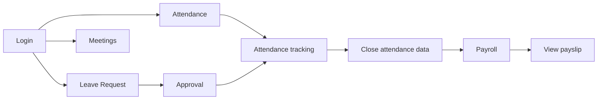

<p>
  <a href="./README.md">JP</a>
  ·
  <a href="./README.en.md"><strong>EN</strong></a>
  ·
  <a href="./README.vi.md">VI</a>
</p>

# Web HRM User Guide

> Version: 2.3  
> Audience: End users and HRM administrators  
> Scope: FE `tmv-hrm`, BE `tmv-hrm-be`  
> Website: [https://hrm.tamada.vn/](https://hrm.tamada.vn/)  
> Report issues: [https://github.com/tamada-chinhhv/tmv-hrm-docs/issues/new](https://github.com/tamada-chinhhv/tmv-hrm-docs/issues/new)

---

## Quick Start

If you are new to HRM, follow these five steps:

1. **Open a browser** and go to [https://hrm.tamada.vn/login](https://hrm.tamada.vn/login).
2. **Log in** with the username and password provided by HR (the default password is usually the same as the username).
3. **Change your password** (recommended): user menu (top bar) → **Change password**.
4. **Attendance**: menu **Time & Attendance** → **Attendance** → **Check in** / **Check out** (web: allow browser **Location/GPS**; mobile app: connect to **company WiFi** when the branch uses WiFi — see [Section 8.1](#81-how-it-works)).
5. **Personal calendar**: menu **Calendar** → select your column → click an empty time slot to create a meeting (if needed).

**Expected outcome:** You can log in, see menus matching your permissions, check in/out, and use the calendar basics.

---

## Table of Contents

1. [Introduction to the HRM System](#1-introduction-to-the-hrm-system)
2. [Requirements Before Use](#2-requirements-before-use)
3. [Accounts & Login](#3-accounts--login)
4. [Employee Management](#4-employee-management)
5. [Calendar & Scheduling](#5-calendar--scheduling)
6. [Roles & Permissions](#6-roles--permissions)
7. [Module Guides](#7-module-guides)
8. [Attendance](#8-attendance)
9. [Leave requests](#9-leave-requests)
10. [Attendance & Leave Reports](#10-attendance--leave-reports)
11. [Recommended Operations](#11-recommended-operations)
12. [FAQ](#12-faq)
13. [Handover Checklist](#13-handover-checklist)

---

## 1. Introduction to the HRM System

### 1.1 What is HRM?

**HRM** (Human Resource Management) is a web system that helps your company manage HR-related work in one place: employee records, attendance, leave, payroll, meeting schedules, and system configuration.

You use HRM to:

- Record work hours (check-in / check-out).
- Create and approve leave requests.
- View and manage employees, departments, and positions.
- Schedule meetings and invite colleagues.
- Calculate and view payslips (based on permissions).
- Configure holidays, office locations, and roles (for administrators).

### 1.2 Who uses the system?

| User type | Role in the system | Typical tasks |
|-----------|-------------------|-----------------|
| **Admin / HR** | `ADMIN` or full admin permissions | Create employees, assign permissions, configure holidays and locations, manage payroll |
| **Manager** | Has `EMPLOYEE_VIEW` and direct reports (`manager`) | Monitor team attendance, approve leave (with `LEAVE_APPROVE`), view team employees |
| **Employee** | `EMPLOYEE` role when assigned | Check in/out, request leave, view own payslip, join meetings |

> **Note:** Each employee has **one role** on their account. Menus and actions depend on **permissions** assigned to that role.

### 1.3 Main modules

| Menu group | Function | URL path |
|------------|----------|----------|
| **Overview** | Dashboard, quick metrics | `/dashboard` |
| **Account** | Personal profile, appearance (color, font, light/dark) | `/account` (tabs **Information** / **Settings**) |
| **Calendar** | Multi-employee meeting schedule | `/calendar` |
| **Organization** | Employees, Departments, Positions, Documents | `/org/employees`, `/org/departments`, `/org/positions`, `/org/documents` |
| **Time & Attendance** | Attendance, Attendance tracking, Leave requests, Leave request approvals | `/time/attendance`, `/time/attendance-tracking`, `/time/leave`, `/time/leave-approvals` |
| **Payroll** | Payslips, tax settings | `/payroll` |
| **System configuration** | Holidays, Locations, Work shift, Assign permissions (tabs: Assign + Role groups), Document expiry notifications | `/sysConfig/holidays`, `/sysConfig/locations`, `/sysConfig/settings`, `/sysConfig/assign` (tab `roles` for role groups; `/sysConfig/roles` redirects), `/settings/document-notifications` |

Menus appear **based on permissions**. If a menu item is missing, your account may lack the required permission (see [Section 6](#6-roles--permissions)).

### 1.4 Main business flow



---

## 2. Requirements Before Use

### 2.1 Supported browsers

Use a **recent version** of a browser on desktop or mobile:

| Browser | Recommended |
|---------|:-------------:|
| Google Chrome | Yes |
| Microsoft Edge | Yes |
| Mozilla Firefox | Yes |
| Safari (macOS / iOS) | Yes |

**Location-based attendance:** The system accepts **GPS inside a branch radius** or **office WiFi (BSSID match)** — either one is enough. On **web**, the browser must allow **Location**; browsers cannot read WiFi BSSID, so web check-in uses GPS only. On **mobile** (when integrated), the client sends `wifi.ssid` and `wifi.bssid`.

**Expected outcome:** The HRM page loads and the login form displays correctly.

### 2.2 Access requirements

| Requirement | Description |
|-------------|-------------|
| **HRM account** | Created by HR or Admin when adding an employee record |
| **Username & password** | Provided by HR/IT initially |
| **Role & permissions** | Control which menus and actions you can use |
| **Network** | Access to the HRM server (URL below) |

New employees **cannot self-register** — HR must create the profile first.

### 2.3 Login URL

| Environment | URL |
|-------------|-----|
| **Production** | [https://hrm.tamada.vn/](https://hrm.tamada.vn/) |
| **Login page** | [https://hrm.tamada.vn/login](https://hrm.tamada.vn/login) |

After a successful login, you are redirected to **Attendance** (`/time/attendance`) or the page you tried to open before being sent to login.

---

## 3. Accounts & Login

### 3.1 Step-by-step login

1. Open a browser (Chrome, Edge, etc.).
2. Go to **https://hrm.tamada.vn/login**
3. On the login form, enter:
   - **Username** — not email, not employee code.
   - **Password** — use the show/hide (eye) icon if needed.
4. Click **Login**.
5. If correct, you enter the main app (usually Attendance). If wrong, an error appears on the form.

**Login form fields:**

| Element | Description |
|---------|-------------|
| Logo / HRM title | Branding |
| **Username** | Required |
| **Password** | Required; minimum 6 characters for login |
| **Login** button | Submits credentials |
| Language switcher | Top bar (Vietnamese / English / Japanese) |

**Not on the form:** email field, “Forgot password” link, remember-me.

**Expected outcome:** You see the sidebar menu and your name in the top bar.

### 3.2 Automatic username rules

When HR **creates a new employee**, the system suggests a username from **Full name** — **not** from email or employee code (`EMP001`, …).

**Processing steps:**

1. Trim leading/trailing spaces.
2. Convert to **lowercase** (login is not case-sensitive; stored as lowercase).
3. Remove diacritics (Vietnamese: ă→a, ê→e, …; **đ** → **d**).
4. Remove any character that is not `a–z` or `0–9` (spaces, hyphens, `@`, etc.).

**Examples:**

| Full name | Suggested username |
|-----------|-------------------|
| Nguyễn Văn An | `nguyenvanan` |
| Trần Thị Lan | `tranthilan` |
| Lê Văn Đức | `levanduc` |
| Nguyễn Văn A | `nguyenvana` |

**Employee code** (`EMP001`, `EMP002`, …) is auto-generated on save for records only — **not** used to log in.

#### Duplicate username

The system **does not** auto-append numbers (`nguyenvanan1`, `nguyenvanan2`, …).

- On save, a duplicate returns: **Username "…" already exists**.
- HR must **manually edit** the Username field before saving (e.g. `nguyenvanan2`, `nguyenvananhr`).

| Situation | Action |
|-----------|--------|
| `nguyenvanan` already exists, adding another Nguyễn Văn An | Change username to `nguyenvanan2` or add a suffix |
| Two names normalize to the same string | Must use different usernames manually |

#### Character limits

| Rule | Detail |
|------|--------|
| Length | 1–50 characters |
| Allowed characters | Only `a–z`, `0–9` after normalization |
| Case sensitivity | **No** — always stored lowercase |
| Change after create | **Not allowed** — username is locked permanently |

### 3.3 Default password

| Question | Answer |
|----------|--------|
| Default password? | **Same as username** (e.g. `nguyenvanan` / `nguyenvanan`) |
| How is it set? | Uses username when HR does not enter a separate password on create |
| Forced change on first login? | **No** |
| Production system admin | `admin` / `admin123` on first deploy — backend auto-creates/restores after each deploy (`ensure-system-admin.mjs`); **change password immediately** after login |

**Example:** Employee **Nguyễn Văn An** → login: `nguyenvanan` / `nguyenvanan`.

> **Security:** Ask employees to **Change password** after account handover ([Section 3.4](#34-change-password)).

### 3.4 Change password

**Self-service (while logged in):**

1. Click your **name / avatar** (top right).
2. Choose **Change password**.
3. Enter current password, new password, and confirmation.
4. Click **Update password**.

**New password rules:**

| Rule | Valid example |
|------|----------------|
| Minimum 8 characters | `Abcdef1!` |
| At least 1 lowercase | `a` |
| At least 1 uppercase | `A` |
| At least 1 digit | `1` |
| At least 1 special character | `!` `@` `#` … |
| New = confirmation | Must match |

**Expected outcome:** After a successful change you **stay signed in** on the current browser; use the new password next time. Other tabs or devices may need to sign in again.

### 3.5 Forgot password & admin reset

There is **no** “Forgot password” flow on the login page.

| Who | Action |
|-----|--------|
| **HR / Admin** (`EMPLOYEE_UPDATE`) | Open employee profile → **Reset password** → password becomes **username** again; employee must **sign in again** on all devices |
| **Employee** | Contact HR/IT — cannot recover from the login screen |

### 3.6 Logout

1. Click your name (top) → **Logout**.
2. Confirm if prompted.

**Expected outcome:** You return to the login page; the session ends.

### 3.7 System `admin` account (immutable)

Production always has username **`admin`** with role **ADMIN** and **all permissions**. Script `ensure-system-admin.mjs` runs automatically after migrations on backend startup.

| Rule | Detail |
|------|--------|
| First login | `admin` / `admin123` (if newly created) — change password immediately |
| Delete `admin` account | **Not allowed** |
| **Reset password** (HR button on profile) | **Not allowed** — cannot reset `admin` back to username |
| **Change password** (user menu → Change password) | **Allowed** — `admin` can change own password; redeploy **does not** revert to `admin123` |
| Change role / deactivate `admin` | **Not allowed** — always ADMIN + ACTIVE |
| Edit `admin` profile by other users | **Not allowed** |
| Assign **ADMIN** role to others | **Only** username `admin` |
| Edit **ADMIN** role permissions | **Only** username `admin`; system always grants full permissions to ADMIN |
| Username `admin` | **Reserved** — cannot create another employee with this username |

---

## 4. Employee Management

> For HR/Admin with `EMPLOYEE_CREATE`, `EMPLOYEE_UPDATE`, `EMPLOYEE_DELETE`.

### 4.1 Create a new employee — step by step

1. Log in with an account that can create employees.
2. **Organization** → **Employees** (`/org/employees`) — requires `EMPLOYEE_VIEW`.
3. Click **Add employee**.
4. Fill the form (table below).
5. Review **Username** (auto-filled from full name — editable before save).
6. Select **Role** if needed (empty = no role assigned).
7. Click **Save** / **Create**.
8. You return to the employee list; employee code (`EMP…`) is created automatically.

**Expected outcome:** The new employee appears in the list and can log in with username and default password (= username).

#### Form fields

| Field | Required | Format / notes |
|-------|:--------:|----------------|
| **Full name** | Yes (*) | Max 100 chars; changing name re-suggests username while creating |
| **Email** | No | Valid email; must be unique if provided |
| **Phone** | No | |
| **Citizen ID** | No | |
| **Department** | Yes (*) | Required (except system account `admin`) |
| **Position** | Yes (*) | **Company-wide** catalog (not per department); employee role comes from position |
| **Date of birth** | No | DatePicker — stored as **YYYY-MM-DD** (e.g. 1990-05-15) |
| **Gender** | No | Male / Female / Other |
| **Address** | No | |
| **Dependent count** | No | Integer 0–99 |
| **Total leave days** | No | Number ≥ 0 |
| **Remaining leave days** | No | Number ≥ 0 |
| **Hire date** | Yes (*) | Default today; **YYYY-MM-DD** |
| **Contract type** | No | Full-time, Probation, etc. |
| **Employment status** | No | Default **ACTIVE**; also **INACTIVE** / **TERMINATED** |
| **Username** | Yes (*) | Auto from full name; editable **before** save |
| **Role** | No* | Derived from selected position when `positionId` is set — **only `admin` may assign `ADMIN`** |
| **Exempt from attendance tracking** | No | Admin only — excludes employee from Attendance tracking grid and Excel export |
| **Direct manager** | No | Active employees only |
| **Avatar** | No | Upload image |

> **Warning — Dates:** The UI uses a calendar picker; the system stores **YYYY-MM-DD**, not DD/MM/YYYY in the database.

> **Warning — Username:** Cannot be changed after create. Verify before saving.

### 4.2 Automation on create

| Item | System behavior |
|------|-----------------|
| **Employee code** | Auto: `EMP001`, `EMP002`, … |
| **Username** | Suggested from full name — see [Section 3.2](#32-automatic-username-rules) |
| **Password** | Same as username (hashed in DB) |
| **Welcome email** | **Not sent** — HR must share credentials internally |
| **Default role** | **Not assigned** unless HR selects one — assign `EMPLOYEE` for regular staff |
| **Status** | Default **ACTIVE** |

### 4.3 Common errors when creating

| Error | Cause | Fix |
|-------|-------|-----|
| **Username already exists** | Duplicate username | Edit username (add suffix) and save again |
| **Missing required fields** | Full name, hire date, username, department, or position empty | Fill all (*) fields |
| **Email already exists** | Duplicate email | Use another email or leave blank |
| **EMPLOYEE_DEPARTMENT_REQUIRED / EMPLOYEE_POSITION_REQUIRED** | Missing department or position | Select both department and position |
| **Insufficient permissions** | Missing `EMPLOYEE_CREATE` | Ask Admin to assign permissions |

### 4.4 Edit after create

1. **Organization** → **Employees** → open the employee.
2. Click **Edit** (`/org/employees/{id}/edit`).
3. Update fields (**Username** is locked).
4. Click **Save**.

**Self-service profile:** **Account** (`/account`) → tab **Information** (or user menu → **Account**) — limited personal fields only (no department, role, or username). Tab **Settings**: theme color, font, light/dark mode — saved per user and synced on login on other devices.

**Admin reset password:** Employee detail → **Reset password** → confirm → password = username. **Does not apply** to `admin`.

**Exempt from attendance tracking:** Admin enables the checkbox on the employee form — that employee is excluded from **Attendance tracking** and attendance Excel export. Role `ADMIN` is always excluded from attendance tracking.

### 4.5 Offboarding

Prefer changing status over deleting:

1. Edit the employee.
2. Set **Employment status** to **TERMINATED** or **INACTIVE**.
3. Save.

**Delete** (`EMPLOYEE_DELETE`): Permanent removal — may affect related attendance, payroll, and calendar data. Use status change instead when possible. **Cannot delete** the `admin` account.

---

## 5. Calendar & Scheduling

### 5.1 What the Calendar is for

**Calendar** schedules **meetings / events** between employees: view busy times, create meetings, invite participants, and receive in-app notifications when something changes.

**Not the same as:**

- Monthly attendance grid (**Attendance tracking**).
- Company holiday setup (**Holiday Configuration**).

**Event types on the schedule calendar:**

| Type | Description |
|------|-------------|
| **Meeting / event** | Title, time, location, organizer, participants |
| **Recurring series** | Working days, weekly weekdays, or selected dates |

> Legend chips (Meeting / Leave / Holiday) on the Calendar page are illustrative — the time grid shows **meetings** only; leave and holidays are in other modules.

### 5.2 Viewing the calendar

1. **Calendar** menu → `/calendar`.
2. **Select employees** to display (default: you; multi-select and by department supported).
3. One **column per employee** — events appear on the organizer’s or participant’s column.

**Views:**

| View | Description |
|------|-------------|
| **Week** | Default — weekly grid |
| **Day** | Single day by hour |
| **Month** | **Not available** in the current version |

**Navigation:**

| Control | Action |
|---------|--------|
| **Previous / Next** | Previous or next week/day |
| **Today** | Jump to today |
| **DatePicker** | Jump to any date |

**Colors:**

- Each **employee column** has its own color.
- **Event border** uses the **organizer’s** color.

### 5.3 Create a meeting

**Method 1 — Click an empty slot**

1. Only on **your own column** (cannot create on someone else’s column).
2. Click a time range → the form opens with date/time prefilled.

**Form steps:**

1. **Title** — required.
2. **Participants** — you must be included; add colleagues by name (all active employees).
3. **Date**, **Start time**, **End time** — end must be after start.
4. **Location** — optional.
5. **Recurrence** — optional ([Section 5.4](#54-recurring-events)).
6. Click **Save**.

**Organizer:** Always **you** — you cannot assign another organizer on the form.

**Expected outcome:** The meeting appears on the calendar; invitees get an **in-app notification** (bell icon).

### 5.4 Recurring events

Enable **Recurrence** when creating (editing recurrence rules on the form is not supported — edit or delete occurrences afterward).

| Mode | Meaning |
|------|---------|
| **Working days** | Repeat on working days, excluding company holidays from holiday config |
| **Weekly weekdays** | Selected weekdays (Mon–Sun) each week |
| **Selected dates** | Pick specific dates |

The system generates occurrences for about **12 weeks** from the viewed week (may extend if the series has no end date).

### 5.5 Calendar permissions

Principle: **creator manages**; **invitees can leave**; users with **`CALENDAR_VIEW`** (default for `EMPLOYEE` after seed/migrate) may **view** others’ calendars to plan meetings. The **Calendar** menu (`/calendar`) requires `CALENDAR_VIEW`.

#### Organizer

| Action | Allowed? | Why |
|--------|:--------:|-----|
| View own events | Yes | Owner needs full details |
| Edit title, time, location, participants | Yes | Only the owner should change the meeting |
| Drag-resize on grid | Yes (own column) | Quick adjustments |
| Delete one occurrence or whole series | Yes | Cancel meetings you own |
| **Leave meeting** | **No** | Cancel by **deleting** the event instead |

#### Participant

| Action | Allowed? | Why |
|--------|:--------:|-----|
| View details | Yes | Need time and location |
| Edit / delete event | **No** | Protects others’ schedules |
| **Leave meeting** | Yes | Decline without deleting the event — **reason required** (sent to organizer) |
| Add more invitees | **No** | Organizer manages the list |
| Outlook-style Accept/Decline | **No** | Use **Leave meeting** + notifications |

#### Admin / HR

| Action | Allowed? | Notes |
|--------|:--------:|-------|
| View anyone’s calendar | Yes | Same as any authenticated user |
| Edit/delete others’ meetings | **Yes** (needs `CALENDAR_EDIT_ANY`) | Granted to `ADMIN` by default; assign via **Roles & permissions** for other roles |
| “View all employees” on calendar | Yes (optional) | Requires `CALENDAR_MANAGE` — switch on **Calendar** page |

> **Summary:** Users with `CALENDAR_EDIT_ANY` (typically Admin) can edit/delete others’ meetings for operational support. Regular users may only modify events they organize.

### 5.6 Notifications and reminders

| Trigger | Who is notified |
|---------|-----------------|
| Invited to a new meeting | Participants (not organizer) |
| Removed from participants | Removed person |
| Participant **leaves** | Organizer |
| Organizer **deletes** one occurrence | Remaining participants |
| Organizer **deletes** entire series | Remaining participants |

**Delivery:** **Bell** icon on the top bar; **Web Push** if IT configured VAPID on the server.

**Reminders before meeting time:** **Yes** — scheduler sends a notification **~15 minutes** before start (cron every 5 minutes, timezone `Asia/Ho_Chi_Minh`). Recipients: organizer and participants. Displayed time matches the calendar grid (see §5.8).

### 5.7 Quick actions

| Action | How |
|--------|-----|
| View details | Click an event on the grid |
| Edit | Details → **Edit** (organizer, or user with `CALENDAR_EDIT_ANY`) |
| Delete | Details → **Delete** → **single** or **entire series** |
| Leave | Details → **Leave meeting** → enter reason → confirm |

### 5.8 Calendar timezone and displayed time

| Topic | Convention |
|-------|--------------|
| Business timezone | **`Asia/Ho_Chi_Minh`** (UTC+7) |
| API/DB storage | **Vietnam wall-clock in UTC slot** — e.g. 09:00 VN meeting → `startAt`: `…T09:00:00.000Z` |
| Grid & dialog (web) | Read **UTC components** of `startAt`/`endAt` as display time |
| Notifications / reminders (BE) | Same contract — `formatVietnamStorageDateTime` (`src/shared/vietnam-storage.util.ts`) |
| Reminder fire time | Convert to real VN instant (`vietnamStorageDateToInstant`) then compare to 15-minute window |

**Expected result:** Grid, detail dialog, and reminder notification times **match**; no extra +7h offset when displaying.

---

## 6. Roles & Permissions

### 6.1 Built-in roles

| Code | Display name | Typical user | Summary |
|------|--------------|--------------|---------|
| `ADMIN` | Administrator | IT / Head of HR | All permissions from seed |
| `HR_MANAGER` | HR Manager | HR staff | Role exists; **Admin must assign permissions** (not pre-assigned in seed) |
| `EMPLOYEE` | Employee | Regular staff | Basic: attendance, leave view, own payslip |

Each employee has **one** `roleId` at a time.

### 6.2 Permission matrix (reference)

- **Admin** = `ADMIN` role (full seed permissions).
- **HR** = usually `HR_MANAGER` + permissions assigned by Admin.
- **Manager** = has `EMPLOYEE_VIEW` + direct/indirect reports via `managerId`. `EMPLOYEE_VIEW_ALL` → company-wide read scope (like Admin for list/findOne).
- **Employee** = default `EMPLOYEE` role.

| Feature | Admin | HR* | Manager | Employee |
|---------|:-----:|:---:|:-------:|:--------:|
| Create employee | Yes | Yes* | No** | No |
| Update employee | Yes | Yes* | No** | Account → Information (limited) |
| Delete employee | Yes | Yes* | No | No |
| View employees — company-wide | Yes | Yes* | No | No |
| View employees — team | Yes | Yes* | Yes*** | No |
| View employees — self only | Yes | Yes | Yes | Yes |
| Reset others’ passwords | Yes | Yes* | No | No |
| Edit/delete others’ meetings | Yes* | Yes* | No | No |
| Edit/delete own meetings | Yes | Yes | Yes | Yes |
| View others’ calendars | Yes | Yes | Yes | Yes |
| Own attendance | Yes | Yes | Yes | Yes |
| Team attendance tracking | Yes | Yes* | Yes*** | No |
| Approve leave | Yes | Yes* | Yes***** | No |
| View / manage payroll | Yes | Yes* | By permission | Own view |
| Departments / positions config | Yes | Yes* | No | No |
| Holidays / office locations | Yes | Yes* | No | No |
| Roles & permission assignment | Yes | Yes* | No | No |

\* Requires the matching permission code.  
\** Unless Admin grants extra permissions.  
\*** Manager = `EMPLOYEE_VIEW` + report subtree.  
\**** Edit/delete on calendar API: **organizer** or user with **`CALENDAR_EDIT_ANY`**.  
\***** Requires `LEAVE_APPROVE`.

### 6.3 Scope by level

**Admin (`roleCode = ADMIN`):** Full employee list and management.

**Manager (`EMPLOYEE_VIEW`, not Admin / without `EMPLOYEE_VIEW_ALL`):** Only employees in their **reporting subtree** (direct and indirect reports via `managerId`).

**HR / user with `EMPLOYEE_VIEW_ALL`:** company-wide employee list (no `ADMIN` role required).

**Regular employee (no `EMPLOYEE_VIEW` / `EMPLOYEE_VIEW_ALL`):** Employee API returns **only self**. Calendar **directory** (`/employees/directory`) still lists active employees for meeting invites — not full HR records.

### 6.4 Assigning roles

| Question | Answer |
|----------|--------|
| Who can assign? | Users with `EMPLOYEE_UPDATE` (usually Admin/HR) |
| Where? | **Organization → Employees** → Create/Edit → **Role** field |
| Multiple roles? | **No** — one role per employee |
| Assign **ADMIN** role? | **Only** username `admin` |
| Edit **ADMIN** role permissions? | **Only** username `admin` — system always grants full permissions to ADMIN |
| Assign permissions? | **System configuration → Permission Assignment** (`/sysConfig/assign`) |

**Steps for role permissions:**

1. **System configuration → Roles** — create/view roles (`ROLE_VIEW` / `ROLE_MANAGE`).
2. **System configuration → Permission Assignment** — select role → tick permissions → Save.
3. Assign that **role** to each employee in the employee form.

**Expected outcome:**

- **Changing permissions on a role** (steps 1–2): users are **not** logged out; menus and actions update on the next API call (reload or tab switch also works).
- **Changing an employee's assigned role** (step 3): that employee must **log in again** on all devices/tabs.
- **Saving an employee profile without changing role:** does not affect that employee's session.

### 6.5 Permission codes

| Code | Meaning |
|------|---------|
| `EMPLOYEE_VIEW` | View employees (managed subtree) |
| `EMPLOYEE_VIEW_ALL` | View all employees (company-wide list / detail / tracking) |
| `EMPLOYEE_CREATE` | Create employee |
| `EMPLOYEE_UPDATE` | Update employee, reset password |
| `EMPLOYEE_DELETE` | Delete employee |
| `ATTENDANCE_VIEW` | View / check-in attendance |
| `ATTENDANCE_EXPORT` | Export working-time detail Excel (Attendance tracking) |
| `ATTENDANCE_MANUAL_UPDATE` | Manual time correction |
| `LOCATION_VIEW` / `LOCATION_MANAGE` | View / manage office locations |
| `LEAVE_VIEW` | View / create leave requests (including OT type) |
| `LEAVE_APPROVE` | Approve leave |
| `LEAVE_APPROVE_MANAGED` | Approve managed employees’ leave (child of `LEAVE_APPROVE` in assign UI) |
| `LEAVE_DELETE_APPROVED` | Delete **approved** requests on **Leave request approvals** (default: ADMIN role); approvers with `LEAVE_APPROVE` / `LEAVE_APPROVE_MANAGED` may also delete **APPROVED** rows they can decide on |
| `CALENDAR_VIEW` | View calendar, create/edit own events |
| `CALENDAR_MANAGE` | Company-wide calendar admin switch |
| `CALENDAR_EDIT_ANY` | Edit/delete calendar events owned by other employees (default: ADMIN role) |
| `DOCUMENT_VIEW` | View and create/edit/delete own employee documents; HR can view all |
| `DOCUMENT_MANAGE` | Full org document create/edit/delete + configure expiry notification rules |
| `PAYROLL_VIEW` | View payslips |
| `PAYROLL_MANAGE` | Manage / calculate payroll, tax settings |
| `PAYROLL_PERIOD_LOCK` | Lock / unlock payroll periods |
| `DEPARTMENT_VIEW` / `DEPARTMENT_MANAGE` | Departments |
| `POSITION_VIEW` / `POSITION_MANAGE` | Positions |
| `ROLE_VIEW` / `ROLE_MANAGE` | Roles & permissions |
| `HOLIDAY_CONFIG_VIEW` / `HOLIDAY_CONFIG_EDIT` | Holiday configuration |
| `APPEARANCE_VIEW` / `APPEARANCE_EDIT` | View / edit **system appearance** (`/sysConfig/settings`) |
| `WORK_SHIFT_VIEW` / `WORK_SHIFT_EDIT` | View / edit default work shift (`/sysConfig/settings`) |

> **System appearance** (company default): stored in `app_settings` — Admin configures at **System configuration → Settings**; API `GET/PATCH /settings/appearance` (`APPEARANCE_*`). **Login** and after **logout** always use system appearance (`GET /settings/public/appearance`).  
> **Personal appearance:** any logged-in user — **Account** → tab **Settings**; `GET/PATCH /auth/me/appearance`. Overrides system only when the user has saved (`appearance_customized = true`).  
> `OVERTIME_*` and `ATTENDANCE_MANAGE` are **removed** — do not re-assign.

---

## 7. Module Guides

### 7.0 Account (`/account`)

Available to every logged-in user (sidebar **Account** or user menu).

| Tab | Content |
|-----|---------|
| **Information** | My profile — edit name, email, phone, … (cannot change username, department, or role) |
| **Settings** | Appearance: **Light/Dark** (saved immediately), primary color, font (click **Save** to sync to server) |
| **Documents** | Self-manage own employee documents (requires `DOCUMENT_VIEW`) — see [Section 7.2.1](#721-documents-orgdocuments) |

- Settings tab URL: `/account?tab=settings`
- Documents tab URL: `/account?tab=documents`
- The header light/dark toggle also saves personal preferences (marks appearance as customized)
- Until the user saves, the app uses **system appearance**; after Save or toggling theme, personal settings take priority
- Users **without** `EMPLOYEE_VIEW` / `EMPLOYEE_VIEW_ALL` who open **Employees** are redirected to **Account** (no legacy My Profile tab)

### 7.1 Overview (`/dashboard`)

Quick metrics for HR, attendance, and leave (some widgets need `EMPLOYEE_VIEW` / `LEAVE_VIEW`).

### 7.2 Departments & Positions

- **Departments:** parent/child tree; `DEPARTMENT_VIEW` / `DEPARTMENT_MANAGE`.
- **Positions:** company-wide catalog (unique `code`); each position **requires** a linked role (`roleId`); no `level` / department ownership. Employee role is derived from the position.

### 7.2.1 Documents (`/org/documents`)

Manage **employee** and **company** documents (PDF): with an expiry date (and automatic reminders) or **no expiry**.

| Permission | Capabilities |
|------------|--------------|
| `DOCUMENT_VIEW` | View and create/edit/delete own employee documents (`/account?tab=documents`); HR can view all |
| `DOCUMENT_MANAGE` | Full org create/edit/delete (any document), upload PDF, configure notification rules |

**Add document (HR):**

1. Menu **Organization** → **Documents** → **Add document**.
2. Choose owner type: **Employee** or **Company** (Company → do not select an employee).
3. Upload PDF — the system tries to read the **expiry date** and (for Employee) match **full name + date of birth** to the profile.
4. With expiry: review/edit the date; choose remind-before **1 / 3 / 7 / 30** days (default 30). **No expiry date:** check the box → no expiry field, no reminders.
5. **Add** to save.

**Employee self-service:** tab **Account → Documents** — create/edit/delete **own** employee documents (not company docs; notification rule uses the default).

**Recipients:** **Settings** → **Document notifications** (`/settings/document-notifications`) — select the applicable departments and notification recipients. The document owner can still receive notifications when the corresponding option is enabled.

**Reminders:** Cron at 07:00 weekdays (VN time) sends reminders on the selected day; expired documents remind daily until updated/deleted. Documents with **no expiry** are skipped by the reminder cron.


### 7.3 Attendance, leave, reports

Full detail: [Section 8](#8-attendance), [Section 9](#9-leave-requests), [Section 10](#10-attendance--leave-reports).

### 7.4 Payroll
- `PAYROLL_VIEW`: view payslips (own or broader per configuration); read payroll period status.
- `PAYROLL_MANAGE`: create, recalculate, tax settings, manage payslips.
- `PAYROLL_PERIOD_LOCK`: **lock/unlock payroll period** (or use `PAYROLL_MANAGE`, which includes period lock).
- **Payroll period (`PayrollPeriod`):** default **Open**; HR clicks **Lock period** on **Payroll** (`PayrollPeriodControls`) → status **Locked**. When locked: cannot create/edit/import/copy payslips (API `PAYROLL_PERIOD_LOCKED`); view and Excel export still work. **Unlock** requires `PAYROLL_MANAGE` or `PAYROLL_PERIOD_LOCK` (note required on unlock). Period lock **only** blocks payroll actions—attendance and leave can still be edited (see [Section 10.4](#104-month-end-reconciliation-hr)).

### 7.5 System configuration

- **Holiday Configuration:** `HOLIDAY_CONFIG_VIEW` / `HOLIDAY_CONFIG_EDIT` — `/sysConfig/holidays`.
- **Office Locations:** `LOCATION_VIEW` / `LOCATION_MANAGE` — `/sysConfig/locations`. Each **active** branch must have **GPS** or **at least one active WiFi network** (GPS only, WiFi only, or both). See [Section 7.5.1](#751-branch-configuration-gps--wifi).
- **System appearance:** `APPEARANCE_VIEW` / `APPEARANCE_EDIT` — **System configuration → Settings** (`/sysConfig/settings`, **Appearance** accordion). Applies to users without personal customization and to the login screen.
- **Work shift (system-wide):** `WORK_SHIFT_VIEW` / `WORK_SHIFT_EDIT` — same page `/sysConfig/settings`, **Work shift** accordion.
- **Assign permissions (Assign + Role groups):** `ROLE_VIEW` / `ROLE_MANAGE` — `/sysConfig/assign` (tab `roles` for role groups; `/sysConfig/roles` redirects to `?tab=roles`).

> **Personal** appearance is not configured here — see [Section 7.0](#70-account-account).

### 7.5.1 Branch configuration (GPS + WiFi)

**Path:** `/sysConfig/locations` — **Branch configuration** dialog.

| Field | Description |
|-------|-------------|
| **Active** | Branch on/off. An active branch must have GPS or ≥1 active WiFi network. |
| **GPS** | Toggle **Enable GPS** → latitude, longitude, radius (m). Disabling GPS clears coordinates on the server. |
| **WiFi** | Per access point: **SSID** (display name) + **BSSID** (AP MAC, required). Multiple APs may share the same SSID. Per-network **Active** switch. |
| **Detect current WiFi** | Calls `GET /office-locations/wifi/current` (`LOCATION_MANAGE`). Reads WiFi from the **machine running the backend** (Windows `netsh` / Linux `nmcli`) — for admins configuring from a PC on the office network. |

**SSID vs BSSID:**

- **SSID** — network name (may repeat across APs).
- **BSSID** — MAC address of each AP; **attendance matching uses BSSID**, not SSID alone.
- Employees do not see BSSID in the check-in UI; only admins configure it.

**Config API error codes:** `OFFICE_METHOD_REQUIRED`, `GPS_ENABLED_INCOMPLETE`, `WIFI_BSSID_INVALID`, `WIFI_BSSID_ALREADY_EXISTS` (duplicate BSSID within the same branch).

---

## 8. Attendance

### 8.1 How it works

| Topic | Answer |
|-------|--------|
| Methods | **Web** — Check in/out + **GPS**. **Mobile API** — GPS and/or **WiFi** (`wifi.bssid`). **No** hardware time clocks. |
| Geofence | Pass if GPS inside any active branch radius **OR** client BSSID matches any **active** configured WiFi network |
| Geofence skipped | Approved **REMOTE_WORK** that day; or no active branch has GPS **and** no active WiFi networks configured |
| Web limitation | Web sends GPS only; **WiFi-only** branches block web check-in until mobile sends `wifi` or GPS is enabled |
| Time unit | Minutes stored (`checkOut − checkIn`); **WORK** / **LATE_EARLY** from **work shift** (grace, lunch break, `expectedWorkingMinutes` / `workUnitLabel`) — not a fixed 9h rule |
| Late / early leave | Approved **`LATE_ARRIVAL`** / **`EARLY_DEPARTURE`** adjust evaluation thresholds and **credited minutes** (actual punch + leave-covered minutes, minus lunch overlap). Approve **does not** overwrite punch times — employees still check in/out normally |
| Re-punch | Second check-in/out when time already stored returns existing record (idempotent). WiFi punch does not require GPS |
| Post-deploy | Run `yarn recompute-attendance` in `tmv-hrm-be` to align stored `attendance.status` with new rules (`:dry-run` to preview) |
| Timezone | **`Asia/Ho_Chi_Minh`** |
| Who appears in Attendance tracking? | Employees who require attendance — role `ADMIN` and employees with **Exempt from attendance tracking** are excluded |
| Work shifts | **System default** at `/sysConfig/settings` — no per-employee roster; see [8.7](#87-work-shifts-and-work-schedules-task-09) |

> **Important:** **LATE_EARLY** is evaluated from the configured **work shift** (start/end, grace minutes, lunch break) and **expected working minutes** (`workUnitLabel`), not a fixed 9h/540-minute rule. With approved **late/early leave**, thresholds use the **approved** arrival/departure time; **credited minutes** = actual work + leave-covered minutes (no double-count at lunch). Example: shift 08:00–17:00, 60m lunch, approved late until 09:30, punch 09:30–17:00 → **WORK** (7.5h + 1.5h credited). Punch 10:00–17:00 → **LATE_EARLY** (30m late vs approval, not vs shift+grace).

#### Attendance methods and geofence rules

| Method | Available in HRM? | Details |
|--------|:-----------------:|---------|
| **Web self-attendance** | **Yes** | Check in / Check out on `/time/attendance`; client sends GPS `location` (latitude/longitude). |
| **Mobile attendance + WiFi** | **API available** / app integration dependent | `POST /attendance/check-in|check-out` accepts `wifi: { ssid, bssid }`; matching uses BSSID. The current Flutter app does not send `wifi`. |
| **Physical clock device** | **No** | No fingerprint, card, ZKTeco, or other hardware integration exists in the codebase. |

| Geofence rule | Details |
|---------------|---------|
| Pass | GPS is inside **any** active branch radius **OR** the client BSSID matches **any** active configured WiFi network. |
| Skip | An approved **`REMOTE_WORK`** request exists for that date. |
| No verification | No active branch has GPS and no active WiFi is configured; attendance is still allowed. |
| Web limitation | Web sends GPS only; a **WiFi-only** branch blocks web attendance until mobile sends `wifi` or GPS is enabled. |
| Mobile | Sends `wifi.bssid` (required for matching) together with `ssid`. |

#### Work units and examples

| Unit | Used for | Rule |
|------|----------|------|
| **Minutes** | Database storage and status calculation | `checkOutTime − checkInTime`. |
| **Work unit from shift** | WORK / LATE_EARLY classification | `expectedMinutes = (end − start) − lunchBreak`; enough minutes and no late/early violation gives **WORK**. |
| **Days** | Dashboard leave aggregation | `expectedWorkingMinutes / 60` hours per day. |
| **Shift settings** | System configuration | `work_shift_start_time`, `work_shift_end_time`, `grace_minutes`, `work_shift_lunch_break_minutes`. |

| Check-in | Check-out | Total minutes | Status | Day-mode grid |
|----------|-----------|---------------|--------|---------------|
| 08:00 | 17:00 | 540 | **WORK** | `1` (green) |
| 08:15 | 17:15 | 540 | **WORK** | `1` |
| 08:00 | 16:30 | 510 | **LATE_EARLY** | `1` (yellow) |
| 09:00 | 17:00 | 480 | **LATE_EARLY** | `1` (yellow) |
| 08:00 | *(no check-out)* | — | **FORGOT_CLOCK_IN** or **WORK**, depending on the case | `F` or check-in only |
| *(no punch)* | *(no punch)* | — | Team grid: **ABSENT** (`A`); past personal calendar: **FORGOT_CLOCK_IN** (`F`) | `A` / `F` |

#### Approved late-arrival and early-departure requests

| Rule | Details |
|------|---------|
| Actual punches | Employees still check in/out normally. Approval never fills or overwrites punch times. |
| Late threshold | Compared with the approved arrival time, not `startTime + grace`. |
| Early threshold | Compared with the approved departure time, not `endTime − grace`. |
| Credited minutes | Actual worked minutes plus leave-covered minutes, excluding lunch overlap and double counting. |
| WORK | No violation against adjusted thresholds and credited minutes meet `expectedWorkingMinutes`. |

For a shift of 08:00–17:00 with 60-minute lunch and an 8-hour work unit: approved late arrival until **09:30** plus attendance 09:30–17:00 is **WORK** (7.5 worked + 1.5 credited hours). Attendance 10:00–17:00 remains **LATE_EARLY** because it is 30 minutes later than approved. An approved late arrival does not excuse a separate early departure.

**Re-punch:** A second Check in/out after the time is stored returns the existing record (idempotent). WiFi attendance does not require GPS.

**Post-deployment:** Run `yarn recompute-attendance` in `tmv-hrm-be` (or `:dry-run` to preview) to synchronize stored `attendance.status` values.

| Time topic | Value |
|------------|-------|
| Business timezone | **`Asia/Ho_Chi_Minh`** (UTC+7) |
| Attendance “today” | Vietnam date |
| Displayed check-in/out | Vietnam time, stored with the UTC-slot convention |

### 8.2 Self check-in

1. **Attendance** (`/time/attendance`) — current month only shows Check in/out buttons.
2. Confirm → allow **Location** → GPS must be inside a configured branch radius (unless approved **REMOTE_WORK** that day). WiFi check-in is for mobile clients sending `wifi.bssid`.
3. Check out after check-in; buttons hide when done.

**Days with approved late/early leave:** Still punch **actual** times; approval **recomputes status only** — it does **not** preset check-in/out.

**Forgot punch:** status **FORGOT_CLOCK_IN** / grid **F** or **A**; fix via second punch, leave types (**LATE_ARRIVAL**, **EARLY_DEPARTURE**, **ATTENDANCE_CORRECTION**), or **manual time** (`ATTENDANCE_MANUAL_UPDATE`).

**No** server-side check-in time window (e.g. 30 minutes after shift start).

**Detailed steps:**

1. Open **Time & Attendance** → **Attendance** (`/time/attendance`), or use the quick action in **Overview**.
2. Select the **current month**; attendance buttons are hidden for other months.
3. Click **Check in**, confirm, and allow browser **Location**.
4. On success, a green message appears and today’s cell shows the check-in time.
5. After Check in, click **Check out** and repeat confirmation/location verification. The button disappears after completion.

**Geofence exceptions:** approved **`REMOTE_WORK`** bypasses GPS/WiFi; if no branch GPS or active WiFi has been configured, geofence is skipped. Common errors are `GEO_LOCATION_OR_WIFI_REQUIRED` (neither GPS nor WiFi) and `OUTSIDE_OFFICE_AREA` (GPS/BSSID does not match).

| Forgotten-punch situation | System record | Resolution |
|---------------------------|---------------|------------|
| Check-in only | **FORGOT_CLOCK_IN**, or WORK if only check-out is missing depending on the case | Complete check-out that day; use **EARLY_DEPARTURE** / **ATTENDANCE_CORRECTION**; or ask HR for manual time. |
| Check-out only | **FORGOT_CLOCK_IN** | Add check-in; use **LATE_ARRIVAL** / **ATTENDANCE_CORRECTION**; or use manual time. |
| No punches on a past working day | Team grid `A`; personal calendar `F` | Submit leave, request correction, or follow the company make-up-punch procedure. |

### 8.3 Viewing data

| Role | Where | Scope |
|------|-------|-------|
| Employee | `/time/attendance` | Own month calendar |
| Manager | `/time/attendance-tracking` | Report subtree (`EMPLOYEE_VIEW`) |
| Admin | Same | All employees **who require attendance** (role `ADMIN` and **Exempt from attendance tracking** excluded) |

Grid symbols: `1`/`8h` worked, `W` weekend, `H` holiday, leave codes, `F` forgot punch, `A` absent (team view), `-` future.

**Employee detail:** On `/time/attendance`, clicking a date opens check-in/out, location if present, leave/holiday suggestions, and a time-edit form if permitted.

**Manager flow:** Open **Attendance tracking** (`/attendance-tracking`), requiring `EMPLOYEE_VIEW` and direct/indirect reports. The scope is the recursive `managerId` subtree only. Filter by name, month, and one or more departments, then open `/attendance-tracking/{id}` for individual detail.

| Symbol | Day mode | Hour mode | Meaning |
|--------|----------|-----------|---------|
| `1` | Worked | `{workUnitLabel}`, for example `8h` | WORK or LATE_EARLY with attendance |
| *(yellow)* | `1` | `{workUnitLabel}` | **LATE_EARLY**: late, early, or short |
| `W` / `H` | Weekend / holiday | — | Fixed off day / configured holiday |
| `PL`, `SL`, `UL`, … | Leave code | — | Approved leave type (first two code letters) |
| `F` / `A` / `-` | Forgot / absent / future | — | Missing punch / past absence / future date |

Classification uses Holiday Configuration first, then approved leave (except REMOTE_WORK and ATTENDANCE_CORRECTION on the grid), then attendance evaluated against shift/grace and approved late/early requests. With no record on a past date, it is ABSENT in team views or FORGOT_CLOCK_IN in some personal views.

### 8.4 Edits & export

- **Manual time:** `ATTENDANCE_MANUAL_UPDATE` — self, Admin, or manager subtree. **No** approval workflow or audit log. **No** block when a leave request exists on that day. Admin UI: any day **≤ today**; optional coordinates; hints on paid-leave / late-early days.
- **Leave approval:** `LATE_ARRIVAL` / `EARLY_DEPARTURE` → recompute **status** only (punch times unchanged). `ATTENDANCE_CORRECTION` / `REMOTE_WORK` → attendance effects per type.
- **Export:** Excel `.xlsx` only from Attendance tracking — no CSV/PDF.

**Manual-time API:** `PATCH /attendance/manual-time`; it requires `ATTENDANCE_MANUAL_UPDATE`. On employee detail (`/attendance-tracking/{id}`) or the personal calendar, click a date **on or before today**, enter **Check-in / Check-out** (coordinates optional), and save. Admins may edit actual punches even when paid leave or late/early requests exist.

| Method | Approval? | Effect |
|--------|:---------:|--------|
| **Manual time** | **No** system approval flow | Writes directly; no editor/reason audit history and no block when a leave request exists. |
| **`LATE_ARRIVAL` / `EARLY_DEPARTURE`** | **Yes**, one approver | Recalculates status only; punch times remain unchanged. |
| **`ATTENDANCE_CORRECTION` / `REMOTE_WORK`** | **Yes** | Updates attendance times or skips geofence according to type. |
| Standard leave | Leave approval | Does not automatically edit punch times. |

> **Warning:** There is no attendance audit-history table. New manual values overwrite existing values; retain sensitive-change evidence outside HRM.

### 8.5 Filtering and exporting data

| Feature | Available? | Details |
|---------|:----------:|---------|
| Filter by **month** | Yes | Month selector on Attendance and Attendance tracking. |
| Filter by employee **name** | Yes | Attendance tracking. |
| Filter by **department** | Yes | Multiple departments can be selected. |
| Separate weekly filter | No | Attendance is filtered by month only. |
| Export **Excel** (`.xlsx`) | Yes | Attendance tracking: `GET /attendance/export-workingtime-detail`; requires `ATTENDANCE_EXPORT`. |
| Export **CSV / PDF** | **No** | — |

The Excel file includes employee code, name, each day’s working minutes, absence/late/early codes, remaining leave days, and other attendance data. Export scope matches the grid: Admin can export the company; Managers can export their reporting subtree.

### 8.6 Permission matrix

| Action | Employee | Manager | HR/Admin |
|--------|:--------:|:-------:|:--------:|
| Check in/out | Yes* | Yes* | Yes* |
| Own calendar | Yes* | Yes* | Yes* |
| Tracking grid | No | Yes** | Yes |
| Employee detail in team | No | Yes** | Yes |
| Excel export | No | Yes** | Yes |
| Manual time | No*** | Yes**** | Yes***** |
| Configure office location | No | No | Yes (`LOCATION_VIEW`) |
| Configure holidays | No | No | Yes (`HOLIDAY_CONFIG_*`) |
| Configure work shift | No | No | Yes (`WORK_SHIFT_VIEW` / `WORK_SHIFT_EDIT`) |

\* `ATTENDANCE_VIEW` — \** `EMPLOYEE_VIEW` + scope — \*** unless granted — \**** team + permission — \***** if granted.

### 8.7 Work shifts and work schedules (Task 09)

> The system has a **default system-wide work shift**, not an employee-specific roster. Configure it under **System configuration → Work shift** (`/sysConfig/settings`).

| Feature | Status |
|---------|--------|
| Default start/end | **Available**: `workShiftStartTime`, `workShiftEndTime` |
| Lunch break | **Available**: `workShiftLunchBreakMinutes` (default 60) |
| Late/early grace | **Available**: `workShiftGraceMinutes` (default 15) |
| Work-unit preview | **Available**: `(end − start − lunch)` in Settings |
| Employee-specific/weekly roster | **Not available** |
| One-day shift change with approval | **Not available** |

```text
shiftSpanMinutes       = endTime − startTime
expectedWorkingMinutes = shiftSpanMinutes − lunchBreakMinutes
workUnitLabel          = expectedWorkingMinutes / 60 (for example, "8h", "8.25h")
```

An 08:00–17:00 shift with 60-minute lunch produces an **8-hour work unit**. Late arrival is after `startTime + grace` (or approved `LATE_ARRIVAL` time); early departure is before `endTime − grace` (or approved `EARLY_DEPARTURE` time). Fixed off days come from **Holiday Configuration**.

---

## 9. Leave requests

### 9.1 Leave types

| Code | Deducts `remainingLeaveDays`? | Notes |
|------|:-----------------------------:|-------|
| `PAID_LEAVE` | **Yes** (on approve) | Full day per working day in range |
| `UNPAID_LEAVE`, `SICK_LEAVE` | No / not PAID_LEAVE logic | No file attachments |
| `LATE_ARRIVAL`, `EARLY_DEPARTURE` | No | On approve: **recompute status** from actual punch + approved minutes — **does not** overwrite check-in/out |
| `REMOTE_WORK`, `ATTENDANCE_CORRECTION` | No | Attendance effects (geofence skip / punch times per type) |
| `HIEU_HI` | No | Paid flag but no balance UI |
| `OVERTIME` | No | Overtime hours; monthly OT totals use **approved** `OVERTIME` requests only (no attendance-computed OT) |

No per-type annual caps, carryover, or attachments in system.

**Annual-leave balance is entered manually by HR:**

- **Total leave days** (`totalLeaveDays`) is a reference value.
- **Remaining leave days** (`remainingLeaveDays`) is deducted only when **`PAID_LEAVE`** is approved.

### 9.2 Create request

**Leave requests** (`/time/leave`) → form: type, date range, times (default 09:00–18:00 on form only), reason, **one Approver** (required). Submit → **PENDING**; approver gets in-app notification (no email).

**Over balance:** blocked at **approve** time for `PAID_LEAVE`, not at submit.

**Request form details:**

1. Open **Time & Attendance** → **Leave requests** (`/leave`), or create a quick request from Attendance.
2. Click **Add** / create request.
3. Select a required **Leave type**, date range (`YYYY-MM-DD`), and optional reason.
4. Set start/end time. The form's 09:00–18:00 default is not the work-shift default.
5. For `LATE_ARRIVAL` / `EARLY_DEPARTURE`, enter **minutes**; multiple days can be selected.
6. Select exactly one required **Approver** from suggestions, then submit.

> **Warning — no half-day value of 0.5:** Although the UI accepts time values, approved `PAID_LEAVE` deducts **one day per overlapping working day**, not 0.5 day.

On submit, the request becomes **PENDING** and the selected Approver receives `LEAVE_REQUEST_CREATED` in the app, linking to `/leave-approvals`. No email is sent automatically.

### 9.3 Leave quota and balance

| Metric | Source | Meaning |
|--------|--------|---------|
| **Total leave days** | HR employee profile | Reference only; it is not automatically deducted. |
| **Used** | No separate database column | Manually inferred as Total − Remaining. |
| **Remaining** | `remainingLeaveDays` | Deducted for approved `PAID_LEAVE`; restored if an authorized user deletes an approved PAID_LEAVE request. |
| **Pending** | Not deducted in advance | Deducted only after **Approve**. |

The balance appears on eligible paid-leave forms and in the employee profile for HR.

### 9.4 Viewing and managing created requests

```
PENDING → APPROVED or REJECTED
```

**List page:** `/leave`, with month and status filters.

| Status | Code | Meaning |
|--------|------|---------|
| Pending | `PENDING` | Submitted and waiting for an approver. |
| Approved | `APPROVED` | Accepted; may deduct leave or update attendance. |
| Rejected | `REJECTED` | Declined; there is no resubmission flow. |

There is no separate `CANCELLED` status. Employees may **edit** and **delete** their own **PENDING** requests on **Leave** (non-OT confirmation: `leave.confirmDelete`). **OVERTIME** **PENDING** uses **Cancel** → `PATCH /leave/:id/cancel` (confirmation: `overtime.confirmCancel`). Requests cannot be edited/deleted by their owner after approval or rejection.

After delete (**PENDING** or **APPROVED**), backend deletes linked in-app notifications (`leaveRequestId` in payload) and emits realtime `notifications:removed` plus `leave:approvals-changed` (`action: deleted`) to the actor and assigned approver.

**Delete** on **Leave request approvals** for **APPROVED** rows: **admin** (`ADMIN` role), **assigned approver** / **direct manager** (`LEAVE_APPROVE` / `LEAVE_APPROVE_MANAGED`), or users with `LEAVE_DELETE_APPROVED` (restores `PAID_LEAVE` balance; reverts attendance for `LATE_ARRIVAL` / `EARLY_DEPARTURE` / `ATTENDANCE_CORRECTION` when safe). Permission errors: `LEAVE_DELETE_NOT_ALLOWED` (i18n).

Rejected requests notify the requester through `LEAVE_REQUEST_REJECTED`. The API does **not** require a separate rejection note; only the requester's original reason is visible when one was entered.

### 9.5 Approval workflow (single step)

- **One approver** per request — not Manager→HR chain, not parallel.
- Requesters select the approver from `GET /leave/approvers`. Suggestions include the active direct manager, employees at a higher position in the department, and employees in parent departments.
- Only assigned approver can decide (`LEAVE_APPROVE` + matching `approverId`).
- **No** delegation when manager is away.
- **Approve** blocked with `LEAVE_APPROVE_BLOCKED_BY_OVERLAP` if another **APPROVED** request overlaps the same period.
- **Delete approved** blocked with `LEAVE_DELETE_BLOCKED_BY_OVERLAP` while another **APPROVED** request still overlaps.
- **Replace workflow:** delete old approved request → create new → approve new.

**Approval steps:**

1. Open the `LEAVE_REQUEST_CREATED` notification or **Leave request approvals** (`/leave-approvals`).
2. Select month/status, then open request detail. The approval screen does not separately show leave balance.
3. **Approve:** requester is notified; `PAID_LEAVE` deducts `remainingLeaveDays`, while special types update attendance.
4. **Reject:** requester is notified; a reason is not required.
5. An authorized user may delete an approved request to restore applicable leave/attendance effects.

| Question | Answer |
|----------|--------|
| Can a Manager approve all team requests? | No. Only requests that selected them as **Approver**. |
| Can HR/Admin approve every request? | No, unless selected on that request or creating it on behalf of an employee. |
| Can an absent Manager delegate approval? | No delegation exists. Choose another approver when creating the request. |
| Can an approved request be changed? | No. Delete it if permitted and not blocked by overlap, then create and approve a replacement. |

| Notification event | Recipient | Channel |
|--------------------|-----------|---------|
| Employee submits | Selected approver | App (+ Web Push if enabled) |
| Approve / Reject | Requester | App (+ Push) |
| Edit PENDING / delete | — | No notification |
| Unselected HR/Admin tries to approve | — | Not allowed (403) |

---

## 10. Attendance & Leave Reports

> Task 12 — intended for HR / Managers.

### 10.1 Available reports and summaries

| Report | Access | Export |
|--------|--------|--------|
| Personal `/time/attendance` dashboard | `ATTENDANCE_VIEW` | — |
| **Attendance tracking** grid | `EMPLOYEE_VIEW` / `EMPLOYEE_VIEW_ALL` + scope | **Excel .xlsx** (`ATTENDANCE_EXPORT`) |
| Dashboard leave/OT widgets | Pending count, approved leave days; **today late** = live evaluation (read-only, includes approved late/early leave); **OT hours** = sum of **approved** `OVERTIME` in month | — |
| Dedicated leave PDF/CSV | **No** | — |

### 10.2 Viewing the monthly summary

1. **Manager / HR:** Open **Attendance tracking** and choose the **month/year**.
2. Filter by **department** and/or **name**.
3. Read daily grid values and the **total** columns at the end of the table.
4. Switch between Day and Hour units: Day uses `1`, `F`, `A`, etc.; Hour shows a worked day as `8h`, for example.

| Personal Attendance metric | Meaning |
|----------------------------|---------|
| Expected working days | Working days in the month after configured weekend/holiday dates. |
| Worked days | Days with WORK or equivalent attendance. |
| Paid / unpaid leave | Converted from approved request hours (÷ 8). |
| Holidays | From Holiday Configuration. |

> **Note:** The dashboard `getTodaySummary.late` widget evaluates current data, including approved late/early requests, and does not write a database status when opened. Use `yarn recompute-attendance` after deployment to synchronize stored `attendance.status`.

### 10.3 Exporting reports

| Format | Available? |
|--------|:----------:|
| **Excel (`.xlsx`)** | Yes |
| PDF | No |
| CSV | No |

1. Open **Attendance tracking**.
2. Choose the month and filter department/name if necessary.
3. Click **Export** / Excel export.
4. Download the `.xlsx` file.

Representative columns include employee code, full name, department, each day’s in/out minutes or code, total minutes, file-legend codes (7 absent, 8 late, 9 early), remaining leave days, and more.

### 10.4 Month-end reconciliation (HR)

#### Data that is still open vs closed in HRM

| Scope | Still open | Closed in HRM |
|---------|------------|---------------|
| **Attendance & leave** | Each month can still be **edited** with permission: punch, manual-time, create/edit requests, approve requests | **No** attendance month lock in the system (backlog Phase 2b) |
| **Payroll period** | Period **Open** — create/edit/import/copy payslips | Period **Locked** — table `payroll_periods`, **Lock period** / **Unlock** on **Payroll**; API `POST /payroll/periods/:year/:month/lock` and `unlock` (`PAYROLL_MANAGE` or `PAYROLL_PERIOD_LOCK`) |

HR should still **reconcile attendance** using the checklist below before locking the payroll period and running payroll ([Section 11.3](#113-monthly)).

#### Month-end checklist (HR)

- [ ] Open **Attendance tracking** for the month to close
- [ ] Filter by **department** or export company **Excel**
- [ ] Review **`F`** (forgot punch) → require make-up punch / ATTENDANCE_CORRECTION / manual-time
- [ ] Review **`A`** (absent) → confirm unpaid absence vs missing leave request
- [ ] Review **yellow / LATE_EARLY** → confirm under work-unit threshold or needs action
- [ ] Check **PENDING** on **Leave request approvals** — approve or reject before payroll
- [ ] Align **`remainingLeaveDays`** with approved **`PAID_LEAVE`** in the month
- [ ] Export **Excel** as reconciliation evidence (file timestamp on download)
- [ ] Move to **Payroll** when attendance data is consistent
- [ ] On **Payroll**, pick month/year → **Lock period** after payslips are final (or before release — per company process)
- [ ] (Optional) Internal attendance reconciliation record (email/minutes) — does **not** replace payroll period lock in the system

**Expected outcome:** HR does not miss pending requests, missing attendance, or leave balance errors before payroll.

---

## 11. Recommended Operations

### 11.1 Initial setup

1. Configure departments, positions, office locations, holidays.
2. Create roles and assign permissions (`ADMIN`, `EMPLOYEE`, …).
3. Create employees; assign department, manager, and **role**.
4. Distribute usernames/passwords; ask everyone to **change password**.

### 11.2 Daily

1. Attendance check-in/out.
2. Create / approve leave.
3. Schedule meetings on **Calendar** if needed.
4. Handle exceptions (forgot clock-in, etc.).

### 11.3 Monthly

1. Reconcile attendance ([Section 10](#10-attendance--leave-reports)) — no system lock button.
2. Update payroll and tax parameters if needed.
3. Run payroll on **Payroll**; when done, **Lock period** for that month (`PAYROLL_MANAGE` or `PAYROLL_PERIOD_LOCK`).

---

## 12. FAQ

### 12.1 Accounts

**I forgot my password.**

There is no self-service forgot-password on the login page. Contact **HR or IT** for **Reset password** on your profile. After reset, the password equals your **username** again — then [change it](#34-change-password).

**My account is locked — who do I contact?**

There is no dedicated “account lock” feature. If login fails: verify **username** (not email/EMP code), ask HR to reset password, then contact IT. Placeholders: HR _[email/phone]_, IT _[email/phone]_.

**Can I change my username?**

**No** — usernames are permanent after employee creation.

### 12.2 Employees

**No welcome email after creating an employee.**

Correct — the system does **not** send email. HR must share credentials manually.

**Does deleting an employee remove all data?**

**Yes** — hard delete from the database. Prefer **TERMINATED** / **INACTIVE** status.

**Offboarding.**

1. Set employment status to **TERMINATED** or **INACTIVE**.  
2. Revoke sensitive permissions / change role.  
3. Avoid deleting the record unless policy requires it.

### 12.2b Attendance and leave

**I checked in at 08:15 but am still marked “Late / Early”. Why?**

The system assigns **LATE_EARLY** when attendance is late/early against the **work shift** (including grace) **or** total credited work time is below the work unit (`workUnitLabel`, for example 8 hours after lunch). For an 08:00–17:00 shift with a 60-minute lunch, 08:15–16:45 is 8.5 hours elapsed but still **LATE_EARLY** because the arrival/departure thresholds are violated. See [Section 8.1](#81-how-it-works).

**Is there a morning/afternoon shift menu?**

**No.** HRM has only the default system-wide work-shift configuration, not per-employee or rotating shift schedules. See [Section 8.7](#87-work-shifts-and-work-schedules-task-09).

**I am a Manager. Why can’t I approve a team member’s request?**

You may approve only if the request selected **you** as its **Approver**. Approval is not automatically granted for every member of your team; see [Section 9.5](#95-approval-workflow-single-step).

### 12.3 Calendar

**Participants do not see my meeting.**

Check: they are in the participant list; correct **column** and **week/day**; they did not **leave** the meeting. They should also see a **bell** notification when invited.

**Are participants notified when I delete a meeting?**

**Yes** — for single occurrence or full series.

**How do I decline an invitation?**

**Calendar** → open meeting → **Leave meeting** → enter **reason** → confirm.

### 12.4 Common errors

| Error | Cause | Resolution |
|-------|-------|------------|
| **Username already exists** | Duplicate username | Change the username before saving, for example by adding a suffix; see [Section 4.3](#43-common-errors-when-creating). |
| **Insufficient permissions** | Account lacks the required permission | See [Section 6](#6-roles--permissions) and contact an Admin. |
| **Invalid username or password** | Incorrect credentials | Check Caps Lock and ask HR to reset the password if necessary. |
| **Page will not load** | Network, server, or incorrect URL | Check the network, try `https://hrm.tamada.vn/login`, clear cache, then contact IT. |
| **Only the event organizer can modify** | Attempting to edit another user’s event | Ask the **organizer** to edit it, or **leave** the meeting. |
| **Insufficient remaining leave days** | Approving `PAID_LEAVE` exceeds balance | Reject it, or have HR update **Remaining leave days** on the employee profile. |
| **LEAVE_APPROVE_BLOCKED_BY_OVERLAP** | An **APPROVED** request overlaps the same period | Delete or adjust the older approved request first (`LEAVE_DELETE_APPROVED`), then approve the new one. |
| **LEAVE_DELETE_BLOCKED_BY_OVERLAP** | Another **APPROVED** request still overlaps | Delete the other approved overlapping request first, or adjust the date range. |
| **LEAVE_DELETE_NOT_ALLOWED** | User is not admin, assigned approver, direct manager, and lacks `LEAVE_DELETE_APPROVED` | Only an authorized user may delete from Leave request approvals. |
| **GEO_LOCATION_OR_WIFI_REQUIRED** | Branch requires verification but the client sent neither GPS nor WiFi | Web: allow Location. Mobile: send `wifi.bssid` or enable GPS. |
| **OUTSIDE_OFFICE_AREA** | GPS is outside the radius or BSSID does not match | Move within branch range, connect to company WiFi, or use approved **REMOTE_WORK**. |

### 12.5 Support contacts

| Type | Contact (fill in by your company) |
|------|-----------------------------------|
| HR (records, leave) | _[HR email / phone]_ |
| IT (login, system errors) | _[IT email / phone]_ |
| Software issues | [GitHub issue](https://github.com/tamada-chinhhv/tmv-hrm-docs/issues/new) |

---

## 13. Handover Checklist

- [ ] Initial account list (username, role)
- [ ] Internal permission assignment process
- [ ] Attendance guide (GPS on web; WiFi/BSSID on mobile if used) and branch setup at `/sysConfig/locations`
- [ ] Password reset process when forgotten
- [ ] Offboarding process (status change, not casual delete)
- [ ] HR/IT support contacts and SLA
- [ ] **Change all default passwords** (= username) after go-live

> **Recommendation:** Require password changes after handover; do not share accounts.

---

*Documentation version 2.3 — aligned with `tmv-hrm` / `tmv-hrm-be` codebase. Last updated: 2026-06-25 (late/early leave evaluation, admin manual time, recompute-attendance).*
