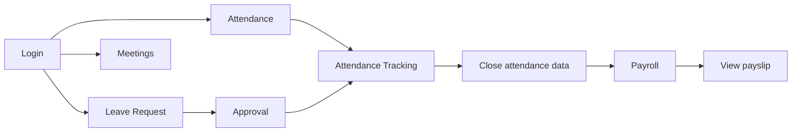

<p>
  <a href="./README.md">JP</a>
  ·
  <a href="./README.en.md"><strong>EN</strong></a>
  ·
  <a href="./README.vi.md">VI</a>
</p>

# Web HRM User Guide

> Version: 2.0  
> Audience: End users and HRM administrators  
> Scope: FE `tmv-hrm`, BE `tmv-hrm-be`  
> Website: [https://hrm.tamada.vn/](https://hrm.tamada.vn/)  
> Report issues: [https://github.com/tamada-chinhhv/tmv-hrm-docs/issues/new](https://github.com/tamada-chinhhv/tmv-hrm-docs/issues/new)

---

## Quick Start

If you are new to HRM, follow these five steps:

1. **Open a browser** and go to [https://hrm.tamada.vn/login](https://hrm.tamada.vn/login).
2. **Log in** with the username and password provided by HR (the default password is usually the same as the username).
3. **Change your password** (recommended): user menu (top bar) → **Change password**.
4. **Attendance**: menu **Attendance & Time** → **Attendance** → **Check in** / **Check out** (allow browser location when prompted).
5. **Personal calendar**: menu **Calendar** → select your column → click an empty time slot to create a meeting (if needed).

**Expected outcome:** You can log in, see menus matching your permissions, check in/out, and use the calendar basics.

---

## Table of Contents

1. [Introduction to the HRM System](#1-introduction-to-the-hrm-system)
2. [Requirements Before Use](#2-requirements-before-use)
3. [Accounts & Login](#3-accounts--login)
4. [Employee Management](#4-employee-management)
5. [Calendar & Scheduling](#5-calendar--scheduling)
6. [Roles & Permissions](#6-roles--permissions)
7. [Module Guides](#7-module-guides)
8. [Attendance](#8-attendance)
9. [Leave Requests](#9-leave-requests)
10. [Attendance & Leave Reports](#10-attendance--leave-reports)
11. [Recommended Operations](#11-recommended-operations)
12. [FAQ](#12-faq)
13. [Handover Checklist](#13-handover-checklist)

---

## 1. Introduction to the HRM System

### 1.1 What is HRM?

**HRM** (Human Resource Management) is a web system that helps your company manage HR-related work in one place: employee records, attendance, leave, payroll, meeting schedules, and system configuration.

You use HRM to:

- Record work hours (check-in / check-out).
- Create and approve leave requests.
- View and manage employees, departments, and positions.
- Schedule meetings and invite colleagues.
- Calculate and view payslips (based on permissions).
- Configure holidays, office locations, and roles (for administrators).

### 1.2 Who uses the system?

| User type | Role in the system | Typical tasks |
|-----------|-------------------|-----------------|
| **Admin / HR** | `ADMIN` or full admin permissions | Create employees, assign permissions, configure holidays and locations, manage payroll |
| **Manager** | Has `EMPLOYEE_VIEW` and direct reports (`manager`) | Monitor team attendance, approve leave (with `LEAVE_APPROVE`), view team employees |
| **Employee** | `EMPLOYEE` role when assigned | Check in/out, request leave, view own payslip, join meetings |

> **Note:** Each employee has **one role** on their account. Menus and actions depend on **permissions** assigned to that role.

### 1.3 Main modules

| Menu group | Function | URL path |
|------------|----------|----------|
| **Overview** | Dashboard, quick metrics | `/dashboard` |
| **Account** | Personal profile, appearance (color, font, light/dark) | `/account` (tabs **Information** / **Settings**) |
| **Calendar** | Multi-employee meeting schedule | `/calendar` |
| **Organization** | Employees, Departments, Positions | `/org/employees`, `/org/departments`, `/org/positions` |
| **Attendance & Time** | Attendance, Attendance Tracking, Leave Requests, Leave Approvals | `/time/attendance`, `/time/attendance-tracking`, `/time/leave`, `/time/leave-approvals` |
| **Payroll** | Payslips, tax settings | `/payroll` |
| **System Settings** | Holidays, Locations, Work shift, Roles, Permission Assignment | `/sysConfig/holidays`, `/sysConfig/locations`, `/sysConfig/settings`, `/sysConfig/roles`, `/sysConfig/assign` |

Menus appear **based on permissions**. If a menu item is missing, your account may lack the required permission (see [Section 6](#6-roles--permissions)).

### 1.4 Main business flow



---

## 2. Requirements Before Use

### 2.1 Supported browsers

Use a **recent version** of a browser on desktop or mobile:

| Browser | Recommended |
|---------|:-------------:|
| Google Chrome | Yes |
| Microsoft Edge | Yes |
| Mozilla Firefox | Yes |
| Safari (macOS / iOS) | Yes |

**Location-based attendance:** The browser must allow **Location** access when asked. Without it, you cannot check in within the office geofence.

**Expected outcome:** The HRM page loads and the login form displays correctly.

### 2.2 Access requirements

| Requirement | Description |
|-------------|-------------|
| **HRM account** | Created by HR or Admin when adding an employee record |
| **Username & password** | Provided by HR/IT initially |
| **Role & permissions** | Control which menus and actions you can use |
| **Network** | Access to the HRM server (URL below) |

New employees **cannot self-register** — HR must create the profile first.

### 2.3 Login URL

| Environment | URL |
|-------------|-----|
| **Production** | [https://hrm.tamada.vn/](https://hrm.tamada.vn/) |
| **Login page** | [https://hrm.tamada.vn/login](https://hrm.tamada.vn/login) |

After a successful login, you are redirected to **Attendance** (`/time/attendance`) or the page you tried to open before being sent to login.

---

## 3. Accounts & Login

### 3.1 Step-by-step login

1. Open a browser (Chrome, Edge, etc.).
2. Go to **https://hrm.tamada.vn/login**
3. On the login form, enter:
   - **Username** — not email, not employee code.
   - **Password** — use the show/hide (eye) icon if needed.
4. Click **Login**.
5. If correct, you enter the main app (usually Attendance). If wrong, an error appears on the form.

**Login form fields:**

| Element | Description |
|---------|-------------|
| Logo / HRM title | Branding |
| **Username** | Required |
| **Password** | Required; minimum 6 characters for login |
| **Login** button | Submits credentials |
| Language switcher | Top bar (Vietnamese / English / Japanese) |

**Not on the form:** email field, “Forgot password” link, remember-me.

**Expected outcome:** You see the sidebar menu and your name in the top bar.

### 3.2 Automatic username rules

When HR **creates a new employee**, the system suggests a username from **Full name** — **not** from email or employee code (`EMP001`, …).

**Processing steps:**

1. Trim leading/trailing spaces.
2. Convert to **lowercase** (login is not case-sensitive; stored as lowercase).
3. Remove diacritics (Vietnamese: ă→a, ê→e, …; **đ** → **d**).
4. Remove any character that is not `a–z` or `0–9` (spaces, hyphens, `@`, etc.).

**Examples:**

| Full name | Suggested username |
|-----------|-------------------|
| Nguyễn Văn An | `nguyenvanan` |
| Trần Thị Lan | `tranthilan` |
| Lê Văn Đức | `levanduc` |
| Nguyễn Văn A | `nguyenvana` |

**Employee code** (`EMP001`, `EMP002`, …) is auto-generated on save for records only — **not** used to log in.

#### Duplicate username

The system **does not** auto-append numbers (`nguyenvanan1`, `nguyenvanan2`, …).

- On save, a duplicate returns: **Username "…" already exists**.
- HR must **manually edit** the Username field before saving (e.g. `nguyenvanan2`, `nguyenvananhr`).

| Situation | Action |
|-----------|--------|
| `nguyenvanan` already exists, adding another Nguyễn Văn An | Change username to `nguyenvanan2` or add a suffix |
| Two names normalize to the same string | Must use different usernames manually |

#### Character limits

| Rule | Detail |
|------|--------|
| Length | 1–50 characters |
| Allowed characters | Only `a–z`, `0–9` after normalization |
| Case sensitivity | **No** — always stored lowercase |
| Change after create | **Not allowed** — username is locked permanently |

### 3.3 Default password

| Question | Answer |
|----------|--------|
| Default password? | **Same as username** (e.g. `nguyenvanan` / `nguyenvanan`) |
| How is it set? | Uses username when HR does not enter a separate password on create |
| Forced change on first login? | **No** |
| Dev seed admin | `admin` / `admin123` — change immediately in production |

**Example:** Employee **Nguyễn Văn An** → login: `nguyenvanan` / `nguyenvanan`.

> **Security:** Ask employees to **Change password** after account handover ([Section 3.4](#34-change-password)).

### 3.4 Change password

**Self-service (while logged in):**

1. Click your **name / avatar** (top right).
2. Choose **Change password**.
3. Enter current password, new password, and confirmation.
4. Click **Update password**.

**New password rules:**

| Rule | Valid example |
|------|----------------|
| Minimum 8 characters | `Abcdef1!` |
| At least 1 lowercase | `a` |
| At least 1 uppercase | `A` |
| At least 1 digit | `1` |
| At least 1 special character | `!` `@` `#` … |
| New = confirmation | Must match |

**Expected outcome:** Next login uses the new password.

### 3.5 Forgot password & admin reset

There is **no** “Forgot password” flow on the login page.

| Who | Action |
|-----|--------|
| **HR / Admin** (`EMPLOYEE_UPDATE`) | Open employee profile → **Reset password** → password becomes **username** again |
| **Employee** | Contact HR/IT — cannot recover from the login screen |

### 3.6 Logout

1. Click your name (top) → **Logout**.
2. Confirm if prompted.

**Expected outcome:** You return to the login page; the session ends.

---

## 4. Employee Management

> For HR/Admin with `EMPLOYEE_CREATE`, `EMPLOYEE_UPDATE`, `EMPLOYEE_DELETE`.

### 4.1 Create a new employee — step by step

1. Log in with an account that can create employees.
2. **Organization** → **Employees** (`/org/employees`) — requires `EMPLOYEE_VIEW`.
3. Click **Add employee**.
4. Fill the form (table below).
5. Review **Username** (auto-filled from full name — editable before save).
6. Select **Role** if needed (empty = no role assigned).
7. Click **Save** / **Create**.
8. You return to the employee list; employee code (`EMP…`) is created automatically.

**Expected outcome:** The new employee appears in the list and can log in with username and default password (= username).

#### Form fields

| Field | Required | Format / notes |
|-------|:--------:|----------------|
| **Full name** | Yes (*) | Max 100 chars; changing name re-suggests username while creating |
| **Email** | No | Valid email; must be unique if provided |
| **Phone** | No | |
| **Citizen ID** | No | |
| **Department** | No | Select before position |
| **Position** | No | Enabled after department is selected |
| **Date of birth** | No | DatePicker — stored as **YYYY-MM-DD** (e.g. 1990-05-15) |
| **Gender** | No | Male / Female / Other |
| **Address** | No | |
| **Dependent count** | No | Integer 0–99 |
| **Total leave days** | No | Number ≥ 0 |
| **Remaining leave days** | No | Number ≥ 0 |
| **Hire date** | Yes (*) | Default today; **YYYY-MM-DD** |
| **Contract type** | No | Full-time, Probation, etc. |
| **Employment status** | No | Default **ACTIVE**; also **INACTIVE** / **TERMINATED** |
| **Username** | Yes (*) | Auto from full name; editable **before** save |
| **Role** | No | e.g. `ADMIN`, `EMPLOYEE`, `HR_MANAGER` |
| **Direct manager** | No | Active employees only |
| **Avatar** | No | Upload image |

> **Warning — Dates:** The UI uses a calendar picker; the system stores **YYYY-MM-DD**, not DD/MM/YYYY in the database.

> **Warning — Username:** Cannot be changed after create. Verify before saving.

### 4.2 Automation on create

| Item | System behavior |
|------|-----------------|
| **Employee code** | Auto: `EMP001`, `EMP002`, … |
| **Username** | Suggested from full name — see [Section 3.2](#32-automatic-username-rules) |
| **Password** | Same as username (hashed in DB) |
| **Welcome email** | **Not sent** — HR must share credentials internally |
| **Default role** | **Not assigned** unless HR selects one — assign `EMPLOYEE` for regular staff |
| **Status** | Default **ACTIVE** |

### 4.3 Common errors when creating

| Error | Cause | Fix |
|-------|-------|-----|
| **Username already exists** | Duplicate username | Edit username (add suffix) and save again |
| **Missing required fields** | Full name, hire date, or username empty | Fill all (*) fields |
| **Email already exists** | Duplicate email | Use another email or leave blank |
| **Position must belong to department** | Position not in selected department | Re-select department/position |
| **Insufficient permissions** | Missing `EMPLOYEE_CREATE` | Ask Admin to assign permissions |

### 4.4 Edit after create

1. **Organization** → **Employees** → open the employee.
2. Click **Edit** (`/org/employees/{id}/edit`).
3. Update fields (**Username** is locked).
4. Click **Save**.

**Self-service profile:** **Account** (`/account`) → tab **Information** (or user menu → **Account**) — limited personal fields only (no department, role, or username). Tab **Settings**: theme color, font, light/dark mode — saved per user and synced on login on other devices.

**Admin reset password:** Employee detail → **Reset password** → confirm → password = username.

### 4.5 Offboarding

Prefer changing status over deleting:

1. Edit the employee.
2. Set **Employment status** to **TERMINATED** or **INACTIVE**.
3. Save.

**Delete** (`EMPLOYEE_DELETE`): Permanent removal — may affect related attendance, payroll, and calendar data. Use status change instead when possible.

---

## 5. Calendar & Scheduling

### 5.1 What the Calendar is for

**Calendar** schedules **meetings / events** between employees: view busy times, create meetings, invite participants, and receive in-app notifications when something changes.

**Not the same as:**

- Monthly attendance grid (**Attendance Tracking**).
- Company holiday setup (**Holiday Configuration**).

**Event types on the schedule calendar:**

| Type | Description |
|------|-------------|
| **Meeting / event** | Title, time, location, organizer, participants |
| **Recurring series** | Working days, weekly weekdays, or selected dates |

> Legend chips (Meeting / Leave / Holiday) on the Calendar page are illustrative — the time grid shows **meetings** only; leave and holidays are in other modules.

### 5.2 Viewing the calendar

1. **Calendar** menu → `/calendar`.
2. **Select employees** to display (default: you; multi-select and by department supported).
3. One **column per employee** — events appear on the organizer’s or participant’s column.

**Views:**

| View | Description |
|------|-------------|
| **Week** | Default — weekly grid |
| **Day** | Single day by hour |
| **Month** | **Not available** in the current version |

**Navigation:**

| Control | Action |
|---------|--------|
| **Previous / Next** | Previous or next week/day |
| **Today** | Jump to today |
| **DatePicker** | Jump to any date |

**Colors:**

- Each **employee column** has its own color.
- **Event border** uses the **organizer’s** color.

### 5.3 Create a meeting

**Method 1 — Click an empty slot**

1. Only on **your own column** (cannot create on someone else’s column).
2. Click a time range → the form opens with date/time prefilled.

**Form steps:**

1. **Title** — required.
2. **Participants** — you must be included; add colleagues by name (all active employees).
3. **Date**, **Start time**, **End time** — end must be after start.
4. **Location** — optional.
5. **Recurrence** — optional ([Section 5.4](#54-recurring-events)).
6. Click **Save**.

**Organizer:** Always **you** — you cannot assign another organizer on the form.

**Expected outcome:** The meeting appears on the calendar; invitees get an **in-app notification** (bell icon).

### 5.4 Recurring events

Enable **Recurrence** when creating (editing recurrence rules on the form is not supported — edit or delete occurrences afterward).

| Mode | Meaning |
|------|---------|
| **Working days** | Repeat on working days, excluding company holidays from holiday config |
| **Weekly weekdays** | Selected weekdays (Mon–Sun) each week |
| **Selected dates** | Pick specific dates |

The system generates occurrences for about **12 weeks** from the viewed week (may extend if the series has no end date).

### 5.5 Calendar permissions

Principle: **creator manages**; **invitees can leave**; users with **`CALENDAR_VIEW`** (default for `EMPLOYEE` after seed/migrate) may **view** others’ calendars to plan meetings. The **Calendar** menu (`/calendar`) requires `CALENDAR_VIEW`.

#### Organizer

| Action | Allowed? | Why |
|--------|:--------:|-----|
| View own events | Yes | Owner needs full details |
| Edit title, time, location, participants | Yes | Only the owner should change the meeting |
| Drag-resize on grid | Yes (own column) | Quick adjustments |
| Delete one occurrence or whole series | Yes | Cancel meetings you own |
| **Leave meeting** | **No** | Cancel by **deleting** the event instead |

#### Participant

| Action | Allowed? | Why |
|--------|:--------:|-----|
| View details | Yes | Need time and location |
| Edit / delete event | **No** | Protects others’ schedules |
| **Leave meeting** | Yes | Decline without deleting the event — **reason required** (sent to organizer) |
| Add more invitees | **No** | Organizer manages the list |
| Outlook-style Accept/Decline | **No** | Use **Leave meeting** + notifications |

#### Admin / HR

| Action | Allowed? | Notes |
|--------|:--------:|-------|
| View anyone’s calendar | Yes | Same as any authenticated user |
| Edit/delete others’ meetings | **No** on calendar API | `ADMIN` does **not** override organizer rules |
| “View all employees” on calendar | Yes (optional) | Requires `CALENDAR_MANAGE` — switch on **Calendar** page |

### 5.6 Notifications and reminders

| Trigger | Who is notified |
|---------|-----------------|
| Invited to a new meeting | Participants (not organizer) |
| Removed from participants | Removed person |
| Participant **leaves** | Organizer |
| Organizer **deletes** one occurrence | Remaining participants |
| Organizer **deletes** entire series | Remaining participants |

**Delivery:** **Bell** icon on the top bar; **Web Push** if IT configured VAPID on the server.

**Reminders before meeting time:** **Not available** — no automatic “15 minutes before” alert.

### 5.7 Quick actions

| Action | How |
|--------|-----|
| View details | Click an event on the grid |
| Edit | Details → **Edit** (organizer only) |
| Delete | Details → **Delete** → **single** or **entire series** |
| Leave | Details → **Leave meeting** → enter reason → confirm |

---

## 6. Roles & Permissions

### 6.1 Built-in roles

| Code | Display name | Typical user | Summary |
|------|--------------|--------------|---------|
| `ADMIN` | Administrator | IT / Head of HR | All permissions from seed |
| `HR_MANAGER` | HR Manager | HR staff | Role exists; **Admin must assign permissions** (not pre-assigned in seed) |
| `EMPLOYEE` | Employee | Regular staff | Basic: attendance, leave view, own payslip |

Each employee has **one** `roleId` at a time.

### 6.2 Permission matrix (reference)

- **Admin** = `ADMIN` role (full seed permissions).
- **HR** = usually `HR_MANAGER` + permissions assigned by Admin.
- **Manager** = has `EMPLOYEE_VIEW` + direct/indirect reports via `managerId`.
- **Employee** = default `EMPLOYEE` role.

| Feature | Admin | HR* | Manager | Employee |
|---------|:-----:|:---:|:-------:|:--------:|
| Create employee | Yes | Yes* | No** | No |
| Update employee | Yes | Yes* | No** | Account → Information (limited) |
| Delete employee | Yes | Yes* | No | No |
| View employees — company-wide | Yes | Yes* | No | No |
| View employees — team | Yes | Yes* | Yes*** | No |
| View employees — self only | Yes | Yes | Yes | Yes |
| Reset others’ passwords | Yes | Yes* | No | No |
| Edit/delete others’ meetings | No**** | No**** | No**** | No**** |
| Edit/delete own meetings | Yes | Yes | Yes | Yes |
| View others’ calendars | Yes | Yes | Yes | Yes |
| Own attendance | Yes | Yes | Yes | Yes |
| Team attendance tracking | Yes | Yes* | Yes*** | No |
| Approve leave | Yes | Yes* | Yes***** | No |
| View / manage payroll | Yes | Yes* | By permission | Own view |
| Departments / positions config | Yes | Yes* | No | No |
| Holidays / office locations | Yes | Yes* | No | No |
| Roles & permission assignment | Yes | Yes* | No | No |

\* Requires the matching permission code.  
\** Unless Admin grants extra permissions.  
\*** Manager = `EMPLOYEE_VIEW` + report subtree.  
\**** Only the **organizer** can modify their events.  
\***** Requires `LEAVE_APPROVE`.

### 6.3 Scope by level

**Admin (`roleCode = ADMIN`):** Full employee list and management.

**Manager (`EMPLOYEE_VIEW`, not Admin):** Only employees in their **reporting subtree** (direct and indirect reports via `managerId`).

**Regular employee (no `EMPLOYEE_VIEW`):** Employee API returns **only self**. Calendar **directory** (`/employees/directory`) still lists active employees for meeting invites — not full HR records.

### 6.4 Assigning roles

| Question | Answer |
|----------|--------|
| Who can assign? | Users with `EMPLOYEE_UPDATE` (usually Admin/HR) |
| Where? | **Organization → Employees** → Create/Edit → **Role** field |
| Multiple roles? | **No** — one role per employee |
| Assign permissions? | **System Settings → Permission Assignment** (`/sysConfig/assign`) |

**Steps for role permissions:**

1. **System Settings → Roles** — create/view roles (`ROLE_VIEW` / `ROLE_MANAGE`).
2. **System Settings → Permission Assignment** — select role → tick permissions → Save.
3. Assign that **role** to each employee in the employee form.

### 6.5 Permission codes

| Code | Meaning |
|------|---------|
| `EMPLOYEE_VIEW` | View employees (scoped) |
| `EMPLOYEE_CREATE` | Create employee |
| `EMPLOYEE_UPDATE` | Update employee, reset password |
| `EMPLOYEE_DELETE` | Delete employee |
| `ATTENDANCE_VIEW` | View / check-in attendance |
| `ATTENDANCE_EXPORT` | Export working-time detail Excel (Attendance Tracking) |
| `ATTENDANCE_MANUAL_UPDATE` | Manual time correction |
| `LOCATION_VIEW` / `LOCATION_MANAGE` | View / manage office locations |
| `LEAVE_VIEW` | View / create leave requests (including OT type) |
| `LEAVE_APPROVE` | Approve leave |
| `LEAVE_APPROVE_MANAGED` | Approve managed employees’ leave (child of `LEAVE_APPROVE` in assign UI) |
| `CALENDAR_VIEW` | View calendar, create/edit own events |
| `CALENDAR_MANAGE` | Company-wide calendar admin switch |
| `PAYROLL_VIEW` | View payslips |
| `PAYROLL_MANAGE` | Manage / calculate payroll, tax settings |
| `PAYROLL_PERIOD_LOCK` | Lock / unlock payroll periods |
| `DEPARTMENT_VIEW` / `DEPARTMENT_MANAGE` | Departments |
| `POSITION_VIEW` / `POSITION_MANAGE` | Positions |
| `ROLE_VIEW` / `ROLE_MANAGE` | Roles & permissions |
| `HOLIDAY_CONFIG_VIEW` / `HOLIDAY_CONFIG_EDIT` | Holiday configuration |
| `WORK_SHIFT_VIEW` / `WORK_SHIFT_EDIT` | View / edit default work shift (`/sysConfig/settings`) |

> **Personal appearance** (color, font, light/dark): any logged-in user — **Account** → tab **Settings**; API `GET/PATCH /auth/me/appearance` (not `APPEARANCE_*`).  
> `OVERTIME_*`, `ATTENDANCE_MANAGE`, and legacy `APPEARANCE_*` are **removed** — do not re-assign.

---

## 7. Module Guides

### 7.0 Account (`/account`)

Available to every logged-in user (sidebar **Account** or user menu).

| Tab | Content |
|-----|---------|
| **Information** | My profile — edit name, email, phone, … (cannot change username, department, or role) |
| **Settings** | Appearance: **Light/Dark** (saved immediately), primary color, font (click **Save** to sync to server) |

- Settings tab URL: `/account?tab=settings`
- The light/dark toggle in the header also saves to the same server-side preferences
- Users **without** `EMPLOYEE_VIEW` who open **Employees** are redirected to **Account** (no legacy My Profile tab)

### 7.1 Overview (`/dashboard`)

Quick metrics for HR, attendance, and leave (some widgets need `EMPLOYEE_VIEW` / `LEAVE_VIEW`).

### 7.2 Departments & Positions

- **Departments:** parent/child tree; `DEPARTMENT_VIEW` / `DEPARTMENT_MANAGE`.
- **Positions:** per department; lower **Level** number = higher rank (`1` is highest).

### 7.3 Attendance, leave, reports

Full detail: [Section 8](#8-attendance), [Section 9](#9-leave-requests), [Section 10](#10-attendance--leave-reports).

### 7.4 Payroll
- `PAYROLL_VIEW`: view payslips (own or broader per configuration); read payroll period status.
- `PAYROLL_MANAGE`: create, recalculate, tax settings, manage payslips.
- `PAYROLL_PERIOD_LOCK`: **lock/unlock payroll period** (or use `PAYROLL_MANAGE`, which includes period lock).
- **Payroll period (`PayrollPeriod`):** default **Open**; HR clicks **Lock period** on **Payroll** (`PayrollPeriodControls`) → status **Locked**. When locked: cannot create/edit/import/copy payslips (API `PAYROLL_PERIOD_LOCKED`); view and Excel export still work. **Unlock** requires `PAYROLL_MANAGE` or `PAYROLL_PERIOD_LOCK` (note required on unlock). Period lock **only** blocks payroll actions—attendance and leave can still be edited (see [Section 10.4](#104-month-end-reconciliation-hr)).

### 7.5 System Settings

- **Holiday Configuration:** `HOLIDAY_CONFIG_VIEW` / `HOLIDAY_CONFIG_EDIT` — `/sysConfig/holidays`.
- **Office Locations:** `LOCATION_VIEW` / `LOCATION_MANAGE` — `/sysConfig/locations`.
- **Work shift (system-wide):** `WORK_SHIFT_VIEW` / `WORK_SHIFT_EDIT` — **System Settings → Work shift** (`/sysConfig/settings`).
- **Roles / Permission Assignment:** `ROLE_VIEW` / `ROLE_MANAGE` — `/sysConfig/roles`, `/sysConfig/assign`.

> Personal appearance is not configured here — see [Section 7.0](#70-account-account).

---

## 8. Attendance

### 8.1 How it works

| Topic | Answer |
|-------|--------|
| Methods | **Web only** — Check in/out + GPS geofence. **No** hardware time clocks. |
| Time unit | Minutes stored; status uses **≥ 9 hours** between check-in and check-out → **WORK**, else **LATE_EARLY**. |
| Timezone | **`Asia/Ho_Chi_Minh`** |
| Work shifts | **System default** at `/sysConfig/settings` — no per-employee roster; see [8.5](#85-work-shifts) |

> **Important:** **LATE_EARLY** is evaluated from the configured **work shift** (start/end, grace minutes, lunch break) and **expected working minutes** (`workUnitLabel`), not a fixed 9h/540-minute rule. Late/early vs shift boundaries or insufficient net working time → LATE_EARLY; otherwise WORK.

### 8.2 Self check-in

1. **Attendance** (`/time/attendance`) — current month only shows Check in/out buttons.
2. Confirm → allow **Location** → must be inside configured **Office Locations** (unless approved **REMOTE_WORK** that day).
3. Check out after check-in; buttons hide when done.

**Forgot punch:** status **FORGOT_CLOCK_IN** / grid **F** or **A**; fix via second punch, leave types (**LATE_ARRIVAL**, **EARLY_DEPARTURE**, **ATTENDANCE_CORRECTION**), or **manual time** (`ATTENDANCE_MANUAL_UPDATE`).

**No** server-side check-in time window (e.g. 30 minutes after shift start).

### 8.3 Viewing data

| Role | Where | Scope |
|------|-------|-------|
| Employee | `/time/attendance` | Own month calendar |
| Manager | `/time/attendance-tracking` | Report subtree (`EMPLOYEE_VIEW`) |
| Admin | Same | All employees |

Grid symbols: `1`/`8h` worked, `W` weekend, `H` holiday, leave codes, `F` forgot punch, `A` absent (team view), `-` future.

### 8.4 Edits & export

- **Manual time:** `ATTENDANCE_MANUAL_UPDATE` — self, Admin, or manager subtree. **No** approval workflow or audit log.
- **Leave approval** can update times (late/early/remote/correction types).
- **Export:** Excel `.xlsx` only from Attendance Tracking — no CSV/PDF.

### 8.5 Work shifts

HRM has a **system-wide default work shift** (start/end, grace minutes, lunch break) — **System Settings → Work shift** (`/sysConfig/settings`), permissions `WORK_SHIFT_VIEW` / `WORK_SHIFT_EDIT`. There is **no** per-employee shift roster. Late/early and `workUnitLabel` use these settings (see note in [8.1](#81-how-it-works)). Excel may show SS/NS labels as payroll allowance legend only.

### 8.6 Permission matrix

| Action | Employee | Manager | HR/Admin |
|--------|:--------:|:-------:|:--------:|
| Check in/out | Yes* | Yes* | Yes* |
| Own calendar | Yes* | Yes* | Yes* |
| Tracking grid | No | Yes** | Yes |
| Excel export | No | Yes** | Yes |
| Manual time | No*** | Yes**** | Yes***** |

\* `ATTENDANCE_VIEW` — \** `EMPLOYEE_VIEW` + scope — \*** unless granted — \**** team + permission — \***** if granted.

---

## 9. Leave Requests

### 9.1 Leave types

| Code | Deducts `remainingLeaveDays`? | Notes |
|------|:-----------------------------:|-------|
| `PAID_LEAVE` | **Yes** (on approve) | Full day per working day in range |
| `UNPAID_LEAVE`, `SICK_LEAVE` | No / not PAID_LEAVE logic | No file attachments |
| `LATE_ARRIVAL`, `EARLY_DEPARTURE` | No | Updates attendance on approve |
| `REMOTE_WORK`, `ATTENDANCE_CORRECTION` | No | Attendance effects |
| `HIEU_HI` | No | Paid flag but no balance UI |

No per-type annual caps, carryover, or attachments in system.

### 9.2 Create request

**Leave Requests** (`/time/leave`) → form: type, date range, times (default 09:00–18:00 on form only), reason, **one Approver** (required). Submit → **PENDING**; approver gets in-app notification (no email).

**Over balance:** blocked at **approve** time for `PAID_LEAVE`, not at submit.

### 9.3 Lifecycle

```
PENDING → APPROVED or REJECTED
```

Employee may edit/delete only while **PENDING**. No `CANCELLED` status. Reject notifies requester; **no mandatory** reject reason field.

### 9.4 Approval (single step)

- **One approver** per request — not Manager→HR chain, not parallel.
- Approver list: direct manager + higher level in dept/parent depts.
- Only assigned approver can decide (`LEAVE_APPROVE` + matching `approverId`).
- **No** delegation when manager is away.

---

## 10. Attendance & Leave Reports

| Report | Access | Export |
|--------|--------|--------|
| Personal `/time/attendance` dashboard | `ATTENDANCE_VIEW` | — |
| **Attendance Tracking** grid | `EMPLOYEE_VIEW` + scope | **Excel .xlsx** (`ATTENDANCE_EXPORT`) |
| Dedicated leave PDF/CSV | **No** | — |

### 10.4 Month-end reconciliation (HR)

#### Data that is still open vs closed in HRM

| Scope | Still open | Closed in HRM |
|---------|------------|---------------|
| **Attendance & leave** | Each month can still be **edited** with permission: punch, manual-time, create/edit requests, approve requests | **No** attendance month lock in the system (backlog Phase 2b) |
| **Payroll period** | Period **Open** — create/edit/import/copy payslips | Period **Locked** — table `payroll_periods`, **Lock period** / **Unlock** on **Payroll**; API `POST /payroll/periods/:year/:month/lock` and `unlock` (`PAYROLL_MANAGE` or `PAYROLL_PERIOD_LOCK`) |

HR should still **reconcile attendance** using the checklist below before locking the payroll period and running payroll ([Section 11.3](#113-monthly)).

#### Month-end checklist (HR)

- [ ] Open **Attendance Tracking** for the month to close
- [ ] Filter by **department** or export company **Excel**
- [ ] Review **`F`** (forgot punch) → require make-up punch / ATTENDANCE_CORRECTION / manual-time
- [ ] Review **`A`** (absent) → confirm unpaid absence vs missing leave request
- [ ] Review **yellow / LATE_EARLY** → confirm under work-unit threshold or needs action
- [ ] Check **PENDING** on **Leave Approvals** — approve or reject before payroll
- [ ] Align **`remainingLeaveDays`** with approved **`PAID_LEAVE`** in the month
- [ ] Export **Excel** as reconciliation evidence (file timestamp on download)
- [ ] Move to **Payroll** when attendance data is consistent
- [ ] On **Payroll**, pick month/year → **Lock period** after payslips are final (or before release — per company process)
- [ ] (Optional) Internal attendance reconciliation record (email/minutes) — does **not** replace payroll period lock in the system

**Expected outcome:** HR does not miss pending requests, missing attendance, or leave balance errors before payroll.

---

## 11. Recommended Operations

### 11.1 Initial setup

1. Configure departments, positions, office locations, holidays.
2. Create roles and assign permissions (`ADMIN`, `EMPLOYEE`, …).
3. Create employees; assign department, manager, and **role**.
4. Distribute usernames/passwords; ask everyone to **change password**.

### 11.2 Daily

1. Attendance check-in/out.
2. Create / approve leave.
3. Schedule meetings on **Calendar** if needed.
4. Handle exceptions (forgot clock-in, etc.).

### 11.3 Monthly

1. Reconcile attendance ([Section 10](#10-attendance--leave-reports)) — no system lock button.
2. Update payroll and tax parameters if needed.
3. Run payroll on **Payroll**; when done, **Lock period** for that month (`PAYROLL_MANAGE` or `PAYROLL_PERIOD_LOCK`).

---

## 12. FAQ

### 12.1 Accounts

**I forgot my password.**

There is no self-service forgot-password on the login page. Contact **HR or IT** for **Reset password** on your profile. After reset, the password equals your **username** again — then [change it](#34-change-password).

**My account is locked — who do I contact?**

There is no dedicated “account lock” feature. If login fails: verify **username** (not email/EMP code), ask HR to reset password, then contact IT. Placeholders: HR _[email/phone]_, IT _[email/phone]_.

**Can I change my username?**

**No** — usernames are permanent after employee creation.

### 12.2 Employees

**No welcome email after creating an employee.**

Correct — the system does **not** send email. HR must share credentials manually.

**Does deleting an employee remove all data?**

**Yes** — hard delete from the database. Prefer **TERMINATED** / **INACTIVE** status.

**Offboarding.**

1. Set employment status to **TERMINATED** or **INACTIVE**.  
2. Revoke sensitive permissions / change role.  
3. Avoid deleting the record unless policy requires it.

### 12.3 Calendar

**Participants do not see my meeting.**

Check: they are in the participant list; correct **column** and **week/day**; they did not **leave** the meeting. They should also see a **bell** notification when invited.

**Are participants notified when I delete a meeting?**

**Yes** — for single occurrence or full series.

**How do I decline an invitation?**

**Calendar** → open meeting → **Leave meeting** → enter **reason** → confirm.

### 12.4 Common errors

| Error | Fix |
|-------|-----|
| Username already exists | Change username before save — [Section 4.3](#43-common-errors-when-creating) |
| Insufficient permissions | [Section 6](#6-roles--permissions); contact Admin |
| Invalid username or password | Check Caps Lock; ask HR to reset |
| Page will not load | Check network and `https://hrm.tamada.vn/login`; clear cache; contact IT |
| Only the event organizer can modify | Ask the **organizer** to edit, or **leave** the meeting |

### 12.5 Support contacts

| Type | Contact (fill in by your company) |
|------|-----------------------------------|
| HR (records, leave) | _[HR email / phone]_ |
| IT (login, system errors) | _[IT email / phone]_ |
| Software issues | [GitHub issue](https://github.com/tamada-chinhhv/tmv-hrm-docs/issues/new) |

---

## 13. Handover Checklist

- [ ] Initial account list (username, role)
- [ ] Internal permission assignment process
- [ ] Attendance & GPS guide for employees
- [ ] Password reset process when forgotten
- [ ] Offboarding process (status change, not casual delete)
- [ ] HR/IT support contacts and SLA
- [ ] **Change all default passwords** (= username) after go-live

> **Recommendation:** Require password changes after handover; do not share accounts.

---

*Documentation version 2.0 — aligned with `tmv-hrm` / `tmv-hrm-be` codebase. Last updated: 2026.*
