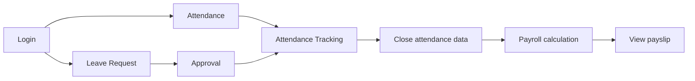
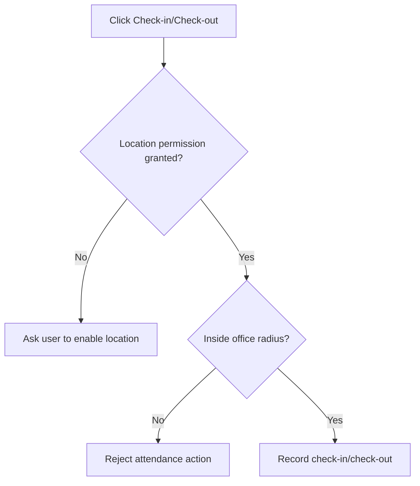
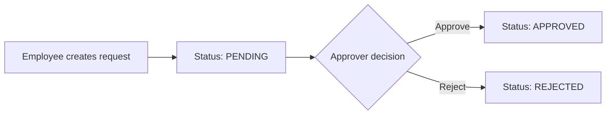
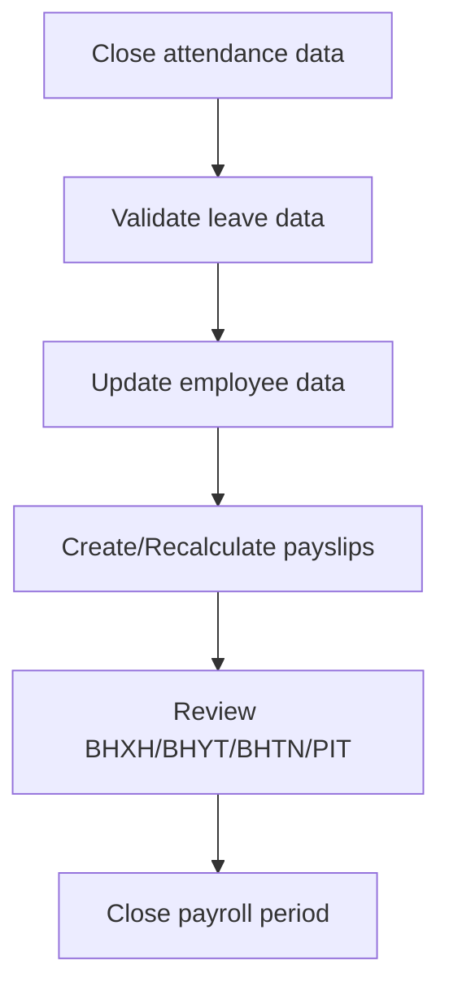

  <a href="./README.md">JP</a>
  ·
  <a href="./README.en.md"><strong>EN</strong></a>
  ·
  <a href="./README.vi.md">VI</a>

# Web HRM User Guide

> Version: 1.0 
> Audience: HRM customers and end users 
> Scope: FE `tmv-hrm`, BE `tmv-hrm-be` 
> Website: [https://hrm.tamada.vn/](https://hrm.tamada.vn/) 
> Report issues when needed: [https://github.com/tamada-chinhhv/tmv-hrm-docs/issues/new](https://github.com/tamada-chinhhv/tmv-hrm-docs/issues/new)

---

## 1. Document Purpose

This guide explains how to operate the Web HRM system in production, including:

- Organization management (Employees, Departments, Positions)
- Attendance, leave requests, and approvals
- Payroll management and PIT configuration
- System configuration (Roles, permissions, holidays, office locations)

## 2. User Roles

| Role | Main responsibilities |
|---|---|
| Admin/HR | System setup, HR master data, leave approvals, payroll operations |
| Manager | Leave approvals and attendance monitoring (based on assigned permissions) |
| Employee | Check-in/out, create leave requests, view own attendance and payroll |

## 3. Process Overview (Illustration)

## 4. Login and Security

### 4.1 Login
1. Open the HRM URL.
2. Enter `Username` and `Password`.
3. Click `Login`.

### 4.2 Change password
1. Open `Change password`.
2. Enter current password, new password, and confirmation.
3. Click `Update password`.

### 4.3 Logout
- Click `Logout` from the navigation area.

## 5. System Menu Structure

- **Overview**
- **Organization**
  - Employees
  - Departments
  - Positions
- **Attendance & Time**
  - Attendance
  - Attendance Tracking
  - Leave Requests
  - Leave Approvals
- **Payroll**
- **System Settings**
  - Holiday Configuration
  - Office Locations
  - Roles
  - Permission Assignment

## 6. Module Usage Guide

### 6.1 Overview
- KPI dashboard for attendance status, HR metrics, and leave status.

### 6.2 Employees
- List/create/update/delete employees (permission-based).
- Reset employee password.
- Update personal profile (`My Profile`).

### 6.3 Departments
- Manage department tree (parent/child).
- Create, edit, delete departments.

### 6.4 Positions
- Manage positions by department.
- Lower `Level` means higher rank (`1` is highest).

### 6.5 Attendance
- Geofence-based check-in/check-out.
- Monthly attendance summary.
- Manual time adjustment (if permitted).

### 6.6 Attendance Tracking
- Search employees.
- View monthly details.
- Export Excel report.

| Symbol | Meaning |
|---|---|
| `1 / 8h` | Worked |
| `W` | Weekend |
| `H` | Holiday |
| `A` | Absent |
| `PL, SL, UL...` | Leave by leave type |
| `F` | Forgot clock in/out |
| `-` | Future date/not calculated |

### 6.7 Leave Requests
- Create leave requests.
- Edit/delete while pending.
- Track statuses: `PENDING`, `APPROVED`, `REJECTED`.

### 6.8 Leave Approvals
- Approvers can review and decide requests.

### 6.9 Payroll
- Admin/HR: payroll categories, PIT configuration, payslip create/edit/recalculate, Excel import/export.
- Employee: view own payslip.

### 6.10 Office Locations
- Create/update/delete attendance locations.
- Configure latitude, longitude, and allowed radius.

### 6.11 Holiday Configuration
- Weekly fixed off-days.
- Holiday entries by date range.

### 6.12 Roles and Permissions
- Manage role groups (`ADMIN`, `HR_MANAGER`, `EMPLOYEE`, ...).
- Assign permissions to control visible menus and allowed actions.

## 7. Recommended Operating Procedure

### 7.1 Initial setup
1. Configure departments, positions, locations, holidays.
2. Configure roles and permissions.
3. Create employee accounts and assignments.

### 7.2 Daily operation
1. Employee attendance.
2. Leave request creation/approval.
3. HR monitoring and exception handling.

### 7.3 Monthly operation
1. Lock attendance period.
2. Update payroll/tax parameters if needed.
3. Run payroll and reconcile.

## 8. Common Issues

| Issue | Resolution |
|---|---|
| Cannot login | Check credentials and reset password if needed |
| Cannot check in/out | Check location permission and office geofence radius |
| Missing menu/features | Check assigned role and permissions |
| Cannot request/approve leave | Check `LEAVE_VIEW` / `LEAVE_APPROVE` permissions |
| Incorrect payroll data | Verify attendance, leave, dependents, and PIT settings |

## 9. Handover Checklist

- [ ] Initial account list delivered
- [ ] Internal authorization flow delivered
- [ ] Backup procedure delivered
- [ ] Technical support contact and SLA delivered
- [ ] All default passwords changed

> Recommendation: change all default passwords immediately after go-live.
