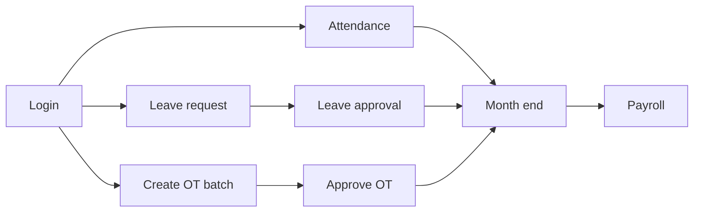



  <a href="./README.md">JP</a>
  ·
  <a href="./README.en.md"><strong>EN</strong></a>
  ·
  <a href="./README.vi.md">VI</a>

# HRM User Guide

> Version: 2.4  
> Audience: Employees, managers, HR / Admin  
> Website: [https://hrm.tamada.vn/](https://hrm.tamada.vn/)  
> Report issues: [GitHub Issues](https://github.com/tamada-chinhhv/tmv-hrm-docs/issues/new)

This guide explains **how to use the screens** (menu → action → expected result). Technical details are in [Section 6](#6-technical-appendix).

---

## Quick Start

1. Open a browser → [https://hrm.tamada.vn/login](https://hrm.tamada.vn/login).
2. Sign in with the account HR provided (the default password is often the same as the username).
3. Change your password (recommended): your name menu (top bar) → **Change password**.
4. Attendance: **Time & Attendance** → **Attendance** → **Check in** / **Check out**. On the web, allow **location**; on mobile, join **company WiFi** when the branch uses WiFi.
5. See your day at a glance: menu **Overview**.

**Expected outcome:** You can sign in, see menus matching your permissions, and check in/out.

---

## Table of Contents

1. [Introduction](#1-introduction)
2. [For employees](#2-for-employees)
3. [For managers](#3-for-managers)
4. [For HR / Admin](#4-for-hr--admin)
5. [FAQ](#5-faq)
6. [Technical appendix](#6-technical-appendix)

---

## 1. Introduction

### 1.1 What can HRM do?

**HRM** helps your company manage people in one place:

- Check in / check out
- Request and approve leave
- Create and approve overtime batches
- Meetings calendar and payslips
- Employees, documents, holidays / branches / work shifts (HR)

### 1.2 Who uses the system?

| You are… | Typical tasks |
|----------|---------------|
| **Employee** | Attendance, leave requests, payslip, calendar, personal overview |
| **Manager** | Team attendance, leave approvals, create / approve overtime batches |
| **HR / Admin** | Employees, permissions, system setup, payroll, documents |

Menus depend on permissions. Missing a menu item → ask HR to grant access.

### 1.3 Main workflow

```mermaid
flowchart LR
  A[Login] --> B[Attendance]
  A --> C[Leave request]
  C --> D[Leave approval]
  A --> E[Create OT batch]
  E --> F[Approve OT]
  B --> G[Month end]
  D --> G
  F --> G
  G --> H[Payroll]
```

---

## 2. For employees

### 2.1 Login & account

**When to use:** First login, password change, or personal profile updates.

**Steps — Login**

1. Open the [login page](https://hrm.tamada.vn/login).
2. Enter username and password.
3. Sign in.

**Steps — Account**

1. Menu **Account** (or your name in the top bar).
2. **Information** tab: edit name, email, phone (username, department, and role cannot be changed here).
3. **Settings** tab: light/dark theme, colors, font.
4. **Documents** tab (if available): view / add your own employee documents.

**Expected outcome:** You are signed in; personal profile can be updated.

**Troubleshooting**

- Wrong password → retry or ask HR to reset.
- Forgotten password → contact HR / IT (no self-registration).

---

### 2.2 Overview (Dashboard)

**When to use:** Quick view of your info and monthly attendance.

**Steps**

1. Menu **Overview**.
2. Open **My overview**: employee info, monthly attendance board, pending leave count.
3. You may check in/out from here when allowed.

**Expected outcome:** You see your monthly attendance and leave status.

**Troubleshooting**

- No company overview tab → normal for regular employees; that tab is for managers / HR on large screens.

---

### 2.3 Check in / check out

**When to use:** Each workday when you arrive / leave (per company rules).

**Steps**

1. **Time & Attendance** → **Attendance**.
2. Tap **Check in** when arriving; **Check out** when leaving.
3. On the **web**: allow location access.
4. On **mobile**: if the branch uses WiFi, connect to company WiFi first.

**Expected outcome:** The system records your in/out times for the day.

**Troubleshooting**

- “Outside office area” → move into the branch range or join the correct company WiFi.
- Approved **remote work** for that day → you may check in without GPS/WiFi.
- Missed one punch → ask a manager / HR, or submit a correction request per policy.

---

### 2.4 Leave requests

**When to use:** Paid leave, unpaid leave, late/early, remote, bereavement/celebration leave, etc.

**Steps — Create**

1. **Time & Attendance** → **Leave requests**.
2. Create a request → choose type, time range, reason.
3. For **bereavement/celebration (hiếu hỷ)**: choose the **leave type** (do not exceed the max days).
4. Submit → wait for approval.

**Steps — Track**

- In the list: see pending / approved / rejected.
- Pending requests can often be edited or deleted/cancelled depending on type.

**Expected outcome:** The request appears in your list; approvers can process it.

**Troubleshooting**

- Cannot submit → check required dates / type / fields.
- Hiếu hỷ exceeds max days → pick another type or shorten the range.

---

### 2.5 Calendar

**When to use:** Schedule a meeting or view colleagues’ calendars (if allowed).

**Steps**

1. Menu **Calendar**.
2. Select your column (or a colleague you may view).
3. Click an empty slot → create a meeting, invite people, save.

**Expected outcome:** The meeting shows on participants’ calendars.

---

### 2.6 View payslip

**When to use:** After HR posts / calculates a payroll period.

**Steps**

1. Menu **Payroll**.
2. Select the period → open your payslip.

**Expected outcome:** You can view your own payslip (if you have view permission).

**Troubleshooting:** No payslip → ask HR whether the period is ready and your account can view it.

---

## 3. For managers

### 3.1 Team attendance tracking

**When to use:** Review team attendance by day / month.

**Steps**

1. **Time & Attendance** → **Attendance tracking**.
2. Pick month and department / employees (within your scope).
3. Review the status grid (present, late, leave, missed punch…).
4. Open a person for details or export when available.

**Expected outcome:** You see team attendance within your management scope.

---

### 3.2 Approve leave requests

**When to use:** Direct reports (or assigned) leave requests need a decision.

**Steps**

1. **Time & Attendance** → **Leave request approvals**.
2. Open a request → review type, dates, reason.
3. **Approve** or **Reject** (include a reason when rejecting).

**Expected outcome:** Status updates; the employee sees the result under **Leave requests**.

---

### 3.3 Create overtime batch

**When to use:** Register overtime for one or more employees on the same day.

**Steps**

1. **Time & Attendance** → **Create overtime batch**.
2. Click **Create overtime batch**.
3. Choose **Date** and shift type (weekday / day off / holiday).
4. Add employees: **From – To** times, remarks if needed.
5. Choose **Department head approver** (or submit straight to Director when allowed).
6. **Save draft** or **Submit to department head** / **Submit to director**.

**Expected outcome:** A batch code appears; status is **Draft** or waiting for approval.

**Common statuses**

| Status | Meaning |
|--------|---------|
| Draft | Not submitted |
| Waiting for dept head | Pending department head |
| Waiting for director | Pending director |
| Returned to dept head | Director sent it back for edits |
| Approved | Done |
| Rejected | Rejected — edit and resubmit |
| Cancelled | Cancelled while pending |

**Troubleshooting**

- Missing employees / times / approver.
- OT overlap, over daily OT limit, or OT inside normal work hours.
- No department assigned → cannot resolve approvers.

---

### 3.4 Approve overtime (dept head / director)

**When to use:** You are a department head or director assigned to approve OT.

**Steps — Department head**

1. **Time & Attendance** → **Overtime approvals** → **Department head** tab.
2. Open a batch **Waiting for dept head**.
3. Choose **Work content** per employee (catalog configured by HR).
4. Select **Director approver** → **Approve** or **Reject** (with reason).
5. If **Returned to dept head**: fix work content → **Resubmit** to the director.

**Steps — Director**

1. Same **Overtime approvals** menu → **Director** tab.
2. Open a batch **Waiting for director**.
3. **Approve** (done) or **Return** (reason required) for the department head to fix.

**Expected outcome:** The batch moves to the next step or becomes **Approved**.

---

## 4. For HR / Admin

### 4.1 Employees, departments, positions

**When to use:** Onboarding, org changes, profile updates.

**Steps**

1. **Organization** → **Employees**: add / edit / deactivate; assign manager, role, department.
2. **Organization** → **Departments**: parent/child tree.
3. **Organization** → **Positions**: catalog (often linked to a default role group).

**Expected outcome:** Employees can sign in and see the correct menus.

---

### 4.2 Documents & company documents

**When to use:** Store employee IDs/contracts, or shared company files (policies…).

| Task | Menu |
|------|------|
| Employee / company docs with expiry reminders | **Organization** → **Documents** |
| Shared company library | **Organization** → **Company documents** |
| Who gets expiry alerts | **System configuration** → **Document notifications** |

**Steps — Documents**

1. **Add document** → choose owner (employee or company).
2. Upload a **PDF** (typically max 5 MB).
3. Set expiry or mark as no expiry → save.

Employees can manage their own files under **Account** → **Documents**.

**Expected outcome:** Files are stored; upcoming expiries trigger reminders per settings.

---

### 4.3 Payroll

**When to use:** Calculate / lock a payroll period and review payslips.

**Steps**

1. Menu **Payroll**.
2. Create / recalculate payslips for the period (if you have manage rights).
3. **Lock period** when final — locked periods cannot be edited (view / export only).
4. Employees view their own payslips on the same menu (by permission).

**Expected outcome:** Correct payslips for the period; locked periods stay stable.

---

### 4.4 System configuration

**When to use:** Holidays, check-in locations, work shifts, default appearance.

| Task | Menu |
|------|------|
| Holidays | **System configuration** → **Holiday configuration** |
| Branches (GPS / WiFi for attendance) | **System configuration** → **Branch locations** |
| Shift hours, lunch, late/early grace | **System configuration** → **Work shift** |
| System default appearance | **System configuration** → **System appearance** |
| Permissions / role groups | **System configuration** → **Assign permissions** |

**Branches (plain language):** each active branch needs **GPS** and/or **office WiFi** so people can check in. WiFi matching uses the access-point identity, not only the network name.

**Work shift:** set start/end, lunch break, minutes allowed late/early. After major changes, use the on-screen action to re-apply attendance evaluation if needed.

---

### 4.5 Overtime setup

**When to use:** Maintain the work-content catalog used when department heads approve OT.

**Steps**

1. **System configuration** → **OT work contents**.
2. Add / edit contents (e.g. production support, events…).
3. When a department head approves an OT batch, they pick from this list.

**Expected outcome:** Approval forms show the available work contents.

---

### 4.6 Bereavement / celebration leave (hiếu hỷ)

**When to use:** Define leave types (wedding, funeral…) and max days.

**Steps**

1. **System configuration** → **Hiếu hỷ configuration**.
2. Review types (System / Custom).
3. **Add type** or edit: name, max days, paid or not.
4. **System** types can be edited but not deleted.

**Expected outcome:** When creating a hiếu hỷ leave request, employees pick a valid type within the max days.

---

### 4.7 Who sees which menus

Permissions control menus. Rough guide:

| Work area | Who usually sees it |
|-----------|---------------------|
| Own attendance, leave, calendar, account | Most employees |
| Attendance tracking, leave approvals | Managers / HR |
| Create / approve OT batches | Users granted OT rights |
| Employees, departments, documents, payroll manage | HR |
| System configuration | Admin / authorized HR |

To grant more access: **System configuration** → **Assign permissions**.

---

### 4.8 Month-end process

Suggested order:

1. Remind staff to complete punches; clear pending leave / OT.
2. **Attendance tracking** — review late, missed punches, remote.
3. Close attendance data per internal policy.
4. **Payroll** — calculate → review → **lock period**.
5. Tell employees to open their payslips.

---

## 5. FAQ

**I do not see a menu?**  
Your account lacks that permission. Contact HR.

**Check-in says outside the office?**  
Move into the branch range or join company WiFi. For remote work, use an approved remote request that day.

**I forgot check-in or check-out?**  
Add the missing punch if still allowed; or ask a manager / HR; or submit a correction request per policy.

**Can I cancel a leave request after sending?**  
Usually only while **pending** (and if the type allows). After approval, ask someone with rights on **Leave request approvals**.

**OT batch rejected / returned?**  
Open **Create overtime batch**, fix per the reason → resubmit to the correct step (dept head or director).

**Document upload fails?**  
PDF only, within the size limit (often 5 MB). Use **Documents** or **Company documents** as appropriate.

**Which browsers work?**  
Recent Chrome, Edge, Firefox, or Safari.

---

## 6. Technical appendix

For IT / Admin. Most users can skip this.

### 6.1 URLs

| Environment | URL |
|-------------|-----|
| Production | https://hrm.tamada.vn/ |
| Login | https://hrm.tamada.vn/login |

### 6.2 Common error codes

| Symptom / code | Suggested action |
|----------------|------------------|
| Outside office / `OUTSIDE_OFFICE_AREA` | Enter GPS radius or matching branch WiFi |
| Missing location / WiFi on punch | Enable GPS or send WiFi info (mobile) |
| Not allowed to delete approved leave | Only admin / authorized approvers |
| Payroll period locked | Unlock (if permitted) before editing payslips |
| OT overlap / over limit | Adjust times or employees on the batch |

### 6.3 Architecture notes (for developers)

- FE: `tmv-hrm` · BE: `tmv-hrm-be`
- Overtime batches: `/time/overtime-batches` with dept-head / director approval (legacy single OT menu is not on the main sidebar)
- Product issues: [GitHub Issues](https://github.com/tamada-chinhhv/tmv-hrm-docs/issues/new)
