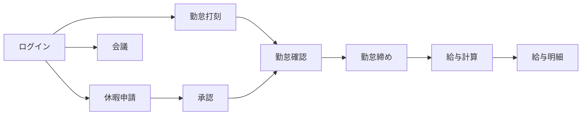

<p>
  <a href="./README.md"><strong>JP</strong></a>
  ·
  <a href="./README.en.md">EN</a>
  ·
  <a href="./README.vi.md">VI</a>
</p>

# Web HRM 利用ガイド

> バージョン: 2.3  
> 対象: HRM システム利用者・管理者  
> 対象範囲: FE `tmv-hrm`, BE `tmv-hrm-be`  
> Webサイト: [https://hrm.tamada.vn/](https://hrm.tamada.vn/)  
> 問題報告: [https://github.com/tamada-chinhhv/tmv-hrm-docs/issues/new](https://github.com/tamada-chinhhv/tmv-hrm-docs/issues/new)

---

## クイックスタート

HRM を初めて使う場合は、次の 5 ステップを順に実行してください。

1. **ブラウザを開き** [https://hrm.tamada.vn/login](https://hrm.tamada.vn/login) にアクセスする。
2. **ログイン** — HR から渡された ユーザー名 と パスワード（初期パスワードは多くの場合 ユーザー名 と同じ）。
3. **パスワード変更**（推奨）— 画面上部の自分の名前 → **パスワード変更**。
4. **勤怠打刻** — メニュー **勤怠・休暇** → **勤怠** → **出勤** / **退勤**（Web: ブラウザの **位置情報/GPS** を許可。モバイルアプリ: 拠点が WiFi 設定の場合は **会社 WiFi** に接続 — [セクション 8.1](#81-仕組み)）。
5. **個人カレンダー** — メニュー **カレンダー** → 自分の列を選択 → 空き時間をクリックして会議を作成（必要な場合）。

**期待される結果:** ログインでき、権限に応じたメニューが表示され、打刻とカレンダーの基本操作ができる。

---

## 目次

1. [HRM システムの概要](#1-hrm-システムの概要)
2. [利用前の要件](#2-利用前の要件)
3. [アカウントとログイン](#3-アカウントとログイン)
4. [従業員管理](#4-従業員管理)
5. [カレンダーとスケジュール](#5-カレンダーとスケジュール)
6. [ロールと権限](#6-ロールと権限)
7. [機能別ガイド](#7-機能別ガイド)
8. [勤怠](#8-勤怠)
9. [休暇申請](#9-休暇申請)
10. [勤怠・休暇レポート](#10-勤怠休暇レポート)
11. [推奨運用手順](#11-推奨運用手順)
12. [よくある質問（FAQ）](#12-よくある質問faq)
13. [引き渡しチェックリスト](#13-引き渡しチェックリスト)

---

## 1. HRM システムの概要

### 1.1 HRM とは

**HRM**（人事管理）は、従業員情報・勤怠・休暇・給与・会議スケジュール・システム設定を一つの Web システムで扱うためのツールです。

主な用途:

- 出退勤の記録（出勤 / 退勤）
- 休暇申請の作成と承認
- 従業員・部署・役職の管理
- 会議の予定作成と参加者招待
- 給与明細の参照・計算（権限による）
- 休日・打刻拠点・ロールの設定（管理者向け）

### 1.2 利用者

| 利用者 | システム上の位置づけ | 主な作業 |
|--------|---------------------|----------|
| **管理者 / HR** | `ADMIN` または十分な管理権限 | 従業員作成、権限付与、休日・拠点設定、給与運用 |
| **マネージャー** | `EMPLOYEE_VIEW` があり部下（`manager`）がいる | チーム勤怠の確認、休暇承認（`LEAVE_APPROVE` がある場合） |
| **一般従業員** | `EMPLOYEE` ロール（割り当て時） | 打刻、休暇申請、自分の給与確認、会議参加 |

> **補足:** 各従業員には **1 つのロール** が紐づきます。メニューや操作可否は、そのロールに付与された **権限コード** で決まります。

### 1.3 主なモジュール

| メニュー | 機能 | URL |
|----------|------|-----|
| **概要** | ダッシュボード | `/dashboard` |
| **アカウント** | 個人プロフィール・外観（色・フォント・ライト/ダーク） | `/account`（タブ **情報** / **設定**） |
| **カレンダー** | 複数従業員の会議カレンダー | `/calendar` |
| **組織** | 従業員, 部署, 役職, 書類 | `/org/employees`, `/org/departments`, `/org/positions`, `/org/documents` |
| **勤怠・休暇** | 勤怠, 勤怠一覧, 休暇申請, 休暇申請の承認 | `/time/attendance`, `/time/attendance-tracking`, `/time/leave`, `/time/leave-approvals` |
| **給与** | 給与明細・税設定 | `/payroll` |
| **システム設定** | 休日・拠点・勤務シフト・権限割り当て（タブ: 割当 + 権限グループ）・書類期限通知 | `/sysConfig/holidays`, `/sysConfig/locations`, `/sysConfig/settings`, `/sysConfig/assign`（権限グループは `?tab=roles`；`/sysConfig/roles` はリダイレクト）、`/settings/document-notifications` |

メニューは **権限に応じて表示** されます。項目が見えない場合は [セクション 6](#6-ロールと権限) を参照してください。

### 1.4 業務フロー概要



---

## 2. 利用前の要件

### 2.1 対応ブラウザ

**最新版に近い** ブラウザを使用してください（PC・スマートフォン）。

| ブラウザ | 推奨 |
|----------|:----:|
| Google Chrome | ○ |
| Microsoft Edge | ○ |
| Mozilla Firefox | ○ |
| Safari | ○ |

**位置情報による打刻:** システムは **拠点半径内の GPS** または **オフィス WiFi（BSSID 一致）** のいずれか一方で検証します。**Web** ではブラウザの **位置情報** 許可が必要です。ブラウザは WiFi BSSID を読めないため、Web 打刻は GPS のみです。**モバイル**（連携時）は端末から `wifi.ssid` と `wifi.bssid` を送信します。

**期待される結果:** ページが開き、ログインフォームが表示される。

### 2.2 必要なアクセス

| 要件 | 説明 |
|------|------|
| **HRM アカウント** | HR/管理者が従業員登録時に作成 |
| **ユーザー名 / パスワード** | 初回は HR/IT から配布 |
| **ロールと権限** | メニューと操作範囲を決定 |
| **ネットワーク** | 下記 URL に到達できること |

新規従業員は **自己登録不可** — 事前に HR がプロフィールを作成する必要があります。

### 2.3 ログイン URL

| 環境 | URL |
|------|-----|
| **本番** | [https://hrm.tamada.vn/](https://hrm.tamada.vn/) |
| **ログイン画面** | [https://hrm.tamada.vn/login](https://hrm.tamada.vn/login) |

ログイン成功後は **勤怠**（`/time/attendance`）または、ログイン前に開こうとしていたページへ遷移します。

---

## 3. アカウントとログイン

### 3.1 ログイン手順

1. ブラウザを開く。
2. **https://hrm.tamada.vn/login** にアクセス。
3. フォームに入力:
   - **ユーザー名** — メールや従業員コード（`EMP001` 等）ではありません。
   - **パスワード** — 目のアイコンで表示/非表示を切り替え可能。
4. **ログイン** をクリック。
5. 成功するとメイン画面（多くは勤怠）へ。失敗時はフォーム上にエラー表示。

**ログインフォームの項目:**

| 項目 | 説明 |
|------|------|
| **ユーザー名** | 必須 |
| **パスワード** | 必須（ログイン時は最低 6 文字） |
| **ログイン** | 送信 |
| 言語切替 | 画面上部 |

**フォームにないもの:** メール欄、「パスワードを忘れた」、ログイン状態の保持。

### 3.2 ユーザー名 の自動生成ルール

従業員 **新規作成** 時、**氏名** から ユーザー名 を提案します（メール・従業員コードは使用しません）。

**処理手順:**

1. 前後の空白を除去
2. **小文字** に変換（大文字小文字は区別しません）
3. ベトナム語などの **発音記号を除去**（**đ** → **d**）
4. `a–z`, `0–9` 以外を削除

**例:**

| 氏名 | 提案 ユーザー名 |
|------|---------------|
| Nguyễn Văn An | `nguyenvanan` |
| Trần Thị Lan | `tranthilan` |
| Lê Văn Đức | `levanduc` |

**従業員コード**（`EMP001` …）は保存時に自動採番 — ログインには使用しません。

#### ユーザー名 が既に存在する場合

**自動で末尾に数字は付きません**（`nguyenvanan1` 等は生成されない）。

- 保存時に重複 → **ユーザー名 "…" already exists**
- HR が手動で ユーザー名 を変更してから保存（例: `nguyenvanan2`）

#### 制限

| ルール | 内容 |
|--------|------|
| 長さ | 1〜50 文字 |
| 使用可能文字 | 正規化後は `a–z`, `0–9` のみ |
| 大文字小文字 | 区別しない（小文字で保存） |
| 作成後の変更 | **不可** |

### 3.3 初期パスワード

| 質問 | 回答 |
|------|------|
| 初期パスワードは？ | **ユーザー名 と同じ** |
| 生成ルール | 作成時に別パスワードを入力しなければ ユーザー名 を使用 |
| 初回ログイン時の強制変更 | **なし** |
| 本番システム管理者 | 初回 `admin` / `admin123` — デプロイ後に backend が自動作成/復元（`ensure-system-admin.mjs`）。ログイン後**直ちにパスワード変更** |

### 3.4 パスワード変更

1. 画面上部の自分の名前 → **パスワード変更**
2. 現在のパスワード、新しいパスワード、確認を入力
3. **パスワード更新**

**新パスワード条件:** 8 文字以上、大文字・小文字・数字・記号を各 1 文字以上（例: `Abcdef1!`）。

**想定結果:** 変更成功後も**現在のブラウザではログイン状態を維持**。次回から新しいパスワードを使用。他のタブ・端末は再ログインが必要な場合あり。

### 3.5 パスワードを忘れた場合

ログイン画面に **パスワードを忘れた** はありません。

| 担当 | 対応 |
|------|------|
| HR/管理者（`EMPLOYEE_UPDATE`） | 従業員詳細 → **パスワードをリセット** → ユーザー名 と同じ値に戻る。従業員は**全端末で再ログイン**が必要 |
| 従業員 | HR/IT に連絡 |

### 3.6 ログアウト

名前メニュー → **ログアウト** → 確認。

### 3.7 システム `admin` アカウント（保護）

本番では常に **`admin`**（ADMIN、全権限）が存在。`ensure-system-admin.mjs` が migration 後に自動実行。

- `admin` の削除・HR による **パスワードをリセット**・ロール変更・他ユーザーによる編集: **不可**
- `admin` の **パスワード変更**（自己変更）: **可** — 再デプロイでも `admin123` に戻さない
- **ADMIN** ロールの付与・ADMIN ロール権限の編集: **`admin` のみ**
- ユーザー名 `admin` は **予約済み**

---

## 4. 従業員管理

> `EMPLOYEE_CREATE` / `EMPLOYEE_UPDATE` / `EMPLOYEE_DELETE` を持つ HR/管理者 向け。

### 4.1 新規従業員作成手順

1. 作成権限のあるアカウントでログインする。
2. **組織** → **従業員**（`/org/employees`）— `EMPLOYEE_VIEW` が必要。
3. **従業員を追加** をクリック。
4. フォームを入力する（下表）。
5. **ユーザー名** を確認する（氏名から自動入力 — 保存前に編集可）。
6. 必要なら **権限グループ** を選択する（未選択 = ロール未割当）。
7. **保存** / **追加** をクリック。
8. 従業員一覧に戻る。従業員コード（`EMP…`）は自動採番される。

**期待される結果:** 新従業員が一覧に表示され、ユーザー名 と初期パスワード（= ユーザー名）でログインできる。

#### フォーム項目

| 項目 | 必須 | 形式 / 備考 |
|------|:----:|-------------|
| **氏名** | ○ (*) | 最大 100 文字。作成中に氏名を変えると ユーザー名 が再提案される |
| **メール** | — | 正しいメール形式。既存と重複不可 |
| **電話番号** | — | |
| **市民ID** | — | |
| **部署** | — | 役職より先に選択 |
| **役職** | — | 部署選択後に有効化 |
| **生年月日** | — | DatePicker — 保存形式 **YYYY-MM-DD**（例: 1990-05-15） |
| **性別** | — | 男性 / 女性 / その他 |
| **住所** | — | |
| **扶養人数** | — | 整数 0–99 |
| **年間休暇日数** | — | 数値 ≥ 0 |
| **残休暇日数** | — | 数値 ≥ 0 |
| **入社日** | ○ (*) | 既定は当日。**YYYY-MM-DD** |
| **契約種別** | — | Full-time、Probation など |
| **ステータス** | — | 既定 **ACTIVE**。ほか **INACTIVE** / **TERMINATED** |
| **ユーザー名** | ○ (*) | 氏名から自動。**保存前**のみ編集可 |
| **権限グループ** | — | 例: `EMPLOYEE`, `HR_MANAGER` — **`ADMIN` は `admin` のみ付与可** |
| **勤怠管理の対象外** | — | 管理者のみ — 勤怠一覧 グリッドと Excel 出力から除外 |
| **上司** | — | 有効な従業員のみ |
| **アバター** | — | 画像アップロード |

> **警告 — 日付:** UI はカレンダー選択。DB には **YYYY-MM-DD** で保存（DD/MM/YYYY ではない）。

> **警告 — ユーザー名:** 作成後は変更不可。保存前に必ず確認する。

### 4.2 作成時の自動処理

| 項目 | システム動作 |
|------|--------------|
| **従業員コード** | 自動: `EMP001`, `EMP002`, … |
| **ユーザー名** | 氏名から提案 — [セクション 3.2](#32-username-の自動生成ルール) |
| **パスワード** | ユーザー名 と同じ（DB にハッシュ保存） |
| **ウェルカムメール** | **送信しない** — HR が社内チャネルで認証情報を共有 |
| **既定ロール** | HR が選ばなければ **未割当** — 一般社員には `EMPLOYEE` を推奨 |
| **ステータス** | 既定 **ACTIVE** |

### 4.3 よくあるエラー

| エラー | 原因 | 対処 |
|--------|------|------|
| **ユーザー名 already exists** | ユーザー名 重複 | ユーザー名 を編集（接尾辞追加）して再保存 |
| **必須項目が未入力** | 氏名・入社日・ユーザー名 が空 | (*) 項目をすべて入力 |
| **メールが既に存在します** | メール重複 | 別メールを使うか空欄にする |
| **役職は部署に属している必要があります** | 選択部署に属さない役職 | 部署/役職を選び直す |
| **権限が不足しています** | `EMPLOYEE_CREATE` 不足 | 管理者に **権限割り当て** で権限付与を依頼 |

### 4.4 作成後の編集

1. **組織** → **従業員** → 対象者を開く。
2. **編集**（`/org/employees/{id}/edit`）。
3. 項目を更新（**ユーザー名** はロック）。
4. **保存**。

**自己編集プロフィール:** **アカウント**（`/account`）→ タブ **情報**（またはユーザーメニュー → **アカウント**）— 個人項目のみ（部署・ロール・ユーザー名 は変更不可）。タブ **設定**: テーマ色・フォント・ライト/ダーク — ユーザー単位で保存し、他端末ログイン時に同期。

**管理者のパスワードリセット:** 従業員詳細 → **パスワードをリセット** → 確認 → パスワード = ユーザー名。**`admin` には適用されない**。

**勤怠管理の対象外:** 管理者が従業員フォームのチェックを有効化 — その従業員は **勤怠一覧** と勤怠 Excel から除外。ロール `ADMIN` は常に勤怠一覧の対象外。

### 4.5 退職時

削除よりステータス変更を推奨:

1. 従業員を編集する。
2. **ステータス** を **TERMINATED** または **INACTIVE** にする。
3. 保存する。

**削除**（`EMPLOYEE_DELETE`）: DB から**完全削除** — 関連する勤怠・給与・カレンダーに影響しうる。可能な限りステータス変更を使う。**`admin` アカウントは削除不可**。

---

## 5. カレンダーとスケジュール

### 5.1 概要

**カレンダー** は従業員間の **会議・イベント** 予定用です。忙しい時間の確認、会議作成、参加者招待、変更時のアプリ内通知ができます。

**混同しないもの:**

- **勤怠一覧** の月次勤怠グリッド。
- **休日・祝日設定** の会社休日設定。

**スケジュールカレンダー上のイベント種別:**

| 種別 | 説明 |
|------|------|
| **会議 / イベント** | タイトル、時刻、場所、主催者、参加者 |
| **繰り返しシリーズ** | 稼働日、週次曜日、または選択日付 |

> カレンダー ページの凡例チップ（Meeting / Leave / Holiday）は参考表示です。時間グリッドに出るのは主に **会議** のみ。休暇・祝日は他モジュールで管理します。

### 5.2 カレンダーの見方

1. **カレンダー** メニュー → `/calendar`。
2. 表示する **従業員を選択**（既定は自分。複数選択・部署単位可）。
3. 従業員ごとに **1 列** — イベントは主催者または参加者の列に表示。

**表示モード:**

| 表示 | 説明 |
|------|------|
| **週** | 既定 — 週グリッド |
| **日** | 1 日を時間単位で表示 |
| **月** | 現行バージョンでは **未実装** |

**ナビゲーション:**

| 操作 | 動作 |
|------|------|
| **前へ / 次へ** | 前/次の週または日 |
| **今日** | 今日へジャンプ |
| **DatePicker** | 任意日へジャンプ |

**色:**

- 各 **従業員列** に固有色。
- **イベント枠** は **主催者** の色。

### 5.3 会議の作成

**方法 1 — 空きスロットをクリック**

1. **自分の列** のみ（他人の列では作成不可）。
2. 時間範囲をクリック → 日付/時刻が事前入力されたフォームが開く。

**フォーム手順:**

1. **タイトル** — 必須。
2. **参加者** — 自分を含める。氏名で同僚を追加（有効な全従業員）。
3. **日付**、**開始時刻**、**終了時刻** — 終了は開始より後。
4. **位置情報** — 任意。
5. **繰り返し** — 任意（[セクション 5.4](#54-繰り返し)）。
6. **保存**。

**Organizer:** 常に **自分** — フォーム上で他者を主催者に指定できない。

**期待される結果:** 会議がカレンダーに表示され、招待者に **アプリ内通知**（ベル）が届く。

### 5.4 繰り返し

作成時に **繰り返し** を有効化（フォーム上での繰り返しルール編集は非対応 — 後から occurrence を編集/削除）。

| モード | 意味 |
|--------|------|
| **稼働日** | 稼働日に繰り返し（休日設定の会社休日を除く） |
| **毎週の曜日** | 毎週の選択曜日（月–日） |
| **選択日付** | 特定日付を選択 |

表示週から約 **12 週間** 分の occurrence を生成（シリーズに終了日がない場合は延長あり）。

### 5.5 権限

原則: **作成者が管理**。**招待者は Leave 可**。**`CALENDAR_VIEW`**（seed/migrate 後の `EMPLOYEE` 既定）があれば他人のカレンダーを **閲覧** して会議調整できる。メニュー **カレンダー**（`/calendar`）には `CALENDAR_VIEW` が必要。

#### Organizer（主催者）

| 操作 | 可？ | 理由 |
|------|:----:|------|
| 自分のイベント閲覧 | 可 | 詳細が必要 |
| タイトル・時刻・場所・参加者の編集 | 可 | 変更は所有者のみ |
| グリッド上のドラッグリサイズ | 可（自分の列） | 素早い調整 |
| 1 occurrence またはシリーズ全体の削除 | 可 | 自分の会議をキャンセル |
| **会議を退出** | **不可** | 代わりにイベントを **削除** |

#### Participant（参加者）

| 操作 | 可？ | 理由 |
|------|:----:|------|
| 詳細閲覧 | 可 | 時刻と場所が必要 |
| イベントの編集/削除 | **不可** | 他人の予定を保護 |
| **会議を退出** | 可 | イベントを消さずに辞退 — **理由必須**（主催者へ送信） |
| 追加招待 | **不可** | リストは主催者が管理 |
| Outlook 風 承認/辞退 | **不可** | **会議を退出** + 通知を使用 |

#### 管理者 / HR

| 操作 | 可？ | 備考 |
|------|:----:|------|
| 誰のカレンダーでも閲覧 | 可 | 認証済みユーザーと同様 |
| 他人の会議の編集/削除 | **可**（`CALENDAR_EDIT_ANY` が必要） | `ADMIN` に既定付与。他ロールは **権限グループ & permissions** で付与 |
| カレンダー上の「全社員表示」 | 可（任意） | `CALENDAR_MANAGE` — **カレンダー** ページのスイッチ |

> **まとめ:** `CALENDAR_EDIT_ANY`（通常 Admin）があれば運用支援のため他人の会議を編集/削除できる。一般ユーザーは自分が主催するイベントのみ変更可。

### 5.6 通知とリマインダー

| トリガー | 通知先 |
|----------|--------|
| 新規会議への招待 | 参加者（主催者以外） |
| 参加者リストから削除 | 削除された人 |
| 参加者が **退出** | 主催者 |
| 主催者が 1 occurrence を **削除** | 残りの参加者 |
| 主催者がシリーズ全体を **削除** | 残りの参加者 |

**配信:** 画面上部の **ベル**。IT がサーバーに VAPID を設定していれば **Web Push**。

**会議開始前リマインダー:** **あり** — 開始約 **15 分前**にスケジューラが通知（cron 5 分間隔、タイムゾーン `Asia/Ho_Chi_Minh`）。対象: 主催者と参加者。表示時刻はカレンダーグリッドと一致（§5.8）。

### 5.7 操作まとめ

| 操作 | 方法 |
|------|------|
| 詳細 | グリッド上のイベントをクリック |
| 編集 | 詳細 → **編集**（主催者、または `CALENDAR_EDIT_ANY`） |
| 削除 | 詳細 → **削除** → **単一** または **シリーズ全体** |
| 辞退 | 詳細 → **会議を退出** → 理由入力 → 確認 |

### 5.8 タイムゾーンと表示時刻

| 項目 | 規約 |
|------|------|
| 業務タイムゾーン | **`Asia/Ho_Chi_Minh`**（UTC+7） |
| API/DB 保存 | **VN 壁時計を UTC スロットに保存** — 例: 09:00 VN の会議 → `startAt`: `…T09:00:00.000Z` |
| グリッドとダイアログ（Web） | `startAt`/`endAt` の **UTC 成分**を表示時刻として読む |
| 通知 / リマインダー（BE） | 同じ契約 — `formatVietnamStorageDateTime`（`src/shared/vietnam-storage.util.ts`） |
| リマインダー発火時刻 | 実 VN instant（`vietnamStorageDateToInstant`）に変換してから 15 分窓と比較 |

**期待される結果:** グリッド、詳細ダイアログ、リマインダー通知の時刻が **一致**。表示時に余分な +7h オフセットが付かない。

---

## 6. ロールと権限

### 6.1 組み込みロール

| コード | 表示名 | 典型ユーザー | 概要 |
|--------|--------|--------------|------|
| `ADMIN` | Administrator | IT / HR 責任者 | seed の全権限 |
| `HR_MANAGER` | HR Manager | HR 担当 | ロールは存在。**管理者が権限を付与**（seed では未割当） |
| `EMPLOYEE` | Employee | 一般社員 | 基本: 打刻、休暇閲覧、自分の給与明細 |

各従業員は同時に **1 つ**の `roleId` のみ。

### 6.2 権限マトリクス（参考）

- **Admin** = `ADMIN` ロール（seed の全権限）。
- **HR** = 通常 `HR_MANAGER` + 管理者が付与した権限。
- **Manager** = `EMPLOYEE_VIEW` + `managerId` 経由の直属/間接部下。
- **Employee** = 既定の `EMPLOYEE` ロール。

| 機能 | Admin | HR* | Manager | Employee |
|------|:-----:|:---:|:-------:|:--------:|
| 従業員作成 | 可 | 可* | 不可** | 不可 |
| 従業員更新 | 可 | 可* | 不可** | アカウント → 情報（限定） |
| 従業員削除 | 可 | 可* | 不可 | 不可 |
| 従業員閲覧 — 全社 | 可 | 可* | 不可 | 不可 |
| 従業員閲覧 — チーム | 可 | 可* | 可*** | 不可 |
| 従業員閲覧 — 自分のみ | 可 | 可 | 可 | 可 |
| 他人のパスワード reset | 可 | 可* | 不可 | 不可 |
| 他人の会議編集/削除 | 可* | 可* | 不可 | 不可 |
| 自分の会議編集/削除 | 可 | 可 | 可 | 可 |
| 他人のカレンダー閲覧 | 可 | 可 | 可 | 可 |
| 自分の勤怠 | 可 | 可 | 可 | 可 |
| チーム勤怠トラッキング | 可 | 可* | 可*** | 不可 |
| 休暇承認 | 可 | 可* | 可***** | 不可 |
| 給与の閲覧/管理 | 可 | 可* | 権限による | 自分の閲覧 |
| 部署/役職設定 | 可 | 可* | 不可 | 不可 |
| 休日 / オフィス拠点 | 可 | 可* | 不可 | 不可 |
| ロールと権限割当 | 可 | 可* | 不可 | 不可 |

\* 対応する permission コードが必要。  
\** 管理者が追加権限を付与した場合を除く。  
\*** Manager = `EMPLOYEE_VIEW` + 報告サブツリー。  
\**** カレンダー API の編集/削除: **主催者** または **`CALENDAR_EDIT_ANY`**。  
\***** `LEAVE_APPROVE` が必要。

### 6.3 スコープ

**Admin（`roleCode = ADMIN`）:** 全従業員の一覧と管理。

**Manager（`EMPLOYEE_VIEW`、Admin 以外）:** **報告サブツリー**内の従業員のみ（`managerId` 経由の直属・間接部下）。

**一般従業員（`EMPLOYEE_VIEW` なし）:** 従業員 API は **自分のみ** を返す。カレンダー用 **directory**（`/employees/directory`）は会議招待のため有効従業員を一覧 — 完全な人事レコードではない。

### 6.4 ロール割当

| 質問 | 回答 |
|------|------|
| 誰が割当できる？ | `EMPLOYEE_UPDATE` を持つユーザー（通常 Admin/HR） |
| どこで？ | **組織 → 従業員** → 作成/編集 → **ロール** フィールド |
| 複数ロール？ | **不可** — 従業員あたり 1 ロール |
| **ADMIN** ロールの付与？ | ユーザー名 **`admin` のみ** |
| **ADMIN** ロール権限の編集？ | ユーザー名 **`admin` のみ** — システムは常に ADMIN に全権限を付与 |
| 権限の割当は？ | **システム設定 → 権限割り当て**（`/sysConfig/assign`） |

**ロール権限の手順:**

1. **システム設定 → 権限グループ** — ロールの作成/閲覧（`ROLE_VIEW` / `ROLE_MANAGE`）。
2. **システム設定 → 権限割り当て** — ロールを選択 → 権限にチェック → 保存。
3. 従業員フォームでその **ロール** を各従業員に割当。

**期待される結果:**

- **ロールの permission 変更**（手順 1–2）: ユーザーは**ログアウトされない**。次の API 呼び出しでメニュー・操作が更新（リロードやタブ切替でも可）。
- **従業員に割り当てるロール変更**（手順 3）: その従業員は全デバイス/タブで**再ログイン**が必要。
- **ロールを変えずに従業員プロフィールを保存:** その従業員のセッションには影響しない。

### 6.5 権限コード一覧

| コード | 意味 |
|--------|------|
| `EMPLOYEE_VIEW` | 従業員閲覧（スコープ付き） |
| `EMPLOYEE_CREATE` | 従業員作成 |
| `EMPLOYEE_UPDATE` | 従業員更新、パスワード reset |
| `EMPLOYEE_DELETE` | 従業員削除 |
| `ATTENDANCE_VIEW` | 勤怠閲覧 / 打刻 |
| `ATTENDANCE_EXPORT` | 労働時間詳細 Excel 出力（勤怠一覧） |
| `ATTENDANCE_MANUAL_UPDATE` | 手動時刻修正 |
| `LOCATION_VIEW` / `LOCATION_MANAGE` | オフィス拠点の閲覧 / 管理 |
| `LEAVE_VIEW` | 休暇申請の閲覧/作成（OT 種別含む） |
| `LEAVE_APPROVE` | 休暇承認 |
| `LEAVE_APPROVE_MANAGED` | 管理下従業員の休暇承認（割当 UI では `LEAVE_APPROVE` の子） |
| `LEAVE_DELETE_APPROVED` | **休暇申請の承認** 上の **承認済み**申請削除（既定: ADMIN）。`LEAVE_APPROVE` / `LEAVE_APPROVE_MANAGED` の承認者も、決定可能な **APPROVED** 行を削除可 |
| `CALENDAR_VIEW` | カレンダー閲覧、自分のイベント作成/編集 |
| `CALENDAR_MANAGE` | 全社カレンダー管理スイッチ |
| `CALENDAR_EDIT_ANY` | 他従業員が所有するカレンダーイベントの編集/削除（既定: ADMIN） |
| `DOCUMENT_VIEW` | 閲覧 + 自分の従業員書類の作成・編集・削除；HR はすべて閲覧可 |
| `DOCUMENT_MANAGE` | 組織全体の書類の作成・編集・削除 + 期限切れ通知ルールの設定 |
| `PAYROLL_VIEW` | 給与明細閲覧 |
| `PAYROLL_MANAGE` | 給与管理/計算、税設定 |
| `PAYROLL_PERIOD_LOCK` | 給与期間のロック/解除 |
| `DEPARTMENT_VIEW` / `DEPARTMENT_MANAGE` | 部署 |
| `POSITION_VIEW` / `POSITION_MANAGE` | 役職 |
| `ROLE_VIEW` / `ROLE_MANAGE` | ロールと権限 |
| `HOLIDAY_CONFIG_VIEW` / `HOLIDAY_CONFIG_EDIT` | 休日設定 |
| `APPEARANCE_VIEW` / `APPEARANCE_EDIT` | **システム外観**の閲覧/編集（`/sysConfig/settings`） |
| `WORK_SHIFT_VIEW` / `WORK_SHIFT_EDIT` | デフォルト勤務シフトの閲覧/編集（`/sysConfig/settings`） |

> **システム外観**（全社既定）: `app_settings` に保存 — 管理者が **システム設定 → 設定** で設定。API `GET/PATCH /settings/appearance`（`APPEARANCE_*`）。**ログイン**と**ログアウト後**は常にシステム外観（`GET /settings/public/appearance`）。  
> **個人外観:** ログイン済みユーザー — **アカウント** → タブ **設定**。`GET/PATCH /auth/me/appearance`。ユーザーが保存した場合のみ上書き（`appearance_customized = true`）。  
> `OVERTIME_*` と `ATTENDANCE_MANAGE` は **削除済み** — 再割当しない。

---

## 7. 機能別ガイド

### 7.0 アカウント（`/account`）

ログイン済みユーザー全員が利用可能（サイドバー **アカウント** またはユーザーメニュー）。

| タブ | 内容 |
|------|------|
| **情報** | 自分のプロフィール（氏名・メール・電話など。ユーザー名・部署・ロールは変更不可） |
| **設定** | 外観: ライト/ダーク（即時保存）、テーマ色・フォント（**保存** でサーバー同期） |
| **書類** | 自分の従業員書類のセルフ管理（`DOCUMENT_VIEW` が必要）— 詳細は [セクション 7.2.1](#721-書類-orgdocuments) |

- 設定: `/account?tab=settings`
- 書類: `/account?tab=documents`
- ヘッダーのライト/ダーク切替も個人設定として保存（カスタム済みになる）
- 未保存時は**システム外観**を使用。保存またはテーマ切替後は個人設定を優先
- `EMPLOYEE_VIEW` のないユーザーが **従業員** を開くと **アカウント** へリダイレクト

### 7.1 概要

ダッシュボード指標（一部は `EMPLOYEE_VIEW` / `LEAVE_VIEW` が必要）。

### 7.2 部署 / 役職

部署は親子ツリー。役職の **Level** は数値が小さいほど上位。

### 7.2.1 書類 (`/org/documents`)

**従業員**および**会社**の書類（PDF）を管理します。有効期限あり（自動リマインダー付き）、または**無期限**に対応します。

| 権限 | できること |
|------|------------|
| `DOCUMENT_VIEW` | 閲覧 + 自分の従業員書類の作成・編集・削除（`/account?tab=documents`）；HR はすべて閲覧可 |
| `DOCUMENT_MANAGE` | 組織全体の作成・編集・削除（任意の書類）、PDF アップロード、通知ルールの設定 |

**書類を追加（HR）:**

1. メニュー **組織** → **書類** → **書類を追加**。
2. 所有者タイプを選択: **従業員** または **会社**（会社の場合は従業員を選びません）。
3. PDF をアップロード — システムが **有効期限** の読み取りを試み、（従業員の場合）**氏名 + 生年月日** で従業員を照合します。
4. 有効期限あり: 日付を確認・修正し、期限前の通知を **1 / 3 / 7 / 30** 日（既定 30）から選択。**無期限（有効期限なし）:** チェックを入れると有効期限の入力とリマインダー送信を行いません。
5. **追加** で保存。

**従業員セルフサービス:** タブ **アカウント → 書類** — **自分の**従業員書類のみ作成・編集・削除可（会社書類は作成不可。通知ルールはデフォルトを使用）。

**通知先の設定:** **設定** → **書類通知**（`/settings/document-notifications`）— 対象部署と通知受信者を選択。対応オプションが有効な場合、書類所有者も通知を受け取れます。

**リマインダー:** 平日 07:00（ベトナム時間）の cron が選択した日数のタイミングで通知を送信。期限切れ書類は更新/削除まで毎日リマインド。**無期限**の書類はリマインダー cron の対象外です。

### 7.3 勤怠・休暇・レポート

詳細は [セクション 8](#8-勤怠)、[セクション 9](#9-休暇申請)、[セクション 10](#10-勤怠休暇レポート) を参照。

### 7.4 給与

- `PAYROLL_VIEW`: 給与明細の閲覧（自分または設定に応じた範囲）、給与期間ステータスの参照。
- `PAYROLL_MANAGE`: 作成・再計算・税設定・明細管理。
- `PAYROLL_PERIOD_LOCK`: **給与期間のロック/解除**（`PAYROLL_MANAGE` でも可。期間ロックを含む）。
- **給与期間（`PayrollPeriod`）:** 既定は **未ロック**。HR が **給与** 上で **期間をロック**（`PayrollPeriodControls`）→ ステータス **ロック済み**。ロック中は明細の作成/編集/インポート/コピー不可（API `PAYROLL_PERIOD_LOCKED`）。閲覧と Excel 出力は可能。**ロック解除** には `PAYROLL_MANAGE` または `PAYROLL_PERIOD_LOCK` が必要（解除時に理由必須）。期間ロックは**給与操作のみ**を止めます — 勤怠・休暇は引き続き編集可（[セクション 10.4](#104-月末照合hr) 参照）。

### 7.5 システム設定

- **休日・祝日設定:** `HOLIDAY_CONFIG_VIEW` / `HOLIDAY_CONFIG_EDIT` — `/sysConfig/holidays`。
- **勤務地設定:** `LOCATION_VIEW` / `LOCATION_MANAGE` — `/sysConfig/locations`。各 **active** 拠点は **GPS** または **active WiFi が 1 件以上**必須（GPS のみ / WiFi のみ / 両方可）。[セクション 7.5.1](#751-拠点設定gps--wifi) 参照。
- **システム外観:** `APPEARANCE_VIEW` / `APPEARANCE_EDIT` — **システム設定 → 設定**（`/sysConfig/settings`、**表示設定** アコーディオン）。個人カスタム未設定のユーザーとログイン画面に適用。
- **勤務シフト（全社）:** `WORK_SHIFT_VIEW` / `WORK_SHIFT_EDIT` — 同ページ `/sysConfig/settings`、**勤務シフト** アコーディオン。
- **権限割り当て（割当 + 権限グループ）:** `ROLE_VIEW` / `ROLE_MANAGE` — `/sysConfig/assign`（権限グループは `?tab=roles`；`/sysConfig/roles` は `?tab=roles` へリダイレクト）。

> **個人**外観はここでは設定しません — [セクション 7.0](#70-accountaccount) を参照。

### 7.5.1 拠点設定（GPS + WiFi）

**パス:** `/sysConfig/locations` — **勤務地の設定** ダイアログ。

| 項目 | 説明 |
|------|------|
| **有効** | 拠点の有効/無効。active 拠点は GPS または active WiFi ≥1 が必須。 |
| **GPS** | **GPSを有効** → 緯度・経度・半径（m）。GPS を無効にするとサーバー上の座標がクリアされる。 |
| **WiFi** | アクセスポイントごと: **SSID**（表示名）+ **BSSID**（AP の MAC、必須）。同一 SSID を複数 AP で共有可。ネットワークごとの **有効** スイッチ。 |
| **現在のWiFiを使用** | `GET /office-locations/wifi/current`（`LOCATION_MANAGE`）。**backend が動いているマシン**の WiFi を読む（Windows `netsh` / Linux `nmcli`）— オフィス網に接続した PC から管理者が設定する用途。 |

**SSID と BSSID:**

- **SSID** — ネットワーク名（複数 AP で重複しうる）。
- **BSSID** — 各 AP の MAC。**打刻照合は BSSID** を使い、SSID 単独では照合しない。
- 従業員の打刻 UI に BSSID は表示されない。設定は管理者のみ。

**設定 API エラーコード:** `OFFICE_METHOD_REQUIRED`, `GPS_ENABLED_INCOMPLETE`, `WIFI_BSSID_INVALID`, `WIFI_BSSID_ALREADY_EXISTS`（同一拠点内の BSSID 重複）。

---

## 8. 勤怠

### 8.1 仕組み

| 項目 | 内容 |
|------|------|
| 方式 | **Web** — 出勤/退勤 + **GPS**。**モバイル API** — GPS および/または **WiFi**（`wifi.bssid`）。ハードウェア打刻機は**なし**。 |
| ジオフェンス | いずれかの active 拠点半径内の GPS **または** いずれかの **active** 設定 WiFi の BSSID 一致で合格 |
| ジオフェンス省略 | 当日の承認済み **REMOTE_WORK**、または active 拠点に GPS も active WiFi も未設定 |
| Web の制限 | Web は GPS のみ送信。**WiFi のみ**の拠点では、モバイルが `wifi` を送るか GPS を有効にするまで Web 打刻不可 |
| 時間単位 | 分で保存（`checkOut − checkIn`）。**WORK** / **LATE_EARLY** は **勤務シフト**（grace、昼休み、`expectedWorkingMinutes` / `workUnitLabel`）から判定 — 固定 9 時間ルールではない |
| 遅刻・早退 | 承認済み **`LATE_ARRIVAL`** / **`EARLY_DEPARTURE`** が評価閾値と **付与分**（実打刻＋申請カバー分、昼休み重複なし）を調整。承認は打刻時刻を**上書きしない** — 従業員は通常どおり打刻する |
| 再打刻 | 既に時刻がある場合の 2 回目 出勤/退勤 は既存レコードを返す（冪等）。WiFi 打刻に GPS は不要 |
| デプロイ後 | `tmv-hrm-be` で `yarn recompute-attendance` を実行し、保存済み `attendance.status` を新ルールに合わせる（`:dry-run` でプレビュー） |
| タイムゾーン | **`Asia/Ho_Chi_Minh`** |
| 勤怠一覧 の対象 | 勤怠必須の従業員 — ロール `ADMIN` と **勤怠管理の対象外** の従業員は除外 |
| 勤務シフト | **全社既定** を `/sysConfig/settings` で設定 — 従業員別ロスターなし。[8.7](#87-勤務シフトと勤務スケジュールtask-09) 参照 |

> **重要:** **LATE_EARLY** は設定された **勤務シフト**（開始/終了、grace、昼休み）と **期待労働分**（`workUnitLabel`）で評価され、固定 9h/540 分ルールではありません。承認済み **遅刻/早退申請**がある場合、閾値は **承認された** 到着/退勤時刻を使い、**付与分** = 実労働＋申請カバー分（昼休みの二重計上なし）。例: シフト 08:00–17:00、昼休み 60 分、09:30 までの遅刻承認、打刻 09:30–17:00 → **WORK**（7.5h + 1.5h credit）。打刻 10:00–17:00 → **LATE_EARLY**（承認に対し 30 分遅刻。シフト+grace との比較ではない）。

#### 打刻方式とジオフェンス規則

| 方式 | HRM で利用可？ | 詳細 |
|------|:--------------:|------|
| **Web 自己打刻** | **あり** | `/time/attendance` で 出勤 / 退勤。クライアントは GPS `location`（緯度/経度）を送信。 |
| **モバイル打刻 + WiFi** | **API あり** / アプリ連携は実装次第 | `POST /attendance/check-in|check-out` は `wifi: { ssid, bssid }` を受け付け、照合は BSSID。現行 Flutter アプリは `wifi` を送信しない。 |
| **物理打刻機** | **なし** | 指紋・カード・ZKTeco 等のハードウェア連携はコードベースに存在しない。 |

| ジオフェンス規則 | 詳細 |
|------------------|------|
| 合格 | GPS がいずれかの active 拠点半径内 **または** クライアント BSSID がいずれかの active 設定 WiFi と一致。 |
| スキップ | 当日に承認済み **`REMOTE_WORK`** がある。 |
| 検証なし | active 拠点に GPS も active WiFi も未設定 — 打刻は許可される。 |
| Web 制限 | Web は GPS のみ。**WiFi のみ**拠点ではモバイルが `wifi` を送るか GPS を有効にするまで Web 打刻不可。 |
| モバイル | 照合用に `wifi.bssid`（必須）と `ssid` を送信。 |

#### 労働単位と例

| 単位 | 用途 | 規則 |
|------|------|------|
| **分** | DB 保存とステータス計算 | `checkOutTime − checkInTime`。 |
| **シフト由来の労働単位** | WORK / LATE_EARLY 分類 | `expectedMinutes = (end − start) − lunchBreak`。十分な分かつ遅刻/早退違反なしで **WORK**。 |
| **日** | ダッシュボードの休暇集計 | 1 日あたり `expectedWorkingMinutes / 60` 時間。 |
| **シフト設定** | システム設定 | `work_shift_start_time`, `work_shift_end_time`, `grace_minutes`, `work_shift_lunch_break_minutes`。 |

| 出勤 | 退勤 | 合計分 | ステータス | Day モードグリッド |
|----------|-----------|--------|------------|-------------------|
| 08:00 | 17:00 | 540 | **WORK** | `1`（緑） |
| 08:15 | 17:15 | 540 | **WORK** | `1` |
| 08:00 | 16:30 | 510 | **LATE_EARLY** | `1`（黄） |
| 09:00 | 17:00 | 480 | **LATE_EARLY** | `1`（黄） |
| 08:00 | *(未 退勤)* | — | **FORGOT_CLOCK_IN** または **WORK**（ケースによる） | `F` または 出勤 のみ |
| *(打刻なし)* | *(打刻なし)* | — | チームグリッド: **ABSENT**（`A`）；過去の個人カレンダー: **FORGOT_CLOCK_IN**（`F`） | `A` / `F` |

#### 承認済み遅刻・早退申請

| 規則 | 詳細 |
|------|------|
| 実打刻 | 従業員は通常どおり 出勤/退勤。承認は打刻時刻を埋めたり上書きしたりしない。 |
| 遅刻閾値 | `startTime + grace` ではなく、承認された到着時刻と比較。 |
| 早退閾値 | `endTime − grace` ではなく、承認された退勤時刻と比較。 |
| Credit 分 | 実労働分＋申請カバー分。昼休み重複と二重計上を除く。 |
| WORK | 調整後閾値に違反がなく、付与分が `expectedWorkingMinutes` を満たす。 |

シフト 08:00–17:00、昼休み 60 分、労働単位 8 時間の場合: **09:30** までの遅刻承認＋打刻 09:30–17:00 は **WORK**（実働 7.5h + credit 1.5h）。打刻 10:00–17:00 は承認より 30 分遅いため **LATE_EARLY** のまま。遅刻承認は別の早退を免責しない。

**再打刻:** 時刻保存後の 2 回目 出勤/退勤 は既存レコードを返す（冪等）。WiFi 打刻に GPS は不要。

**デプロイ後:** `tmv-hrm-be` で `yarn recompute-attendance`（または `:dry-run`）を実行し、保存済み `attendance.status` を同期。

| 時間トピック | 値 |
|--------------|-----|
| 業務タイムゾーン | **`Asia/Ho_Chi_Minh`**（UTC+7） |
| 勤怠の「今日」 | ベトナム日付 |
| 表示する 出勤/退勤 | ベトナム時間（UTC スロット規約で保存） |

### 8.2 自己打刻

1. **勤怠**（`/time/attendance`）— **当月**のみ 出勤/退勤 ボタンが表示される。
2. 確認 → **位置情報** を許可 → GPS が設定拠点半径内であること（当日の承認済み **REMOTE_WORK** を除く）。WiFi 打刻は `wifi.bssid` を送るモバイルクライアント向け。
3. 出勤 後に 退勤。完了するとボタンは非表示。

**遅刻/早退申請が承認された日:** それでも **実際の** 時刻で打刻する。承認は **status の再計算のみ** — 出勤/退勤 を事前設定しない。

**打刻忘れ:** ステータス **FORGOT_CLOCK_IN** / グリッド **F** または **A**。2 回目の打刻、休暇種別（**LATE_ARRIVAL**, **EARLY_DEPARTURE**, **ATTENDANCE_CORRECTION**）、または **手動時刻**（`ATTENDANCE_MANUAL_UPDATE`）で修正。

サーバー側の打刻時間窓（例: シフト開始後 30 分）は**ありません**。

**詳細手順:**

1. **勤怠・休暇** → **勤怠**（`/time/attendance`）、または **概要** のクイック操作。
2. **当月**を選択。他月では打刻ボタンは非表示。
3. **出勤** → 確認 → ブラウザの **位置情報** を許可。
4. 成功すると緑のメッセージと、当日セルに 出勤 時刻が表示される。
5. 出勤 後に **退勤** → 同様に確認/位置検証。完了後ボタンは消える。

**ジオフェンス例外:** 承認済み **`REMOTE_WORK`** は GPS/WiFi をバイパス。拠点 GPS も active WiFi も未設定ならジオフェンスはスキップ。よくあるエラー: `GEO_LOCATION_OR_WIFI_REQUIRED`（GPS も WiFi もなし）、`OUTSIDE_OFFICE_AREA`（GPS/BSSID 不一致）。

| 打刻忘れの状況 | システム記録 | 対処 |
|----------------|--------------|------|
| 出勤 のみ | **FORGOT_CLOCK_IN**、または 退勤 のみ欠けるケースでは WORK | 当日中に 退勤。**EARLY_DEPARTURE** / **ATTENDANCE_CORRECTION**。または HR に手動時刻を依頼。 |
| 退勤 のみ | **FORGOT_CLOCK_IN** | 出勤 を追加。**LATE_ARRIVAL** / **ATTENDANCE_CORRECTION**。または手動時刻。 |
| 過去の稼働日に打刻なし | チームグリッド `A`；個人カレンダー `F` | 休暇申請、訂正申請、または社内の補打刻手順に従う。 |

### 8.3 データの閲覧

| ロール | 場所 | 範囲 |
|--------|------|------|
| 従業員 | `/time/attendance` | 自分の月次カレンダー |
| マネージャー | `/time/attendance-tracking` | 報告ツリー（`EMPLOYEE_VIEW`） |
| Admin | 同上 | 勤怠必須の**全**従業員（ロール `ADMIN` と **勤怠管理の対象外** は除外） |

グリッド記号: `1`/`8h` 出勤、`W` 週末、`H` 祝日、休暇コード、`F` 打刻忘れ、`A` 欠勤（チーム表示）、`-` 未来。

**従業員詳細:** `/time/attendance` で日付をクリックすると、出勤/退勤、位置（あれば）、休暇/祝日の提案、権限があれば時刻編集フォームが開く。

**マネージャー手順:** **勤怠一覧**（`/attendance-tracking`）を開く — `EMPLOYEE_VIEW` と直属/間接部下が必要。範囲は再帰的な `managerId` サブツリーのみ。氏名・月・1 つ以上の部署で絞り込み、`/attendance-tracking/{id}` で個人詳細を開く。

| 記号 | Day モード | Hour モード | 意味 |
|------|------------|-------------|------|
| `1` | 出勤 | `{workUnitLabel}`（例: `8h`） | 勤怠ありの WORK または LATE_EARLY |
| *(黄)* | `1` | `{workUnitLabel}` | **LATE_EARLY**: 遅刻・早退・不足 |
| `W` / `H` | 週末 / 祝日 | — | 固定休 / 設定祝日 |
| `PL`, `SL`, `UL`, … | 休暇コード | — | 承認済み休暇種別（コード先頭 2 文字） |
| `F` / `A` / `-` | 忘れ / 欠勤 / 未来 | — | 打刻欠落 / 過去の欠勤 / 未来日 |

分類は 休日・祝日設定 → 承認済み休暇（グリッド上の REMOTE_WORK と ATTENDANCE_CORRECTION を除く）→ シフト/grace と承認済み遅刻/早退に対する勤怠評価の順。過去日に記録がなければ、チーム表示では ABSENT、一部の個人表示では FORGOT_CLOCK_IN。

### 8.4 編集とエクスポート

- **手動時刻:** `ATTENDANCE_MANUAL_UPDATE` — 本人、Admin、またはマネージャーのサブツリー。**承認フローも監査ログもなし**。その日に休暇申請があっても**ブロックしない**。Admin UI: **今日以前**の任意日。座標は任意。有給/遅刻早退日のヒントあり。
- **休暇承認:** `LATE_ARRIVAL` / `EARLY_DEPARTURE` → **status のみ**再計算（打刻時刻は不変）。`ATTENDANCE_CORRECTION` / `REMOTE_WORK` → 種別に応じた勤怠効果。
- **エクスポート:** 勤怠一覧 からの Excel `.xlsx` のみ — CSV/PDF なし。

**手動時刻 API:** `PATCH /attendance/manual-time`（`ATTENDANCE_MANUAL_UPDATE` 必須）。従業員詳細（`/attendance-tracking/{id}`）または個人カレンダーで **今日以前**の日付をクリックし、**出勤 / 退勤**（座標は任意）を入力して保存。管理者は有給や遅刻/早退申請がある日でも実打刻を編集可。

| 方法 | 承認？ | 効果 |
|------|:------:|------|
| **手動時刻** | システム承認フロー**なし** | 直接書き込み。編集者/理由の監査履歴なし。休暇申請日でもブロックなし。 |
| **`LATE_ARRIVAL` / `EARLY_DEPARTURE`** | **あり**（承認者 1 名） | status のみ再計算。打刻時刻は不変。 |
| **`ATTENDANCE_CORRECTION` / `REMOTE_WORK`** | **あり** | 種別に応じて勤怠時刻更新またはジオフェンス省略。 |
| 通常の休暇 | 休暇承認 | 打刻時刻を自動編集しない。 |

> **警告:** 勤怠の監査履歴テーブルはありません。新しい手動値は既存値を上書きします。重要な変更の証跡は HRM 外で保管してください。

### 8.5 フィルタとデータ出力

| 機能 | 利用可？ | 詳細 |
|------|:--------:|------|
| **月**でフィルタ | あり | 勤怠 / 勤怠一覧 の 月選択。 |
| 従業員**名**でフィルタ | あり | 勤怠一覧。 |
| **部署**でフィルタ | あり | 複数部署を選択可。 |
| 週次フィルタ単体 | なし | 勤怠は月単位のみ。 |
| **Excel**（`.xlsx`）出力 | あり | 勤怠一覧: `GET /attendance/export-workingtime-detail`。`ATTENDANCE_EXPORT` 必須。 |
| **CSV / PDF** 出力 | **なし** | — |

Excel には従業員コード、氏名、各日の労働分、欠勤/遅刻/早退コード、残休暇日数などが含まれます。出力範囲はグリッドと同じ: 管理者は全社、マネージャーは報告サブツリー。

### 8.6 権限マトリクス

| 操作 | 従業員 | マネージャー | HR/管理者 |
|------|:------:|:------------:|:--------:|
| 出勤/退勤 | あり* | あり* | あり* |
| 自分のカレンダー | あり* | あり* | あり* |
| Tracking グリッド | なし | あり** | あり |
| チーム内の従業員詳細 | なし | あり** | あり |
| Excel 出力 | なし | あり** | あり |
| 手動時刻 | なし*** | あり**** | あり***** |
| オフィス拠点設定 | なし | なし | あり（`LOCATION_VIEW`） |
| 休日設定 | なし | なし | あり（`HOLIDAY_CONFIG_*`） |
| 勤務シフト設定 | なし | なし | あり（`WORK_SHIFT_VIEW` / `WORK_SHIFT_EDIT`） |

\* `ATTENDANCE_VIEW` — \** `EMPLOYEE_VIEW` + スコープ — \*** 付与されない限り — \**** チーム + 権限 — \***** 付与されていれば。

### 8.7 勤務シフトと勤務スケジュール（Task 09）

> システムには **全社デフォルト勤務シフト** があり、従業員別ロスターはありません。**システム設定 → 勤務シフト**（`/sysConfig/settings`）で設定します。

| 機能 | 状態 |
|------|------|
| 既定の開始/終了 | **あり**: `workShiftStartTime`, `workShiftEndTime` |
| 昼休み | **あり**: `workShiftLunchBreakMinutes`（既定 60） |
| 遅刻/早退 grace | **あり**: `workShiftGraceMinutes`（既定 15） |
| 労働単位プレビュー | **あり**: 設定 上で `(end − start − lunch)` |
| 従業員別/週次ロスター | **なし** |
| 承認付き 1 日シフト変更 | **なし** |

```text
shiftSpanMinutes       = endTime − startTime
expectedWorkingMinutes = shiftSpanMinutes − lunchBreakMinutes
workUnitLabel          = expectedWorkingMinutes / 60（例: "8h", "8.25h"）
```

08:00–17:00、昼休み 60 分のシフトは **8 時間労働単位**になります。遅刻は `startTime + grace`（または承認済み `LATE_ARRIVAL` 時刻）より後。早退は `endTime − grace`（または承認済み `EARLY_DEPARTURE` 時刻）より前。固定休日は **休日・祝日設定** から。

---

## 9. 休暇申請

### 9.1 休暇種別

| コード | `remainingLeaveDays` を減算？ | 備考 |
|--------|:-----------------------------:|------|
| `PAID_LEAVE` | **あり**（承認時） | 範囲内の稼働日ごとに 1 日 |
| `UNPAID_LEAVE`, `SICK_LEAVE` | なし / PAID_LEAVE ロジック外 | 添付ファイルなし |
| `LATE_ARRIVAL`, `EARLY_DEPARTURE` | なし | 承認時: 実打刻＋承認分から **status 再計算** — 出勤/退勤 は**上書きしない** |
| `REMOTE_WORK`, `ATTENDANCE_CORRECTION` | なし | 勤怠効果（ジオフェンス省略 / 種別に応じた打刻時刻） |
| `HIEU_HI` | なし | 有給フラグはあるが残高 UI なし |
| `OVERTIME` | なし | 残業時間。月次 OT 合計は **承認済み** `OVERTIME` のみ（勤怠からの自動 OT 計算なし） |

種別ごとの年次上限、繰越、添付はシステムにありません。

**年次休暇残高は HR が手動入力:**

- **年間休暇日数**（`totalLeaveDays`）は参照値。
- **残休暇日数**（`remainingLeaveDays`）は **`PAID_LEAVE`** 承認時のみ減算。

### 9.2 申請の作成

**休暇申請**（`/time/leave`）→ フォーム: 種別、日付範囲、時刻（フォーム上の既定のみ 09:00–18:00）、理由、**Approver 1 名**（必須）。送信 → **PENDING**。承認者にアプリ内通知（メールなし）。

**残高超過:** `PAID_LEAVE` は**承認時**にブロック。送信時はブロックしない。

**申請フォーム詳細:**

1. **勤怠・休暇** → **休暇申請**（`/leave`）、または勤怠からクイック作成。
2. **Add** / 申請作成をクリック。
3. 必須の **Leave type**、日付範囲（`YYYY-MM-DD`）、任意の理由を入力。
4. 開始/終了時刻を設定。フォームの 09:00–18:00 既定は勤務シフト既定ではない。
5. `LATE_ARRIVAL` / `EARLY_DEPARTURE` では **分**を入力。複数日を選択可。
6. 候補から必須の **Approver** をちょうど 1 名選び、送信。

> **警告 — 半日 0.5 の減算なし:** UI は時刻を受け付けますが、承認済み `PAID_LEAVE` は重複する稼働日ごとに **1 日**減算し、0.5 日ではありません。

送信後、申請は **PENDING** になり、選択した Approver に `LEAVE_REQUEST_CREATED` がアプリ内で届き、`/leave-approvals` へリンクします。メールは自動送信されません。

### 9.3 休暇枠と残高

| 指標 | ソース | 意味 |
|------|--------|------|
| **年間休暇日数** | HR の従業員プロフィール | 参照のみ。自動減算されない。 |
| **Used** | 別 DB カラムなし | Total − Remaining として手動推定。 |
| **Remaining** | `remainingLeaveDays` | 承認済み `PAID_LEAVE` で減算。権限あるユーザーが承認済み PAID_LEAVE を削除すると復元。 |
| **Pending** | 事前減算なし | **Approve** 後にのみ減算。 |

残高は対象の有給フォームと、HR 向け従業員プロフィールに表示されます。

### 9.4 作成済み申請の閲覧と管理

```
PENDING → APPROVED or REJECTED
```

**一覧ページ:** `/leave`。月とステータスでフィルタ。

| ステータス | コード | 意味 |
|------------|--------|------|
| Pending | `PENDING` | 送信済み、承認待ち。 |
| Approved | `APPROVED` | 受理。休暇減算または勤怠更新の可能性あり。 |
| Rejected | `REJECTED` | 却下。再提出フローなし。 |

別ステータス `CANCELLED` はありません。従業員は **Leave** 上で自分の **PENDING** 申請を **編集**・**削除**可（OT 以外の確認: `leave.confirmDelete`）。**OVERTIME** の **PENDING** は **Cancel** → `PATCH /leave/:id/cancel`（確認: `overtime.confirmCancel`）。承認/却下後は本人による編集/削除不可。

削除後（**PENDING** または **APPROVED**）: backend は関連アプリ内通知（payload の `leaveRequestId`）を削除し、realtime `notifications:removed` と `leave:approvals-changed`（`action: deleted`）を申請者と指定承認者へ送信。

**休暇申請の承認** での **APPROVED** 行の **削除**: **admin**（`ADMIN` ロール）、**指定承認者** / **直属上司**（`LEAVE_APPROVE` / `LEAVE_APPROVE_MANAGED`）、または `LEAVE_DELETE_APPROVED` を持つユーザー（`PAID_LEAVE` 残高を復元。安全な場合は `LATE_ARRIVAL` / `EARLY_DEPARTURE` / `ATTENDANCE_CORRECTION` の勤怠効果を戻す）。権限エラー: `LEAVE_DELETE_NOT_ALLOWED`（i18n）。

却下時は申請者に `LEAVE_REQUEST_REJECTED` で通知。API は別途の却下理由を**必須としない**。申請時に理由があればそれのみ表示。

### 9.5 承認ワークフロー（単一ステップ）

- 申請あたり **承認者 1 名** — Manager→HR 連鎖や並列承認ではない。
- 申請者は `GET /leave/approvers` から承認者を選ぶ。候補: 有効な直属上司、部署内の上位役職、親部署の従業員。
- 決定できるのは指定承認者のみ（`LEAVE_APPROVE` + 一致する `approverId`）。
- マネージャー不在時の**代理承認なし**。
- 同一期間に別の **APPROVED** 申請が重複すると **Approve** は `LEAVE_APPROVE_BLOCKED_BY_OVERLAP` でブロック。
- 別の **APPROVED** が重複している間、**承認済み削除**は `LEAVE_DELETE_BLOCKED_BY_OVERLAP` でブロック。
- **差し替え手順:** 旧承認済みを削除 → 新規作成 → 新規を承認。

**承認手順:**

1. `LEAVE_REQUEST_CREATED` 通知、または **休暇申請の承認**（`/leave-approvals`）を開く。
2. 月/ステータスを選び、申請詳細を開く。承認画面は休暇残高を別表示しない。
3. **Approve:** 申請者に通知。`PAID_LEAVE` は `remainingLeaveDays` を減算。特殊種別は勤怠を更新。
4. **Reject:** 申請者に通知。理由は必須ではない。
5. 権限あるユーザーは承認済み申請を削除し、該当する休暇/勤怠効果を戻せる。

| 質問 | 回答 |
|------|------|
| マネージャーはチーム全員の申請を承認できる？ | いいえ。**Approver** として選ばれた申請のみ。 |
| HR/管理者はすべての申請を承認できる？ | いいえ。その申請で選ばれているか、従業員の代理作成でない限り不可。 |
| 不在マネージャーは承認を委任できる？ | 委任機能なし。作成時に別の承認者を選ぶ。 |
| 承認済み申請を変更できる？ | いいえ。権限があり重複ブロックでなければ削除し、作り直して承認。 |

| 通知イベント | 受信者 | チャネル |
|--------------|--------|----------|
| 従業員が送信 | 選択した承認者 | アプリ（+ 有効なら Web Push） |
| Approve / Reject | 申請者 | アプリ（+ Push） |
| PENDING 編集 / 削除 | — | 通知なし |
| 未選択の HR/管理者が承認しようとする | — | 不可（403） |

---

## 10. 勤怠・休暇レポート

> Task 12 — HR / マネージャー向け。

### 10.1 利用可能なレポートと集計

| レポート | アクセス | 出力 |
|----------|----------|------|
| 個人 `/time/attendance` ダッシュボード | `ATTENDANCE_VIEW` | — |
| **勤怠一覧** グリッド | `EMPLOYEE_VIEW` + スコープ | **Excel .xlsx**（`ATTENDANCE_EXPORT`） |
| ダッシュボード休暇/OT ウィジェット | 承認待ち件数、承認済み休暇日数。**本日の遅刻** = ライブ評価（読み取り専用、承認済み遅刻/早退を含む）。**OT 時間** = 当月の **承認済み** `OVERTIME` 合計 | — |
| 専用休暇 PDF/CSV | **なし** | — |

### 10.2 月次サマリーの見方

1. **マネージャー / HR:** **勤怠一覧** を開き **月/年** を選択。
2. **部署**および/または**氏名**でフィルタ。
3. 日次グリッド値と表末尾の **合計**列を確認。
4. Day / Hour 単位を切替: Day は `1`, `F`, `A` 等。Hour は出勤日を例として `8h` 表示。

| 個人勤怠の指標 | 意味 |
|----------------------|------|
| 期待稼働日 | 設定された週末/祝日を除いた月の稼働日。 |
| 出勤日 | WORK または同等の勤怠がある日。 |
| 有給 / 無給休暇 | 承認済み申請時間から換算（÷ 8）。 |
| 祝日 | 休日・祝日設定 から。 |

> **補足:** ダッシュボードの `getTodaySummary.late` ウィジェットは、承認済み遅刻/早退を含む現在データを評価し、開いただけでは DB ステータスを書きません。保存済み `attendance.status` の同期にはデプロイ後に `yarn recompute-attendance` を使用。

### 10.3 レポートの出力

| 形式 | 利用可？ |
|------|:--------:|
| **Excel（`.xlsx`）** | あり |
| PDF | なし |
| CSV | なし |

1. **勤怠一覧** を開く。
2. 月を選び、必要なら部署/氏名でフィルタ。
3. **エクスポート** / Excel 出力をクリック。
4. `.xlsx` をダウンロード。

代表列: 従業員コード、氏名、部署、各日の in/out 分またはコード、合計分、ファイル凡例コード（7 欠勤、8 遅刻、9 早退）、残休暇日数など。

### 10.4 月末照合（HR）

#### HRM でまだ開いているデータと閉じたデータ

| 範囲 | まだ開いている | HRM で閉じた |
|------|----------------|--------------|
| **勤怠・休暇** | 権限があれば各月を**編集可能**: 打刻、手動時刻、申請作成/編集、承認 | システムに勤怠月ロックは**なし**（バックログ Phase 2b） |
| **給与期間** | 期間 **未ロック** — 明細の作成/編集/インポート/コピー可 | 期間 **ロック済み** — テーブル `payroll_periods`。**給与** 上の **期間をロック** / **ロック解除**。API `POST /payroll/periods/:year/:month/lock` と `unlock`（`PAYROLL_MANAGE` または `PAYROLL_PERIOD_LOCK`） |

給与期間をロックして給与計算する前に、下記チェックリストで **勤怠を照合**してください（[セクション 11.3](#113-月次)）。

#### 月末チェックリスト（HR）

- [ ] 締め対象月の **勤怠一覧** を開く
- [ ] **部署**でフィルタ、または全社 **Excel** を出力
- [ ] **`F`**（打刻忘れ）を確認 → 補打刻 / ATTENDANCE_CORRECTION / 手動時刻を要求
- [ ] **`A`**（欠勤）を確認 → 無給欠勤か休暇申請漏れかを確認
- [ ] **黄 / LATE_EARLY** を確認 → 労働単位閾値内か要対応かを確認
- [ ] **休暇申請の承認** の **PENDING** を確認 — 給与前に承認または却下
- [ ] 当月の承認済み **`PAID_LEAVE`** と **`remainingLeaveDays`** を整合
- [ ] 照合証跡として **Excel** を出力（ダウンロード時のファイルタイムスタンプ）
- [ ] 勤怠データが揃ったら **給与** へ
- [ ] **給与** で月/年を選び、明細確定後（または社内プロセスに従い公開前）に **期間をロック**
- [ ] （任意）社内の勤怠照合記録（メール/議事録）— システム上の給与期間ロックの**代替にはならない**

**期待される結果:** 給与前に、承認待ち・勤怠欠落・休暇残高の誤りを見落とさない。

---

## 11. 推奨運用手順

### 11.1 初期設定

1. 部署・役職・オフィス拠点・休日を設定する。
2. ロールを作成し、権限を割り当てる（`ADMIN`, `EMPLOYEE`, …）。
3. 従業員を作成し、部署・上司・**ロール**を割り当てる。
4. ユーザー名/パスワード を配布し、全員に **パスワード変更**を依頼する。

### 11.2 日次

1. 勤怠の 出勤/退勤。
2. 休暇の作成 / 承認。
3. 必要に応じて **カレンダー** で会議を調整。
4. 例外対応（打刻忘れなど）。

### 11.3 月次

1. 勤怠を照合する（[セクション 10](#10-勤怠休暇レポート)）— システム上のロックボタンはない。
2. 必要に応じて給与・税パラメータを更新。
3. **給与** で給与計算。完了後、その月を **期間をロック**（`PAYROLL_MANAGE` または `PAYROLL_PERIOD_LOCK`）。

---

## 12. よくある質問（FAQ）

### 12.1 アカウント

**パスワードを忘れた。**

ログイン画面に自己復旧はありません。**HR または IT** にプロフィール上の **パスワードをリセット** を依頼してください。リセット後、パスワードは再び **ユーザー名** と同じになります — その後 [変更](#34-パスワード変更)してください。

**アカウントがロックされた — 誰に連絡する？**

専用の「アカウントロック」機能はありません。ログインできない場合: **ユーザー名**（メール/EMP コードではない）を確認 → HR にパスワード reset を依頼 → IT に連絡。プレースホルダ: HR _[メール/電話]_、IT _[メール/電話]_。

**ユーザー名 を変更できる？**

**いいえ** — 従業員作成後、ユーザー名 は永続です。

### 12.2 従業員

**従業員作成後にウェルカムメールが来ない。**

仕様です — システムはメールを**送信しません**。HR が認証情報を手動で共有してください。

**従業員を削除すると全データが消える？**

**はい** — DB からハード削除。**TERMINATED** / **INACTIVE** ステータスを推奨。

**退職時の手順。**

1. 就業ステータスを **TERMINATED** または **INACTIVE** にする。  
2. 機密権限を剥奪 / ロールを変更。  
3. 方針で必須でない限りレコード削除は避ける。

### 12.2b 勤怠と休暇

**08:15 に 出勤 したのに「Late / Early」になるのはなぜ？**

システムは、**勤務シフト**（grace 含む）に対して遅刻/早退がある場合、または credit 労働時間が労働単位（`workUnitLabel`、例: 昼休み後 8 時間）未満の場合に **LATE_EARLY** を付けます。08:00–17:00、昼休み 60 分のシフトで 08:15–16:45 は経過 8.5 時間でも、到着/退勤閾値違反のため **LATE_EARLY** のままです。[セクション 8.1](#81-仕組み) 参照。

**午前/午後シフトのメニューはある？**

**いいえ。** HRM にあるのは全社デフォルト勤務シフト設定のみで、従業員別やローテーションシフトはありません。[セクション 8.7](#87-勤務シフトと勤務スケジュールtask-09) 参照。

**マネージャーなのにチームメンバーの申請を承認できないのはなぜ？**

その申請で **あなた**が **Approver** に選ばれている場合のみ承認できます。チーム全員に自動で承認権は付きません。[セクション 9.5](#95-承認ワークフロー単一ステップ) 参照。

### 12.3 カレンダー

**参加者が会議を見えない。**

確認: 参加者リストに入っているか、正しい **列** と **週/日** か、**会議を退出** していないか。招待時は **ベル**通知も届くはずです。

**会議を削除すると参加者に通知される？**

**はい** — 単一 occurrence でもシリーズ全体でも。

**招待を断るには？**

**カレンダー** → 会議を開く → **会議を退出** → **理由**を入力 → 確認。

### 12.4 よくあるエラー

| エラー | 原因 | 対処 |
|--------|------|------|
| **ユーザー名 already exists** | ユーザー名 重複 | 保存前に ユーザー名 を変更（接尾辞を付ける等）。[セクション 4.3](#43-よくあるエラー) 参照。 |
| **権限が不足しています** | 必要な権限がない | [セクション 6](#6-ロールと権限) を確認し、管理者に連絡。 |
| **Invalid username or password** | 認証情報が誤り | Caps Lock を確認。必要なら HR に reset を依頼。 |
| **Page will not load** | ネットワーク、サーバー、URL 誤り | ネットワーク確認、`https://hrm.tamada.vn/login`、キャッシュ削除、IT に連絡。 |
| **Only the event organizer can modify** | 他人のイベントを編集しようとしている | **主催者**に編集を依頼するか、**会議を退出**。 |
| **Insufficient remaining leave days** | `PAID_LEAVE` 承認が残高超過 | 却下するか、HR が従業員プロフィールの **残休暇日数** を更新。 |
| **LEAVE_APPROVE_BLOCKED_BY_OVERLAP** | 同一期間に別の **APPROVED** 申請が重複 | 先に旧承認済みを削除（`LEAVE_DELETE_APPROVED`）してから新規を承認。 |
| **LEAVE_DELETE_BLOCKED_BY_OVERLAP** | 別の **APPROVED** がまだ重複 | 先に他方の承認済みを削除するか、日付範囲を調整。 |
| **LEAVE_DELETE_NOT_ALLOWED** | admin・指定承認者・直属上司ではなく、`LEAVE_DELETE_APPROVED` もない | 休暇申請の承認 からの削除は権限あるユーザーのみ。 |
| **GEO_LOCATION_OR_WIFI_REQUIRED** | 拠点が検証必須なのにクライアントが GPS も WiFi も送っていない | Web: Location を許可。モバイル: `wifi.bssid` を送るか GPS を有効化。 |
| **OUTSIDE_OFFICE_AREA** | GPS が半径外、または BSSID 不一致 | 拠点範囲内へ移動、会社 WiFi に接続、または承認済み **REMOTE_WORK** を使用。 |

### 12.5 サポート連絡先

| 種別 | 連絡先（社内で記入） |
|------|----------------------|
| HR（人事・休暇） | _[HR メール / 電話]_ |
| IT（ログイン・システム障害） | _[IT メール / 電話]_ |
| ソフトウェア不具合 | [GitHub issue](https://github.com/tamada-chinhhv/tmv-hrm-docs/issues/new) |

---

## 13. 引き渡しチェックリスト

- [ ] 初期アカウント一覧（ユーザー名、ロール）
- [ ] 社内の権限付与プロセス
- [ ] 打刻ガイド（Web: GPS、モバイル利用時: WiFi/BSSID）と `/sysConfig/locations` の拠点設定
- [ ] パスワード忘れ時の reset 手順
- [ ] 退職時手順（安易な削除ではなくステータス変更）
- [ ] HR/IT サポート連絡先と SLA
- [ ] 本番後の **既定パスワード（= ユーザー名）の一括変更**

> **推奨:** 引き渡し後はパスワード変更を必須にし、アカウント共有をしない。

---

*ドキュメント バージョン 2.3 — `tmv-hrm` / `tmv-hrm-be` コードベースと整合。最終更新: 2026-06-25（遅刻・早退申請の評価、Admin 手動時刻、recompute-attendance）。*
