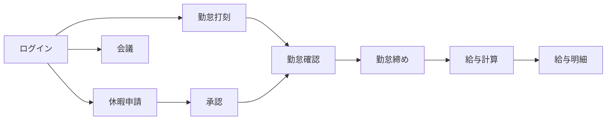

  <a href="./README.md"><strong>JP</strong></a>
  ·
  <a href="./README.en.md">EN</a>
  ·
  <a href="./README.vi.md">VI</a>

# Web HRM 利用ガイド

> バージョン: 2.2  
> 対象: HRM システム利用者・管理者  
> 対象範囲: FE `tmv-hrm`, BE `tmv-hrm-be`  
> Website: [https://hrm.tamada.vn/](https://hrm.tamada.vn/)  
> 問題報告: [https://github.com/tamada-chinhhv/tmv-hrm-docs/issues/new](https://github.com/tamada-chinhhv/tmv-hrm-docs/issues/new)

---

## クイックスタート（Quick Start）

HRM を初めて使う場合は、次の 5 ステップを順に実行してください。

1. **ブラウザを開き** [https://hrm.tamada.vn/login](https://hrm.tamada.vn/login) にアクセスする。
2. **ログイン** — HR から渡された Username と Password（初期パスワードは多くの場合 Username と同じ）。
3. **パスワード変更**（推奨）— 画面上部の自分の名前 → **Change password**。
4. **勤怠打刻** — **Attendance** → **Check in** / **Check out**（Web: 位置情報/GPS。WiFi 拠点はモバイルで BSSID 送信 — [VI 版 8.1](README.vi.md#81-cơ-chế-chấm-công-của-hệ-thống)）。
5. **個人カレンダー** — メニュー **Calendar** → 自分の列を選択 → 空き時間をクリックして会議を作成（必要な場合）。

**期待される結果:** ログインでき、権限に応じたメニューが表示され、打刻とカレンダーの基本操作ができる。

---

## 目次

1. [HRM システムの概要](#1-hrm-システムの概要)
2. [利用前の要件](#2-利用前の要件)
3. [アカウントとログイン](#3-アカウントとログイン)
4. [従業員管理](#4-従業員管理)
5. [カレンダーとスケジュール](#5-カレンダーとスケジュール)
6. [ロールと権限](#6-ロールと権限)
7. [機能別ガイド](#7-機能別ガイド)
8. [勤怠](#8-勤怠)
9. [休暇申請](#9-休暇申請)
10. [勤怠・休暇レポート](#10-勤怠休暇レポート)
11. [推奨運用手順](#11-推奨運用手順)
12. [よくある質問（FAQ）](#12-よくある質問faq)
13. [引き渡しチェックリスト](#13-引き渡しチェックリスト)

---

## 1. HRM システムの概要

### 1.1 HRM とは

**HRM**（Human Resource Management＝人事管理）は、従業員情報・勤怠・休暇・給与・会議スケジュール・システム設定を一つの Web システムで扱うためのツールです。

主な用途:

- 出退勤の記録（Check in / Check out）
- 休暇申請の作成と承認
- 従業員・部署・役職の管理
- 会議の予定作成と参加者招待
- 給与明細の参照・計算（権限による）
- 休日・打刻拠点・ロールの設定（管理者向け）

### 1.2 利用者

| 利用者 | システム上の位置づけ | 主な作業 |
|--------|---------------------|----------|
| **管理者 / HR** | `ADMIN` または十分な管理権限 | 従業員作成、権限付与、休日・拠点設定、給与運用 |
| **マネージャー** | `EMPLOYEE_VIEW` があり部下（`manager`）がいる | チーム勤怠の確認、休暇承認（`LEAVE_APPROVE` がある場合） |
| **一般従業員** | `EMPLOYEE` ロール（割り当て時） | 打刻、休暇申請、自分の給与確認、会議参加 |

> **補足:** 各従業員には **1 つのロール** が紐づきます。メニューや操作可否は、そのロールに付与された **permission（権限コード）** で決まります。

### 1.3 主なモジュール

| メニュー | 機能 | URL |
|----------|------|-----|
| **Overview** | ダッシュボード | `/dashboard` |
| **Account** | 個人プロフィール・外観（色・フォント・ライト/ダーク） | `/account`（タブ **Information** / **Settings**） |
| **Calendar** | 複数従業員の会議カレンダー | `/calendar` |
| **Organization** | Employees, Departments, Positions | `/org/employees`, `/org/departments`, `/org/positions` |
| **Attendance & Time** | Attendance, Attendance Tracking, Leave Requests, Leave Approvals | `/time/attendance`, `/time/attendance-tracking`, `/time/leave`, `/time/leave-approvals` |
| **Payroll** | 給与明細・税設定 | `/payroll` |
| **System Settings** | 休日・拠点・勤務シフト・ロール・権限割当 | `/sysConfig/holidays`, `/sysConfig/locations`, `/sysConfig/settings`, `/sysConfig/roles`, `/sysConfig/assign` |

メニューは **権限に応じて表示** されます。項目が見えない場合は [セクション 6](#6-ロールと権限) を参照してください。

### 1.4 業務フロー概要

---

## 2. 利用前の要件

### 2.1 対応ブラウザ

**最新版に近い** ブラウザを使用してください（PC・スマートフォン）。

| ブラウザ | 推奨 |
|----------|:----:|
| Google Chrome | ○ |
| Microsoft Edge | ○ |
| Mozilla Firefox | ○ |
| Safari | ○ |

**位置情報による打刻:** ブラウザの **Location（位置情報）** 許可が必要です。拒否するとオフィス範囲内の打刻ができません。

### 2.2 必要なアクセス

| 要件 | 説明 |
|------|------|
| **HRM アカウント** | HR/Admin が従業員登録時に作成 |
| **Username / Password** | 初回は HR/IT から配布 |
| **ロールと権限** | メニューと操作範囲を決定 |
| **ネットワーク** | 下記 URL に到達できること |

新規従業員は **自己登録不可** — 事前に HR がプロフィールを作成する必要があります。

### 2.3 ログイン URL

| 環境 | URL |
|------|-----|
| **本番** | [https://hrm.tamada.vn/](https://hrm.tamada.vn/) |
| **ログイン画面** | [https://hrm.tamada.vn/login](https://hrm.tamada.vn/login) |

ログイン成功後は **Attendance**（`/time/attendance`）または、ログイン前に開こうとしていたページへ遷移します。

---

## 3. アカウントとログイン

### 3.1 ログイン手順

1. ブラウザを開く。
2. **https://hrm.tamada.vn/login** にアクセス。
3. フォームに入力:
   - **Username** — メールや従業員コード（`EMP001` 等）ではありません。
   - **Password** — 目のアイコンで表示/非表示を切り替え可能。
4. **Login** をクリック。
5. 成功するとメイン画面（多くは Attendance）へ。失敗時はフォーム上にエラー表示。

**ログインフォームの項目:**

| 項目 | 説明 |
|------|------|
| **Username** | 必須 |
| **Password** | 必須（ログイン時は最低 6 文字） |
| **Login** | 送信 |
| 言語切替 | 画面上部 |

**フォームにないもの:** メール欄、「Forgot password」、ログイン状態の保持。

### 3.2 Username の自動生成ルール

従業員 **新規作成** 時、**氏名（Full name）** から Username を提案します（メール・従業員コードは使用しません）。

**処理手順:**

1. 前後の空白を除去
2. **小文字** に変換（大文字小文字は区別しません）
3. ベトナム語などの **発音記号を除去**（**đ** → **d**）
4. `a–z`, `0–9` 以外を削除

**例:**

| 氏名 | 提案 Username |
|------|---------------|
| Nguyễn Văn An | `nguyenvanan` |
| Trần Thị Lan | `tranthilan` |
| Lê Văn Đức | `levanduc` |

**従業員コード**（`EMP001` …）は保存時に自動採番 — ログインには使用しません。

#### Username が既に存在する場合

**自動で末尾に数字は付きません**（`nguyenvanan1` 等は生成されない）。

- 保存時に重複 → **Username "…" already exists**
- HR が手動で Username を変更してから保存（例: `nguyenvanan2`）

#### 制限

| ルール | 内容 |
|--------|------|
| 長さ | 1〜50 文字 |
| 使用可能文字 | 正規化後は `a–z`, `0–9` のみ |
| 大文字小文字 | 区別しない（小文字で保存） |
| 作成後の変更 | **不可** |

### 3.3 初期パスワード

| 質問 | 回答 |
|------|------|
| 初期パスワードは？ | **Username と同じ** |
| 生成ルール | 作成時に別パスワードを入力しなければ Username を使用 |
| 初回ログイン時の強制変更 | **なし** |
| 本番システム管理者 | 初回 `admin` / `admin123` — デプロイ後に backend が自動作成/復元（`ensure-system-admin.mjs`）。ログイン後**直ちにパスワード変更** |

### 3.4 パスワード変更

1. 画面上部の自分の名前 → **Change password**
2. 現在のパスワード、新しいパスワード、確認を入力
3. **Update password**

**新パスワード条件:** 8 文字以上、大文字・小文字・数字・記号を各 1 文字以上（例: `Abcdef1!`）。

**想定結果:** 変更成功後も**現在のブラウザではログイン状態を維持**。次回から新しいパスワードを使用。他のタブ・端末は再ログインが必要な場合あり。

### 3.5 パスワードを忘れた場合

ログイン画面に **Forgot password** はありません。

| 担当 | 対応 |
|------|------|
| HR/Admin（`EMPLOYEE_UPDATE`） | 従業員詳細 → **Reset password** → Username と同じ値に戻る。従業員は**全端末で再ログイン**が必要 |
| 従業員 | HR/IT に連絡 |

### 3.6 ログアウト

名前メニュー → **Logout** → 確認。

### 3.7 システム `admin` アカウント（保護）

本番では常に **`admin`**（ADMIN、全権限）が存在。`ensure-system-admin.mjs` が migration 後に自動実行。

- `admin` の削除・HR による **Reset password**・ロール変更・他ユーザーによる編集: **不可**
- `admin` の **Change password**（自己変更）: **可** — 再デプロイでも `admin123` に戻さない
- **ADMIN** ロールの付与・ADMIN ロール権限の編集: **`admin` のみ**
- Username `admin` は **予約済み**

---

## 4. 従業員管理

> `EMPLOYEE_CREATE` / `UPDATE` / `DELETE` を持つ HR/Admin 向け。

### 4.1 新規従業員作成手順

1. 作成権限のあるアカウントでログイン
2. **Organization** → **Employees**（`/org/employees` — `EMPLOYEE_VIEW` が必要）
3. **Add employee**
4. フォーム入力（下表）
5. **Username** を確認（氏名から自動 — 保存前に編集可）
6. **Role** を選択（未選択の場合はロール未割当）
7. **Save** / **Create**
8. 一覧に戻る — 従業員コード `EMP…` が自動採番

#### フォーム項目

| 項目 | 必須 | 備考 |
|------|:----:|------|
| Full name | ○ | 最大 100 文字 |
| Email | — | 重複不可 |
| Hire date | ○ | 既定は当日、**YYYY-MM-DD** |
| Username | ○ | 氏名から自動、保存前のみ編集可 |
| Role | — | `EMPLOYEE` 等 — **`ADMIN` は `admin` のみ付与可** |
| Attendance not required | — | Admin のみ — Attendance Tracking / Excel から除外 |
| Employment status | — | 既定 **ACTIVE** |

> **注意:** 日付は DatePicker で選択し、DB には **YYYY-MM-DD** で保存されます。

> **注意:** Username は作成後 **変更できません**。

### 4.2 作成時の自動処理

| 項目 | 動作 |
|------|------|
| 従業員コード | `EMP001`, `EMP002`, … |
| Username | [3.2](#32-username-の自動生成ルール) 参照 |
| Password | Username と同じ（ハッシュ保存） |
| メール通知 | **送信しない** |
| 既定ロール | 未選択時は **未割当** — 一般社員には `EMPLOYEE` を推奨 |

### 4.3 よくあるエラー

| エラー | 対処 |
|--------|------|
| Username already exists | Username を手動変更 |
| Email already exists | 別メールまたは空欄 |
| Insufficient permissions | Admin に権限付与を依頼 |

### 4.4 作成後の編集

**Organization** → **Employees** → 対象者 → **Edit**（`/org/employees/{id}/edit`、Username はロック）。

**自己編集:** **Account**（`/account`）→ タブ **Information**（ユーザー名・部署・ロールは変更不可）。タブ **Settings**: テーマ色・フォント・ライト/ダーク — ユーザー単位で保存、他端末ログイン時に同期。

**Reset password:** 詳細画面 → **Reset password** → Username と同じ値に戻る。

### 4.5 退職時

**TERMINATED** / **INACTIVE** に変更することを推奨。**Delete** は DB から完全削除されます。

---

## 5. カレンダーとスケジュール

### 5.1 概要

**Calendar** は従業員間の **会議・イベント** 予定用です。忙しい時間の確認、会議作成、参加者招待、変更通知ができます。

**混同しないもの:** Attendance Tracking の月次グリッド、Holiday Configuration。

**表示:** 時間グリッド上は主に **会議** のみ（凡例の Leave/Holiday は参考表示）。

### 5.2 カレンダーの見方

1. **Calendar** → `/calendar`
2. 表示する従業員を選択（既定は自分）
3. 従業員ごとに **列** — 主催者または参加者の列にイベント表示

| 表示 | 説明 |
|------|------|
| **Week** | 既定 |
| **Day** | 1 日表示 |
| **Month** | **未実装** |

**色:** 列ごとに色分け。イベント枠は **主催者** の色。

### 5.3 会議の作成

- **自分の列** の空きスロットのみクリックして作成可能
- **Title** 必須、**Participants** に自分を含める
- **Organizer** は常に **自分**

### 5.4 繰り返し

| モード | 内容 |
|--------|------|
| Working days | 稼働日（会社休日設定を除く） |
| Weekly weekdays | 指定曜日 |
| Selected dates | 日付を個別選択 |

約 **12 週間** 分の occurrence を生成（終了日なしの場合は拡張あり）。

### 5.5 権限

| 役割 | 編集/削除 | Leave meeting |
|------|-----------|---------------|
| **Organizer（主催者）** | 可 | 不可（削除でキャンセル） |
| **Participant（参加者）** | 不可 | 可（理由必須） |
| **Admin / HR** | 他人の会議は **`CALENDAR_EDIT_ANY` が必要**（`ADMIN` は migrate 後デフォルト付与） | — |

**設計理由:** 通常は作成者のみが変更。運用支援のため `CALENDAR_EDIT_ANY` で他人の会議を編集可能（Admin 等）。参加者は「参加辞退」で対応。`CALENDAR_VIEW` を持つユーザーは他人のカレンダーを **閲覧** できる（会議調整のため）。メニュー **Calendar** は `CALENDAR_VIEW` が必要。全社員表示スイッチは `CALENDAR_MANAGE`（Calendar 画面）。

### 5.6 通知

| タイミング | 通知先 |
|------------|--------|
| 招待 | 参加者 |
| 参加者削除 | 削除された人 |
| Leave meeting | 主催者 |
| 削除（1件/シリーズ） | 残りの参加者 |

画面上部の **ベル** アイコン。Web Push はサーバー設定次第。

**リマインダー（15 分前）:** **対応済み** — cron 5 分間隔（`Asia/Ho_Chi_Minh`）で開始約 15 分前に通知。主催者・参加者が対象。表示時刻はグリッドと一致（§5.8）。

### 5.7 操作まとめ

| 操作 | 方法 |
|------|------|
| 詳細 | イベントをクリック |
| 編集 | 詳細 → **Edit**（主催者、または `CALENDAR_EDIT_ANY`） |
| 削除 | 詳細 → **Delete**（1件 or シリーズ） |
| 辞退 | 詳細 → **Leave meeting** → 理由入力 |

### 5.8 タイムゾーンと表示時刻

| 項目 | 規約 |
|------|------|
| 業務 TZ | **`Asia/Ho_Chi_Minh`** (UTC+7) |
| API/DB | **VN 壁時計を UTC スロットに保存** — 例: 09:00 → `…T09:00:00.000Z` |
| Web グリッド/詳細 | `startAt`/`endAt` の **UTC 成分**を表示時刻として使用 |
| 通知/reminder (BE) | 同上 — `formatVietnamStorageDateTime` (`vietnam-storage.util.ts`) |
| reminder 発火 | `vietnamStorageDateToInstant` で実 instant に変換後、15 分窓と比較 |

---

## 6. ロールと権限

### 6.1 組み込みロール

| コード | 名称 | 用途 |
|--------|------|------|
| `ADMIN` | Administrator | 全権限 |
| `HR_MANAGER` | HR Manager | seed では権限未割当 — Admin が Assignment で付与 |
| `EMPLOYEE` | Employee | 打刻・休暇閲覧・自分の給与 |

1 従業員につき **1 ロール** のみ。

### 6.2 権限マトリクス（参考）

| 機能 | Admin | HR* | Manager | Employee |
|------|:-----:|:---:|:-------:|:--------:|
| 従業員作成 | ○ | ○* | × | × |
| 全社員閲覧 | ○ | ○* | × | × |
| チーム閲覧 | ○ | ○* | ○*** | × |
| 他人の会議編集 | ○* | ○* | × | × |
| 自分の会議編集 | ○ | ○ | ○ | ○ |
| 他人のカレンダー閲覧 | ○ | ○ | ○ | ○ |
| 休暇承認 | ○ | ○* | ○***** | × |

\* 該当 permission が必要。  
\*** `EMPLOYEE_VIEW` + 部下ツリー。  
\**** カレンダー API の編集/削除: **主催者** または **`CALENDAR_EDIT_ANY`**。  
\***** `LEAVE_APPROVE` が必要。

### 6.3 スコープ

- **Admin:** 全従業員
- **Manager:** `managerId` の部下ツリーのみ
- **一般:** 一覧 API は自分のみ。`GET /employees/directory` は `EMPLOYEE_VIEW` / `CALENDAR_VIEW` / `LEAVE_VIEW` / `ATTENDANCE_VIEW` のいずれかが必要

### 6.4 ロール割当

**Organization** → **Employees** → Role フィールド。  
権限の細かい設定は **System Settings** → **Permission Assignment**（`/sysConfig/assign`）。  
**ADMIN** ロール付与・ADMIN 権限編集は **`admin` のみ**。

**想定される結果:**

- **ロールの permission 変更**（手順 1–2）: ユーザーは**ログアウトされない**。次の API 呼び出しでメニュー・操作が新しい権限に合わせて更新される。
- **従業員に割り当てるロール変更**（手順 3）: 対象従業員は全デバイス/タブで**再ログイン**が必要。
- **ロールを変えずに従業員を保存**: その従業員のセッションには影響しない。

### 6.5 権限コード一覧

| コード | 概要 |
|--------|------|
| `EMPLOYEE_VIEW` / `CREATE` / `UPDATE` / `DELETE` | 従業員の閲覧・作成・更新・削除 |
| `ATTENDANCE_VIEW` | 勤怠閲覧・打刻 |
| `ATTENDANCE_EXPORT` | Attendance Tracking の Excel 出力 |
| `ATTENDANCE_MANUAL_UPDATE` | 手動時刻修正 |
| `LOCATION_VIEW` / `LOCATION_MANAGE` | 拠点の閲覧・管理 |
| `LEAVE_VIEW` / `LEAVE_APPROVE` / `LEAVE_APPROVE_MANAGED` | 休暇（OT 含む）の閲覧・承認 |
| `LEAVE_DELETE_APPROVED` | **承認済み**申請の削除（Leave Approvals、既定 ADMIN） |
| `CALENDAR_VIEW` / `CALENDAR_MANAGE` / `CALENDAR_EDIT_ANY` | カレンダー閲覧・全社表示スイッチ・他人の会議編集（`CALENDAR_EDIT_ANY` は ADMIN デフォルト） |
| `PAYROLL_VIEW` / `PAYROLL_MANAGE` / `PAYROLL_PERIOD_LOCK` | 給与閲覧・管理・期間ロック |
| `DEPARTMENT_*` / `POSITION_*` | 部署・役職 |
| `ROLE_VIEW` / `ROLE_MANAGE` | ロールと権限割当 |
| `HOLIDAY_CONFIG_VIEW` / `EDIT` | 休日設定 |
| `APPEARANCE_VIEW` / `EDIT` | システム外観（`/sysConfig/settings`） |
| `WORK_SHIFT_VIEW` / `EDIT` | デフォルト勤務シフト（`/sysConfig/settings`） |

> **システム外観**（全社既定）: `app_settings` に保存 — **System Settings → Settings**、`GET/PATCH /settings/appearance`（`APPEARANCE_*`）。**ログイン画面**と**ログアウト後**は常にシステム外観（`GET /settings/public/appearance`）。  
> **個人外観**: ログイン済みユーザー — **Account** → **Settings**、`GET/PATCH /auth/me/appearance`。ユーザーが保存した場合のみ上書き（`appearance_customized = true`）。  
> `OVERTIME_*`、`ATTENDANCE_MANAGE` は **削除済み**。

---

## 7. 機能別ガイド

### 7.0 Account（`/account`）

ログイン済みユーザー全員が利用可能（サイドバー **Account** またはユーザーメニュー）。

| タブ | 内容 |
|------|------|
| **Information** | 自分のプロフィール（氏名・メール・電話など。Username・部署・ロールは変更不可） |
| **Settings** | 外観: ライト/ダーク（即時保存）、テーマ色・フォント（**Save** でサーバー同期） |

- Settings: `/account?tab=settings`
- ヘッダーのライト/ダーク切替も個人設定として保存（カスタム済みになる）
- 未保存時は**システム外観**を使用。保存またはテーマ切替後は個人設定を優先
- `EMPLOYEE_VIEW` のないユーザーが **Employees** を開くと **Account** へリダイレクト

### 7.1 Overview

ダッシュボード指標（一部は `EMPLOYEE_VIEW` / `LEAVE_VIEW` が必要）。

### 7.2 Departments / Positions

部署は親子ツリー。Position の **Level** は数値が小さいほど上位。

### 7.3 Attendance

Check in/out は **GPS（拠点半径内）** または **オフィス WiFi（BSSID 一致）** のいずれかで検証。Web は GPS のみ（ブラウザは BSSID 不可）。詳細は [VI 版 8.1](README.vi.md#81-cơ-chế-chấm-công-của-hệ-thống)。

### 7.4 Attendance Tracking

記号: `1/8h` 出勤, `W` 週末, `H` 祝日, `A` 欠勤, `F` 打刻漏れ, 等。

### 7.5 Leave / Approvals

`LEAVE_VIEW` で申請、`LEAVE_APPROVE` で承認。

### 7.6 Payroll

- `PAYROLL_VIEW`: 閲覧・給与期間ステータス
- `PAYROLL_MANAGE`: 管理・再計算・税設定
- `PAYROLL_PERIOD_LOCK`: 給与期間のロック/解除（`PAYROLL_MANAGE` でも可）

### 7.7 System Settings

- 休日: `HOLIDAY_CONFIG_*` — `/sysConfig/holidays`
- 拠点: `LOCATION_*` — `/sysConfig/locations`（GPS / WiFi 併用可。active 拠点は GPS または active WiFi が1件以上必須）— [VI 版 7.5.1](README.vi.md#751-cấu-hình-chi-nhánh-gps--wifi)
- システム外観: `APPEARANCE_*` — **System Settings → Settings**（`/sysConfig/settings`、**Appearance** アコーディオン）
- 勤務シフト（全社既定）: `WORK_SHIFT_*` — 同ページ **Work shift** アコーディオン
- ロール・権限: `/sysConfig/roles`, `/sysConfig/assign`

> 個人外観は [7.0](#70-accountaccount) を参照。

---

## 8. 勤怠

- **Web**（Check in/out + GPS）+ **モバイル API**（GPS または `wifi.bssid`）。ハードウェア連携なし。
- ジオフェンス: 拠点 GPS 半径内 **または** 設定済み active WiFi の BSSID 一致。`REMOTE_WORK` 承認日はスキップ。
- Attendance Tracking 対象: 勤怠必須の従業員のみ（`ADMIN` ロールと **Attendance not required** は除外）
- タイムゾーン: **`Asia/Ho_Chi_Minh`**
- 状態: **勤務シフト**（開始/終了、grace、昼休み、`expectedWorkingMinutes` / `workUnitLabel`）で **WORK** / **LATE_EARLY** を判定 — 固定9時間ルールではない
- **全社デフォルト勤務シフト**あり（`/sysConfig/settings`）— 従業員別ロスターはなし（[VI 版 8.7](README.vi.md#87-ca-làm-việc--lịch-làm-việc-task-09) 参照）
- 手動修正: `ATTENDANCE_MANUAL_UPDATE`、監査ログなし
- エクスポート: **Excel .xlsx** のみ（Attendance Tracking、`ATTENDANCE_EXPORT` 必須）

## 9. 休暇申請

- 種別: `PAID_LEAVE`（残日数減算）、`SICK_LEAVE`、`UNPAID_LEAVE`、`LATE_ARRIVAL`、`EARLY_DEPARTURE`、`REMOTE_WORK`、`ATTENDANCE_CORRECTION`、`HIEU_HI`、`OVERTIME`（残業 — 月次 OT は **承認済み** `OVERTIME` のみ、勤怠からの自動計算なし）
- 承認: **1名の Approver** のみ（連鎖承認・代理承認なし）
- 承認済み削除: Leave Approvals で **Delete** — 管理者・指定承認者・直属上司（`LEAVE_APPROVE` / `LEAVE_APPROVE_MANAGED`）または `LEAVE_DELETE_APPROVED`。従業員の自己削除なし（PENDING は編集のみ、OVERTIME は Cancel）
- 重複ガード: `LEAVE_APPROVE_BLOCKED_BY_OVERLAP` / `LEAVE_DELETE_BLOCKED_BY_OVERLAP` — 別の **APPROVED** と期間重複時は承認/削除不可。手順: 旧承認済みを削除 → 新規作成 → 承認
- 削除権限: `LEAVE_DELETE_NOT_ALLOWED` — 管理者・指定承認者・直属上司または `LEAVE_DELETE_APPROVED` のみ削除可
- 添付ファイル・半日0.5減算・年次繰越: **未実装**
- 状態: `PENDING` → `APPROVED` / `REJECTED`（`CANCELLED` なし）

## 10. 勤怠・休暇レポート

- Attendance Tracking + Excel 出力（`ATTENDANCE_EXPORT`）
- 月次ロック/フリーズ: **未実装**（運用で締め）

---

## 11. 推奨運用手順

### 11.1 初期設定

部署・役職・拠点・休日 → ロール/権限 → 従業員作成 → 認証情報の配布 → パスワード変更の依頼。

### 11.2 日次

打刻、休暇申請/承認、Calendar で会議調整。

### 11.3 月次

勤怠締め、給与パラメータ更新、給与計算と照合。

---

## 12. よくある質問（FAQ）

### 9.1 アカウント

**パスワードを忘れた** → ログイン画面からは復旧不可。HR/IT に **Reset password** を依頼（Username と同じ値に戻る）。

**アカウントロック** → 専用機能なし。Username の確認、HR による reset、IT への連絡。連絡先: HR _[メール/電話]_, IT _[メール/電話]_（要記入）。

**Username の変更** → **不可**（作成後）。

### 9.2 従業員

**作成後にメールが来ない** → 仕様（自動送信なし）。HR が手動で連絡。

**削除するとデータは？** → DB から削除。退職時はステータス変更を推奨。

### 9.3 カレンダー

**参加者に見えない** → 参加者リスト、列・週の選択、Leave 済みかを確認。ベル通知も確認。

**削除時の通知** → 参加者に通知あり。

**招待を断る** → **Leave meeting** + 理由。

### 9.4 エラー

| エラー | 対処 |
|--------|------|
| Username already exists | 保存前に Username 変更 |
| Insufficient permissions | セクション 6、Admin に連絡 |
| LEAVE_APPROVE_BLOCKED_BY_OVERLAP | 別の承認済みと期間重複 — 先に旧承認済みを削除（`LEAVE_DELETE_APPROVED`） |
| LEAVE_DELETE_BLOCKED_BY_OVERLAP | 重複する承認済みが残っている — 先に他方を削除 |
| LEAVE_DELETE_NOT_ALLOWED | 削除権限なし — 管理者または承認者のみ |
| Only the event organizer can modify | 主催者に依頼、または Leave meeting |

### 9.5 サポート

| 種別 | 連絡先（社内で記入） |
|------|---------------------|
| HR | _[メール/電話]_ |
| IT | _[メール/電話]_ |
| 不具合報告 | [GitHub Issues](https://github.com/tamada-chinhhv/tmv-hrm-docs/issues/new) |

---

## 13. 引き渡しチェックリスト

- [ ] 初期アカウント一覧（Username, ロール）
- [ ] 権限付与フロー
- [ ] 打刻ガイド（Web: GPS / モバイル: WiFi BSSID）と `/sysConfig/locations` 拠点設定
- [ ] パスワード reset 手順
- [ ] 退職時手順（削除よりステータス変更）
- [ ] HR/IT 窓口と SLA
- [ ] **既定パスワード（= Username）の一括変更**

---

*ドキュメント バージョン 2.1 — `tmv-hrm` / `tmv-hrm-be` と同期。最終更新: 2026。*
