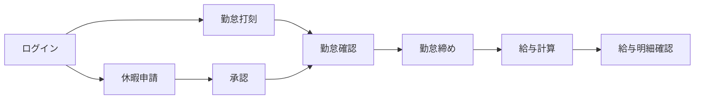
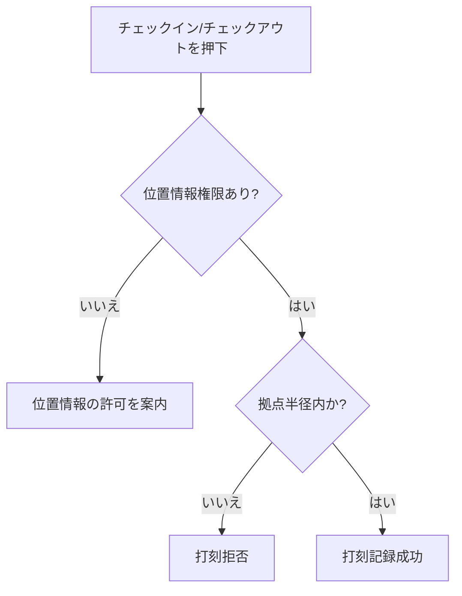
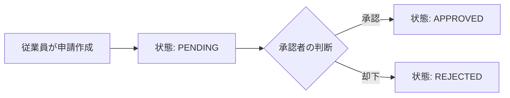
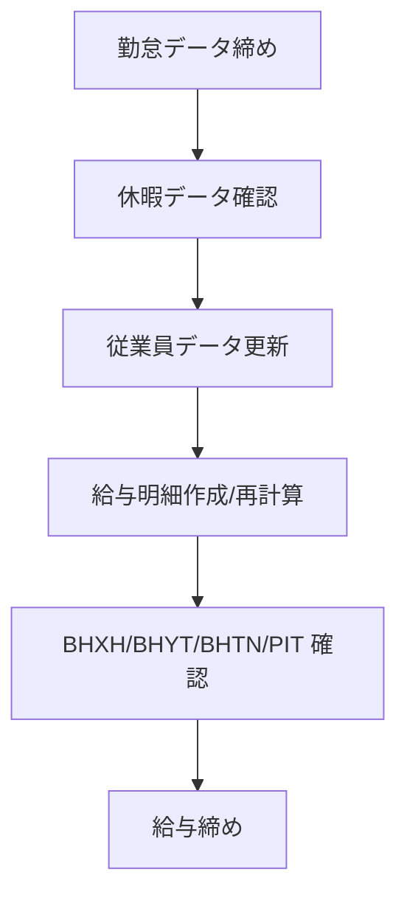

  <a href="./README.md"><strong>JP</strong></a>
  ·
  <a href="./README.en.md">EN</a>
  ·
  <a href="./README.vi.md">VI</a>

# Web HRM 利用ガイド

> バージョン: 1.0 
> 対象: HRM システム利用者・管理者 
> 対象範囲: FE `tmv-hrm`, BE `tmv-hrm-be` 
> Website: [https://hrm.tamada.vn/](https://hrm.tamada.vn/) 
> 問題報告: [https://github.com/tamada-chinhhv/tmv-hrm-docs/issues/new](https://github.com/tamada-chinhhv/tmv-hrm-docs/issues/new)

---

## 1. 本ドキュメントの目的

本ドキュメントは、Web HRM システムを実運用するための手順を説明します。主な対象は以下です。

- 組織管理（従業員、部署、役職）
- 勤怠、休暇申請、承認
- 給与管理と個人所得税（PIT）設定
- システム設定（ロール、権限、休日、拠点位置）

## 2. 利用ロール

| ロール | 主な利用内容 |
|---|---|
| Admin/HR | システム設定、人事マスタ管理、休暇承認、給与運用 |
| Manager | 休暇承認、勤怠モニタリング（付与権限に応じる） |
| Employee | 打刻、休暇申請、自身の勤怠・給与確認 |

## 3. 業務フロー概要（図）

## 4. ログインとセキュリティ

### 4.1 ログイン
1. HRM の URL にアクセスします。
2. `Username` と `Password` を入力します。
3. `Login` をクリックします。

### 4.2 パスワード変更
1. `Change password` を開きます。
2. 現在のパスワード、新しいパスワード、確認用パスワードを入力します。
3. `Update password` をクリックします。

### 4.3 ログアウト
- 画面の `Logout` をクリックします。

## 5. メニュー構成

- **Overview**
- **Organization**
  - Employees
  - Departments
  - Positions
- **Attendance & Time**
  - Attendance
  - Attendance Tracking
  - Leave Requests
  - Leave Approvals
- **Payroll**
- **System Settings**
  - Holiday Configuration
  - Office Locations
  - Roles
  - Permission Assignment

## 6. 機能別利用ガイド

### 6.1 Overview
- 勤怠状況、人員指標、休暇状況をダッシュボードで確認します。

### 6.2 Employees
- 従業員一覧、追加/更新/削除（権限ベース）。
- パスワードリセット。
- `My Profile` 更新。

### 6.3 Departments
- 部署ツリー（親子構造）管理。
- 部署の追加/更新/削除。

### 6.4 Positions
- 部署ごとの役職管理。
- `Level` は値が小さいほど上位（`1` が最上位）。

### 6.5 Attendance
- 位置情報（ジオフェンス）による打刻。
- 月次勤怠サマリー。
- 手動時刻修正（権限がある場合）。

### 6.6 Attendance Tracking
- 従業員検索、月次詳細確認、Excel 出力。

| 記号 | 意味 |
|---|---|
| `1 / 8h` | 出勤 |
| `W` | 週末 |
| `H` | 祝日 |
| `A` | 欠勤 |
| `PL, SL, UL...` | 休暇種別 |
| `F` | 打刻漏れ |
| `-` | 未来日/未計算 |

### 6.7 Leave Requests
- 休暇申請の作成。
- 承認前は編集/削除可能。
- ステータス: `PENDING` / `APPROVED` / `REJECTED`。

### 6.8 Leave Approvals
- 承認者が申請を確認し、承認/却下を実施。

### 6.9 Payroll
- Admin/HR: 給与項目管理、PIT 設定、明細作成/再計算、Excel 入出力。
- Employee: 自身の給与明細確認。

### 6.10 Office Locations
- 打刻拠点の追加/更新/削除。
- 緯度・経度・許容半径を設定。

### 6.11 Holiday Configuration
- 週次固定休日の設定。
- 期間指定の祝日設定。

### 6.12 Roles and Permissions
- ロール管理（`ADMIN`, `HR_MANAGER`, `EMPLOYEE` など）。
- 権限付与により表示メニューと操作可能範囲を制御。

## 7. 推奨運用手順

### 7.1 初期設定
1. 部署、役職、拠点、休日を設定。
2. ロールと権限を設定。
3. 従業員アカウントを作成し所属を設定。

### 7.2 日次運用
1. 打刻。
2. 休暇申請/承認。
3. 例外データの確認・対応。

### 7.3 月次運用
1. 勤怠期間締め。
2. 給与/税パラメータ更新（必要時）。
3. 給与計算と照合。

## 8. よくある問題

| 問題 | 対応 |
|---|---|
| ログインできない | 資格情報確認、必要時パスワードリセット |
| 打刻できない | 位置情報権限とジオフェンス範囲を確認 |
| メニューが表示されない | ロール/権限を確認 |
| 申請/承認できない | `LEAVE_VIEW` / `LEAVE_APPROVE` 権限を確認 |
| 給与データが不正 | 勤怠・休暇・扶養人数・PIT 設定を確認 |

## 9. 引き渡しチェックリスト

- [ ] 初期アカウント一覧の引き渡し
- [ ] 権限運用フローの引き渡し
- [ ] バックアップ手順の引き渡し
- [ ] サポート窓口と SLA の引き渡し
- [ ] デフォルトパスワード変更の確認

> 推奨: 本番稼働前にすべてのデフォルトパスワードを変更してください。
