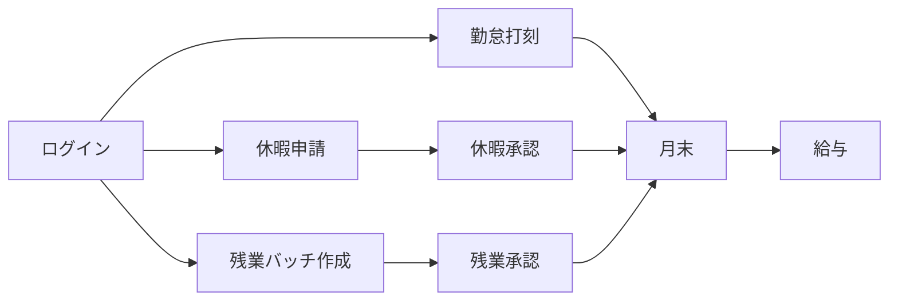

  <a href="./README.md"><strong>JP</strong></a>
  ·
  <a href="./README.en.md">EN</a>
  ·
  <a href="./README.vi.md">VI</a>

# HRM 利用ガイド

> バージョン: 2.4  
> 対象: 従業員・マネージャー・HR / 管理者  
> Webサイト: [https://hrm.tamada.vn/](https://hrm.tamada.vn/)  
> 問題報告: [GitHub Issues](https://github.com/tamada-chinhhv/tmv-hrm-docs/issues/new)

このガイドは **画面操作**（メニュー → 操作 → 期待結果）を説明します。技術詳細は [セクション 6](#6-技術付録) にあります。

---

## クイックスタート

1. ブラウザで [https://hrm.tamada.vn/login](https://hrm.tamada.vn/login) を開く。
2. HR から渡されたアカウントでログイン（初期パスワードはユーザー名と同じことが多い）。
3. パスワード変更（推奨）: 画面上部の自分の名前 → **パスワード変更**。
4. 勤怠: **勤怠・休暇** → **勤怠** → **出勤** / **退勤**。Web では **位置情報** を許可。モバイルでは拠点が WiFi 利用の場合 **会社 WiFi** に接続。
5. 当日の確認: メニュー **概要**。

**期待される結果:** ログインでき、権限に応じたメニューが表示され、打刻できる。

---

## 目次

1. [はじめに](#1-はじめに)
2. [従業員向け](#2-従業員向け)
3. [マネージャー向け](#3-マネージャー向け)
4. [HR / 管理者向け](#4-hr--管理者向け)
5. [よくある質問](#5-よくある質問)
6. [技術付録](#6-技術付録)

---

## 1. はじめに

### 1.1 HRM でできること

**HRM** は人事まわりを一つのシステムで扱います。

- 出退勤の打刻
- 休暇申請と承認
- 残業（バッチ）の作成と承認
- 会議カレンダー・給与明細
- 従業員・書類・休日 / 拠点 / 勤務シフト設定（HR）

### 1.2 だれが使うか

| あなたは… | 主な作業 |
|-----------|----------|
| **従業員** | 打刻、休暇申請、給与確認、カレンダー、個人の概要 |
| **マネージャー** | チーム勤怠、休暇承認、残業バッチの作成 / 承認 |
| **HR / 管理者** | 従業員管理、権限、システム設定、給与、書類 |

メニューは権限で変わります。項目が見えない場合は HR に権限を確認してください。

### 1.3 主な業務フロー

```mermaid
flowchart LR
  A[ログイン] --> B[勤怠打刻]
  A --> C[休暇申請]
  C --> D[休暇承認]
  A --> E[残業バッチ作成]
  E --> F[残業承認]
  B --> G[月末]
  D --> G
  F --> G
  G --> H[給与]
```

---

## 2. 従業員向け

### 2.1 ログインとアカウント

**いつ使うか:** 初回ログイン、パスワード変更、個人情報の更新。

**手順 — ログイン**

1. [ログインページ](https://hrm.tamada.vn/login) を開く。
2. ユーザー名とパスワードを入力。
3. ログイン。

**手順 — アカウント**

1. メニュー **アカウント**（または上部の自分の名前）。
2. **情報** タブ: 氏名・メール・電話を編集（ユーザー名・部署・ロールはここでは変更不可）。
3. **設定** タブ: ライト/ダーク、色、フォント。
4. **書類** タブ（ある場合）: 自分の従業員書類を閲覧 / 追加。

**期待される結果:** ログインでき、個人プロフィールを更新できる。

**困ったとき**

- パスワード誤り → 再入力、または HR にリセット依頼。
- パスワード忘れ → HR / IT に連絡（自己登録は不可）。

---

### 2.2 概要（ダッシュボード）

**いつ使うか:** 個人情報と月次勤怠をすばやく確認したいとき。

**手順**

1. メニュー **概要**。
2. **自分の概要**: 従業員情報、月次勤怠表、承認待ち休暇件数。
3. 許可されていればここから打刻も可能。

**期待される結果:** 自分の月次勤怠と休暇状況が見える。

**困ったとき**

- 企業概要タブがない → 一般従業員では通常。そのタブはマネージャー / HR（大きい画面）向け。

---

### 2.3 出勤 / 退勤

**いつ使うか:** 出社・退社時（会社ルールに従う）。

**手順**

1. **勤怠・休暇** → **勤怠**。
2. 到着時に **出勤**、退社時に **退勤**。
3. **Web**: 位置情報を許可。
4. **モバイル**: 拠点が WiFi 利用なら先に会社 WiFi へ接続。

**期待される結果:** 当日の出退勤時刻が記録される。

**困ったとき**

- オフィス範囲外 → 拠点範囲内へ移動、または正しい会社 WiFi に接続。
- 当日の **リモートワーク** が承認済み → GPS/WiFi なしでも打刻できる場合あり。
- 打刻忘れ → 当日中に補完、またはマネージャー / HR、または規程に従い修正申請。

---

### 2.4 休暇申請

**いつ使うか:** 有給、無給、遅刻・早退、リモート、慶弔休暇など。

**手順 — 作成**

1. **勤怠・休暇** → **休暇申請**。
2. 申請作成 → 種別・期間・理由を選択。
3. **慶弔（hiếu hỷ）**: **慶弔種別** を選び、上限日数を超えない。
4. 送信 → 承認待ち。

**手順 — 確認**

- 一覧で状態（承認待ち / 承認 / 却下）を確認。
- 承認待ちは種別により編集・削除 / 取消ができることが多い。

**期待される結果:** 一覧に申請が表示され、承認者が処理できる。

**困ったとき**

- 送信できない → 日付・種別など必須項目を確認。
- 慶弔の日数超過 → 種別変更または期間短縮。

---

### 2.5 カレンダー

**いつ使うか:** 会議の予定作成、または同僚カレンダーの閲覧（権限がある場合）。

**手順**

1. メニュー **カレンダー**。
2. 自分の列（または閲覧可能な同僚）を選択。
3. 空き枠をクリック → 会議作成、参加者招待、保存。

**期待される結果:** 参加者のカレンダーに予定が表示される。

---

### 2.6 給与明細の確認

**いつ使うか:** HR が給与期間を計算・公開したあと。

**手順**

1. メニュー **給与**。
2. 期間を選び、自分の明細を開く。

**期待される結果:** 自分の給与明細を閲覧できる（閲覧権限がある場合）。

**困ったとき:** 明細がない → 期間の準備状況と権限を HR に確認。

---

## 3. マネージャー向け

### 3.1 チーム勤怠の確認

**いつ使うか:** 日次 / 月次でチームの勤怠を見る。

**手順**

1. **勤怠・休暇** → **勤怠一覧**。
2. 月・部署 / 従業員を選択（閲覧範囲内）。
3. グリッドで状態を確認（出勤、遅刻、休暇、打刻忘れなど）。
4. 必要に応じて個人詳細やエクスポート。

**期待される結果:** 管理範囲内のチーム勤怠が把握できる。

---

### 3.2 休暇申請の承認

**いつ使うか:** 部下（または割当）の休暇を判断する。

**手順**

1. **勤怠・休暇** → **休暇申請の承認**。
2. 申請を開き、種別・期間・理由を確認。
3. **承認** または **却下**（却下時は理由を記入）。

**期待される結果:** 状態が更新され、従業員は **休暇申請** で結果を確認できる。

---

### 3.3 残業バッチの作成

**いつ使うか:** 同日に 1 人以上の残業をまとめて申請する。

**手順**

1. **勤怠・休暇** → **残業申請の作成**。
2. **残業申請の作成** を押す。
3. **日付** と種別（平日 / 休日 / 祝日）を選択。
4. 従業員を追加: **開始–終了**、必要なら備考。
5. **部長承認者** を選択（許可されていれば取締役へ直送も可）。
6. **下書き保存**、または **部長へ提出** / **取締役へ提出**。

**期待される結果:** 申請番号が付き、**下書き** または承認待ちになる。

**主な状態**

| 状態 | 意味 |
|------|------|
| 下書き | 未提出 |
| 部長承認待ち | 部長待ち |
| 取締役承認待ち | 取締役待ち |
| 部長へ差戻し | 取締役が修正のため返却 |
| 承認済み | 完了 |
| 却下 | 却下 — 修正して再提出可 |
| 取消済み | 承認待ち中に取消 |

**困ったとき**

- 従業員 / 時刻 / 承認者の未入力。
- OT 重複、1 日の上限超過、通常勤務時間との重なり。
- 部署未設定で承認者を選べない。

---

### 3.4 残業の承認（部長 / 取締役）

**いつ使うか:** 部長または取締役として OT を承認する。

**手順 — 部長**

1. **勤怠・休暇** → **残業承認** → **部長** タブ。
2. **部長承認待ち** の申請を開く。
3. 各人の **業務内容** を選択（HR が設定したマスタ）。
4. **取締役承認者** を選び **承認** または **却下**（理由必須）。
5. **部長へ差戻し** の場合: 内容を直し **再提出**。

**手順 — 取締役**

1. 同じ **残業承認** → **取締役** タブ。
2. **取締役承認待ち** を開く。
3. **承認**（完了）または **差戻し**（理由必須）。

**期待される結果:** 次の段階へ進むか **承認済み** になる。

---

## 4. HR / 管理者向け

### 4.1 従業員・部署・役職

**いつ使うか:** 入社、組織変更、プロフィール更新。

**手順**

1. **組織** → **従業員**: 追加 / 編集 / 無効化。上司・ロール・部署を設定。
2. **組織** → **部署**: 親子ツリー。
3. **組織** → **役職**: カタログ（多くの場合デフォルト権限グループと連動）。

**期待される結果:** 従業員がログインでき、正しいメニューが見える。

---

### 4.2 書類と会社ドキュメント

**いつ使うか:** 身分証・契約など、または共有ポリシー類。

| 目的 | メニュー |
|------|----------|
| 期限付きの従業員 / 会社書類 | **組織** → **書類** |
| 共有ライブラリ | **組織** → **会社ドキュメント** |
| 期限通知の宛先 | **システム設定** → **書類通知** |

**手順 — 書類**

1. **書類を追加** → 所有者（従業員または会社）を選択。
2. **PDF** をアップロード（多くの場合最大 5 MB）。
3. 有効期限または無期限を設定して保存。

従業員は **アカウント** → **書類** で自分のファイルを管理できます。

**期待される結果:** ファイルが保存され、期限前に通知される（設定次第）。

---

### 4.3 給与

**いつ使うか:** 給与期間の計算 / ロックと明細確認。

**手順**

1. メニュー **給与**。
2. 期間の明細を作成 / 再計算（管理権限がある場合）。
3. 確定後 **期間ロック** — ロック後は閲覧 / 出力のみ。
4. 従業員は同じメニューで自分の明細を見る（権限による）。

**期待される結果:** 正しい明細が用意され、ロック後は誤編集されない。

---

### 4.4 システム設定

**いつ使うか:** 休日、打刻拠点、勤務シフト、既定の外観。

| 目的 | メニュー |
|------|----------|
| 休日 | **システム設定** → **休日設定** |
| 拠点（勤怠用 GPS / WiFi） | **システム設定** → **拠点位置** |
| 勤務時間・昼休み・猶予 | **システム設定** → **勤務シフト** |
| システムの既定外観 | **システム設定** → **システム外観** |
| 権限 / 権限グループ | **システム設定** → **権限割当** |

**拠点（わかりやすく）:** 利用中の各拠点には **GPS** および/または **オフィス WiFi** が必要です。WiFi 照合はネットワーク名だけでなくアクセスポイントの識別情報を使います。

**勤務シフト:** 開始/終了、昼休み、遅刻・早退の猶予分を設定。大きな変更後は画面の案内に従い勤怠評価の再適用が可能です。

---

### 4.5 残業の設定

**いつ使うか:** 部長が OT 承認時に選ぶ業務内容マスタを整備する。

**手順**

1. **システム設定** → **OT 業務内容**。
2. 内容を追加 / 編集（例: 生産支援、イベント対応）。
3. 部長承認時にこの一覧から選択される。

**期待される結果:** 承認画面に業務内容の選択肢がある。

---

### 4.6 慶弔休暇（hiếu hỷ）

**いつ使うか:** 慶弔種別（結婚・葬儀など）と上限日数を定義する。

**手順**

1. **システム設定** → **慶弔設定**。
2. 種別一覧（システム / カスタム）を確認。
3. **種別追加** または編集: 名称、上限日数、有給の有無。
4. **システム** 種別は編集可・削除不可。

**期待される結果:** 慶弔の休暇申請で正しい種別を選べ、上限日数を超えない。

---

### 4.7 だれがどのメニューを見るか

権限がメニューを決めます。目安:

| 領域 | よく見る人 |
|------|------------|
| 自分の勤怠・休暇・カレンダー・アカウント | ほぼ全従業員 |
| 勤怠一覧・休暇承認 | マネージャー / HR |
| 残業バッチの作成 / 承認 | OT 権限がある人 |
| 従業員・部署・書類・給与管理 | HR |
| システム設定 | 管理者 / 権限のある HR |

追加権限: **システム設定** → **権限割当**。

---

### 4.8 月末の進め方

推奨順:

1. 打刻漏れと未処理の休暇 / OT を解消。
2. **勤怠一覧** で遅刻・打刻忘れ・リモートを確認。
3. 社内ルールどおり勤怠を締め。
4. **給与** — 計算 → 確認 → **期間ロック**。
5. 従業員に明細確認を案内。

---

## 5. よくある質問

**メニューが見えない?**  
権限不足です。HR に連絡してください。

**打刻でオフィス外と出る?**  
拠点範囲内へ移動するか会社 WiFi に接続。リモートの場合は当日承認済みのリモート申請を用意。

**出勤または退勤を忘れた?**  
当日中に補完、またはマネージャー / HR、または規程に従い修正申請。

**送信した休暇を取消できる?**  
多くの場合 **承認待ち** の間のみ（種別による）。承認後は **休暇申請の承認** の権限者に依頼。

**残業が却下 / 差戻し?**  
**残業申請の作成** で理由どおり修正し、部長または取締役へ再提出。

**書類がアップロードできない?**  
PDF のみ、サイズ上限内（多くの場合 5 MB）。**書類** または **会社ドキュメント** を使う。

**使えるブラウザは?**  
新しい Chrome / Edge / Firefox / Safari。

---

## 6. 技術付録

IT / 管理者向け。一般利用者は読み飛ばして構いません。

### 6.1 URL

| 環境 | URL |
|------|-----|
| 本番 | https://hrm.tamada.vn/ |
| ログイン | https://hrm.tamada.vn/login |

### 6.2 よくあるエラーコード

| 症状 / コード | 対処の目安 |
|---------------|------------|
| オフィス外 / `OUTSIDE_OFFICE_AREA` | GPS 範囲内、または拠点 WiFi に一致 |
| 打刻時に位置 / WiFi なし | GPS 許可、またはモバイルで WiFi 情報送信 |
| 承認済み休暇を削除できない | 管理者 / 権限ある承認者のみ |
| 給与期間ロック済み | 権限があれば解除してから明細編集 |
| OT 重複 / 上限超過 | バッチの時刻や従業員を調整 |

### 6.3 構成メモ（開発者向け）

- FE: `tmv-hrm` · BE: `tmv-hrm-be`
- 残業バッチ: `/time/overtime-batches` と部長 / 取締役承認（旧個別 OT メニューはメインサイドバーになし）
- 製品の不具合報告: [GitHub Issues](https://github.com/tamada-chinhhv/tmv-hrm-docs/issues/new)
