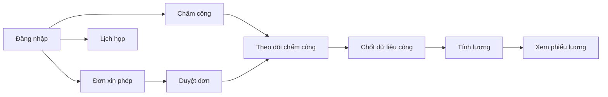

<p>
  <a href="./README.md">JP</a>
  ·
  <a href="./README.en.md">EN</a>
  ·
  <a href="./README.vi.md"><strong>VI</strong></a>
</p>

# Tài liệu Hướng dẫn Sử dụng Hệ thống Web HRM

> Phiên bản: 1.0.3  
> Đối tượng: Người dùng cuối và quản trị viên HRM  
> Phạm vi: FE `tmv-hrm`, BE `tmv-hrm-be`  
> Website: [https://hrm.tamada.vn/](https://hrm.tamada.vn/)  
> Báo lỗi khi cần: [https://github.com/tamada-chinhhv/tmv-hrm-docs/issues/new](https://github.com/tamada-chinhhv/tmv-hrm-docs/issues/new)

---

## Bắt đầu nhanh (Quick Start)

Nếu bạn lần đầu dùng HRM, làm lần lượt 5 bước sau:

1. **Mở trình duyệt** và truy cập [https://hrm.tamada.vn/login](https://hrm.tamada.vn/login).
2. **Đăng nhập** bằng tên đăng nhập và mật khẩu do HR cấp (mật khẩu mặc định thường trùng với tên đăng nhập).
3. **Đổi mật khẩu** (khuyến nghị): menu user (góc trên) → **Đổi mật khẩu**.
4. **Chấm công**: menu **Chấm công & Thời gian** → **Chấm công** → bấm **Chấm công vào** / **Chấm công ra** (web: bật quyền **vị trí/GPS**; app mobile: kết nối **WiFi công ty** nếu chi nhánh cấu hình WiFi — xem [mục 8.1](#81-cơ-chế-chấm-công-của-hệ-thống)).
5. **Xem lịch cá nhân**: menu **Lịch** → chọn cột của bạn → bấm khung giờ trống để tạo cuộc họp (nếu cần).

**Kết quả mong đợi:** Bạn đăng nhập được, thấy menu phù hợp với quyền của mình, chấm công và xem lịch cơ bản.

---

## Mục lục

1. [Giới thiệu hệ thống HRM](#1-giới-thiệu-hệ-thống-hrm)
2. [Yêu cầu trước khi sử dụng](#2-yêu-cầu-trước-khi-sử-dụng)
3. [Tài khoản & Đăng nhập](#3-tài-khoản--đăng-nhập)
4. [Quản lý nhân viên](#4-quản-lý-nhân-viên)
5. [Lịch & Lịch trình](#5-lịch--lịch-trình)
6. [Phân quyền & Vai trò](#6-phân-quyền--vai-trò)
7. [Hướng dẫn theo từng phân hệ](#7-hướng-dẫn-theo-từng-phân-hệ)
8. [Chấm công](#8-chấm-công)
9. [Đơn xin phép](#9-đơn-xin-phép)
10. [Báo cáo chấm công & nghỉ phép](#10-báo-cáo-chấm-công--nghỉ-phép)
11. [Quy trình vận hành đề xuất](#11-quy-trình-vận-hành-đề-xuất)
12. [Câu hỏi thường gặp (FAQ)](#12-câu-hỏi-thường-gặp-faq)
13. [Checklist bàn giao](#13-checklist-bàn-giao)

---

## 1. Giới thiệu hệ thống HRM

### 1.1 HRM là gì?

**HRM** (Human Resource Management — Quản lý nhân sự) là hệ thống web giúp công ty quản lý nhân sự và các công việc liên quan trên một nền tảng thống nhất: hồ sơ nhân viên, chấm công, nghỉ phép, lương, lịch họp và cấu hình hệ thống.

Bạn dùng HRM để:

- Ghi nhận giờ làm việc (chấm công vào/ra).
- Tạo và duyệt đơn xin nghỉ phép.
- Xem và quản lý thông tin nhân viên, phòng ban, chức vụ.
- Lên lịch cuộc họp, mời đồng nghiệp tham gia.
- Tính và xem phiếu lương (theo quyền).
- Cấu hình ngày nghỉ, vị trí chấm công, nhóm quyền (dành cho quản trị).

### 1.2 Ai sẽ dùng hệ thống?

| Đối tượng | Vai trò trong hệ thống | Việc thường làm |
|-----------|------------------------|-----------------|
| **Quản trị / HR** | Vai trò `ADMIN` hoặc được gán đủ quyền quản trị | Tạo nhân viên, phân quyền, cấu hình ngày nghỉ, vị trí chấm công, quản lý lương |
| **Quản lý (Manager)** | Nhân viên có quyền `EMPLOYEE_VIEW` và có cấp dưới (`manager`) | Xem chấm công team, duyệt đơn nghỉ (nếu có `LEAVE_APPROVE`), theo dõi nhân viên trong team |
| **Nhân viên** | Vai trò `EMPLOYEE` (mặc định khi gán) | Chấm công, tạo đơn nghỉ, xem lương cá nhân, tham gia lịch họp |

> **Lưu ý:** Trong hệ thống, mỗi nhân viên có **một vai trò (role)** gắn với tài khoản. Quyền chi tiết (xem menu, tạo/sửa dữ liệu) phụ thuộc vào **phân quyền (permission)** của vai trò đó.

### 1.3 Các module chính

| Nhóm menu | Chức năng | Đường dẫn (URL) |
|-----------|-----------|-----------------|
| **Tổng quan** | Bảng điều khiển, chỉ số nhanh | `/dashboard` |
| **Tài khoản** | Hồ sơ cá nhân, giao diện (màu, font, sáng/tối) | `/account` (tab **Thông tin** / **Cài đặt**) |
| **Lịch** | Lịch họp nhiều nhân viên | `/calendar` |
| **Tổ chức** | Nhân viên, Phòng ban, Chức vụ, Giấy tờ | `/org/employees`, `/org/departments`, `/org/positions`, `/org/documents` |
| **Chấm công & Thời gian** | Chấm công, Theo dõi chấm công, Đơn xin phép, Duyệt đơn | `/time/attendance`, `/time/attendance-tracking`, `/time/leave`, `/time/leave-approvals` |
| **Lương** | Phiếu lương, cấu hình thuế | `/payroll` |
| **Cấu hình hệ thống** | Ngày nghỉ, Vị trí, Giao diện & Ca làm việc, Nhóm quyền, Phân quyền | `/sysConfig/holidays`, `/sysConfig/locations`, `/sysConfig/settings`, `/sysConfig/roles`, `/sysConfig/assign` |

Menu hiển thị **theo quyền** — nếu bạn không thấy mục nào, có thể tài khoản chưa được gán quyền tương ứng (xem [mục 6](#6-phân-quyền--vai-trò)).

### 1.4 Sơ đồ luồng nghiệp vụ chính



---

## 2. Yêu cầu trước khi sử dụng

### 2.1 Trình duyệt hỗ trợ

Dùng trình duyệt **phiên bản mới** trên máy tính hoặc điện thoại:

| Trình duyệt | Khuyến nghị |
|-------------|-------------|
| Google Chrome | Có |
| Microsoft Edge | Có |
| Mozilla Firefox | Có |
| Safari (macOS / iOS) | Có |

**Chấm công theo vị trí:** Hệ thống xác thực **GPS trong bán kính chi nhánh** hoặc **WiFi văn phòng (khớp BSSID)** — chỉ cần **một** trong hai. Trên **web**, trình duyệt cần cho phép **quyền vị trí (Location)**; trình duyệt **không** đọc được BSSID WiFi nên web chỉ dùng GPS. Trên **app mobile** (khi tích hợp), client gửi `wifi.ssid` + `wifi.bssid` từ thiết bị.

**Kết quả mong đợi:** Trang HRM mở bình thường, form đăng nhập hiển thị đầy đủ.

### 2.2 Quyền truy cập cần có

| Yêu cầu | Giải thích |
|---------|------------|
| **Tài khoản HRM** | HR hoặc Admin tạo hồ sơ nhân viên — khi đó hệ thống tự tạo tên đăng nhập |
| **Tên đăng nhập & mật khẩu** | Do bộ phận HR/IT cấp lần đầu |
| **Vai trò & phân quyền** | Quyết định menu và thao tác bạn được phép (ví dụ: chỉ xem lương của mình hay quản lý toàn bộ) |
| **Mạng nội bộ / Internet** | Truy cập được máy chủ HRM (URL bên dưới) |

Nhân viên mới **không tự đăng ký** — cần HR tạo hồ sơ trước.

### 2.3 URL đăng nhập

| Môi trường | URL |
|------------|-----|
| **Hệ thống chính (production)** | [https://hrm.tamada.vn/](https://hrm.tamada.vn/) |
| **Trang đăng nhập** | [https://hrm.tamada.vn/login](https://hrm.tamada.vn/login) |

Sau khi đăng nhập thành công, hệ thống chuyển bạn tới trang **Chấm công** (`/time/attendance`) hoặc trang bạn đang cố mở trước đó (nếu bị chuyển về login giữa chừng).

---

## 3. Tài khoản & Đăng nhập

### 3.1 Hướng dẫn đăng nhập từng bước

1. Mở trình duyệt (Chrome, Edge, …).
2. Vào địa chỉ: **https://hrm.tamada.vn/login**
3. Trên form đăng nhập, điền:
   - **Tên đăng nhập** (`username`) — không phải email, không phải mã nhân viên.
   - **Mật khẩu** (`password`) — có nút hiện/ẩn mật khẩu (biểu tượng mắt).
4. Bấm nút **Đăng nhập**.
5. Nếu đúng, bạn vào trang chính (thường là Chấm công). Nếu sai, thông báo lỗi hiện trên form.

**Giao diện form đăng nhập gồm:**

| Thành phần | Mô tả |
|------------|--------|
| Logo / tiêu đề HRM | Nhận diện hệ thống |
| Ô **Tên đăng nhập** | Bắt buộc |
| Ô **Mật khẩu** | Bắt buộc, tối thiểu 6 ký tự khi đăng nhập |
| Nút **Đăng nhập** | Gửi thông tin lên server |
| Chuyển ngôn ngữ | Góc trên (Tiếng Việt / English / 日本語) |

**Không có** trên form: ô email, liên kết “Quên mật khẩu”, ghi nhớ đăng nhập.

**Kết quả mong đợi:** Vào được hệ thống, thấy menu bên trái và tên bạn ở thanh trên.

### 3.2 Quy tắc tạo tên đăng nhập tự động

Khi HR **tạo nhân viên mới**, hệ thống gợi ý tên đăng nhập từ **Họ và tên** — **không** lấy từ email hay mã nhân viên (`EMP001`, …).

**Các bước xử lý tên:**

1. Bỏ khoảng trắng thừa đầu/cuối.
2. Chuyển thành **chữ thường** (không phân biệt hoa/thường khi đăng nhập — tên lưu dạng chữ thường).
3. Bỏ dấu tiếng Việt (ă → a, ê → e, …; **đ** → **d**).
4. Xóa mọi ký tự **không phải** chữ cái `a–z` hoặc số `0–9` (dấu cách, gạch ngang, @, … đều bị xóa).

**Ví dụ:**

| Họ và tên | Tên đăng nhập gợi ý |
|-----------|---------------------|
| Nguyễn Văn An | `nguyenvanan` |
| Trần Thị Lan | `tranthilan` |
| Lê Văn Đức | `levanduc` |
| Nguyễn Văn A | `nguyenvana` |

**Mã nhân viên** (`EMP001`, `EMP002`, …) do hệ thống tự sinh khi lưu — dùng trong hồ sơ, **không** dùng để đăng nhập.

#### Trường hợp tên đăng nhập đã tồn tại

Hệ thống **không** tự thêm số đuôi (`nguyenvanan1`, `nguyenvanan2`, …).

- Khi lưu, nếu trùng → báo lỗi: **Username "…" already exists** (Tên đăng nhập đã tồn tại).
- HR cần **sửa tay** ô Tên đăng nhập trước khi lưu (ví dụ: `nguyenvanan2`, `nguyenvananhr`).

**Ví dụ xử lý trùng:**

| Tình huống | Cách xử lý |
|------------|------------|
| Đã có `nguyenvanan`, tạo thêm Nguyễn Văn An | Đổi username thành `nguyenvanan2` hoặc thêm họ đệm viết tắt |
| Hai người cùng tên chuẩn hóa giống nhau | Bắt buộc khác username thủ công |

#### Giới hạn ký tự

| Quy tắc | Chi tiết |
|---------|----------|
| Độ dài | 1–50 ký tự (theo cấu hình hệ thống) |
| Ký tự cho phép | Chỉ `a–z`, `0–9` sau khi chuẩn hóa |
| Phân biệt hoa/thường | **Không** — luôn lưu chữ thường |
| Đổi sau khi tạo | **Không được** — username khóa vĩnh viễn sau khi tạo nhân viên |

### 3.3 Mật khẩu mặc định

| Câu hỏi | Trả lời |
|---------|---------|
| Mật khẩu mặc định là gì? | **Trùng với tên đăng nhập** (ví dụ: user `nguyenvanan` → mật khẩu `nguyenvanan`) |
| Quy tắc sinh mật khẩu | Cố định theo username khi HR **không** nhập mật khẩu riêng lúc tạo |
| Bắt buộc đổi lần đầu? | **Không** — hệ thống không ép đổi khi đăng nhập lần đầu |
| Tài khoản Admin hệ thống (production) | `admin` / `admin123` lần đầu — backend tự tạo/khôi phục sau mỗi lần deploy (`ensure-system-admin.mjs`); **đổi mật khẩu ngay** sau khi đăng nhập |

**Ví dụ:** Nhân viên **Nguyễn Văn An** → đăng nhập: `nguyenvanan` / `nguyenvanan`.

> **Khuyến nghị bảo mật:** Sau khi cấp tài khoản, nhân viên nên **Đổi mật khẩu** ngay (mục 3.4). HR nên nhắc đổi toàn bộ mật khẩu mặc định sau bàn giao hệ thống.

### 3.4 Hướng dẫn đổi mật khẩu

**Nhân viên tự đổi (khi đã đăng nhập):**

1. Bấm **tên / avatar** của bạn ở góc trên phải.
2. Chọn **Đổi mật khẩu**.
3. Điền:
   - Mật khẩu hiện tại
   - Mật khẩu mới
   - Xác nhận mật khẩu mới
4. Bấm **Cập nhật mật khẩu**.

**Quy tắc mật khẩu mới:**

| Yêu cầu | Ví dụ hợp lệ |
|---------|----------------|
| Tối thiểu 8 ký tự | `Abcdef1!` |
| Ít nhất 1 chữ thường | `a` |
| Ít nhất 1 chữ hoa | `A` |
| Ít nhất 1 chữ số | `1` |
| Ít nhất 1 ký tự đặc biệt | `!` `@` `#` … |
| Mật khẩu mới = xác nhận | Phải giống nhau |

**Kết quả mong đợi:** Đổi mật khẩu thành công thì **vẫn đăng nhập** trên trình duyệt hiện tại; lần sau dùng mật khẩu mới. Tab hoặc thiết bị khác có thể phải đăng nhập lại.

### 3.5 Quên mật khẩu & reset bởi Admin

Hệ thống **không có** chức năng “Quên mật khẩu” qua email.

| Ai xử lý | Cách làm |
|----------|----------|
| **HR / Admin** (có quyền `EMPLOYEE_UPDATE`) | Mở hồ sơ nhân viên → **Reset mật khẩu** → mật khẩu trở lại **bằng tên đăng nhập**; nhân viên phải **đăng nhập lại** trên mọi thiết bị |
| **Nhân viên** | Liên hệ HR/IT — không tự khôi phục trên màn hình login |

### 3.6 Đăng xuất

1. Bấm tên bạn ở góc trên → **Đăng xuất**.
2. Xác nhận nếu hệ thống hỏi.

**Kết quả mong đợi:** Quay về trang đăng nhập, phiên làm việc kết thúc.

### 3.7 Tài khoản `admin` hệ thống (bất khả xâm phạm)

Khi triển khai production, hệ thống luôn có tài khoản **`admin`** với role **ADMIN** và **toàn bộ quyền**. Script `ensure-system-admin.mjs` chạy tự động sau migration mỗi lần backend khởi động.

| Quy tắc | Chi tiết |
|---------|----------|
| Đăng nhập lần đầu | `admin` / `admin123` (nếu mới tạo) — đổi mật khẩu ngay |
| Xóa tài khoản `admin` | **Không** |
| **Reset mật khẩu** (nút HR trên hồ sơ) | **Không** — không reset `admin` về username |
| **Đổi mật khẩu** (menu user → Change password) | **Có** — `admin` tự đổi được; deploy lại **không** ép về `admin123` |
| Đổi role / vô hiệu hóa `admin` | **Không** — role luôn ADMIN, trạng thái ACTIVE |
| Sửa hồ sơ `admin` bởi user khác | **Không** |
| Gán role **ADMIN** cho người khác | **Chỉ** tài khoản `admin` |
| Sửa quyền role **ADMIN** (Phân quyền) | **Chỉ** tài khoản `admin`; hệ thống luôn gán full quyền cho role ADMIN |
| Username `admin` | **Reserved** — không tạo nhân viên mới với username này |

> **Vận hành:** Dùng `admin` để quản trị phân quyền và gán ADMIN cho người khác nếu cần. Nhân viên thường dùng role `EMPLOYEE` hoặc `HR_MANAGER` + permission tùy chỉnh.

---

## 4. Quản lý nhân viên

> Dành cho HR/Admin có quyền `EMPLOYEE_CREATE`, `EMPLOYEE_UPDATE`, `EMPLOYEE_DELETE`.

### 4.1 Tạo nhân viên mới — từng bước

1. Đăng nhập bằng tài khoản có quyền tạo nhân viên.
2. Menu **Tổ chức** → **Nhân viên** (`/org/employees`) — chỉ khi có quyền `EMPLOYEE_VIEW`.
3. Bấm **Thêm nhân viên** (hoặc tương đương trên danh sách).
4. Điền form (bảng bên dưới).
5. Kiểm tra **Tên đăng nhập** (tự điền từ họ tên — có thể sửa trước khi lưu).
6. Chọn **Vai trò (role)** nếu cần (không chọn = chưa gán vai trò).
7. Bấm **Lưu** / **Tạo**.
8. Hệ thống quay về danh sách nhân viên; mã nhân viên (`EMP…`) đã được tạo tự động.

**Kết quả mong đợi:** Nhân viên mới xuất hiện trên danh sách; có thể đăng nhập bằng username và mật khẩu mặc định (= username).

#### Bảng trường thông tin

| Trường | Bắt buộc | Định dạng / Ghi chú |
|--------|:--------:|---------------------|
| **Họ và tên** | Có (*) | Tối đa 100 ký tự; đổi họ tên sẽ gợi ý lại username khi đang tạo mới |
| **Email** | Không | Đúng định dạng email; không trùng email đã có |
| **Số điện thoại** | Không | |
| **CCCD / CMND** | Không | |
| **Phòng ban** | Không | Chọn trước khi chọn chức vụ |
| **Chức vụ** | Không | Chỉ bật sau khi chọn phòng ban |
| **Ngày sinh** | Không | Chọn trên lịch — lưu dạng **YYYY-MM-DD** (ví dụ: 1990-05-15) |
| **Giới tính** | Không | Nam / Nữ / Khác |
| **Địa chỉ** | Không | |
| **Số người phụ thuộc** | Không | Số nguyên 0–99 |
| **Tổng ngày phép** | Không | Số ≥ 0 |
| **Ngày phép còn lại** | Không | Số ≥ 0 |
| **Ngày vào làm** | Có (*) | Mặc định = hôm nay; định dạng **YYYY-MM-DD** |
| **Loại hợp đồng** | Không | Toàn thời gian, Thử việc, … |
| **Trạng thái làm việc** | Không | Mặc định **Đang làm** (`ACTIVE`); có **Ngừng** / **Nghỉ việc** |
| **Tên đăng nhập** | Có (*) | Tự sinh từ họ tên; có thể sửa **trước** khi lưu |
| **Vai trò** | Không | Gán `EMPLOYEE`, `HR_MANAGER`, … — **chỉ `admin` mới gán được `ADMIN`** |
| **Không cần chấm công** | Không | Chỉ Admin chỉnh sửa — loại nhân viên khỏi báo cáo chấm công / theo dõi công |
| **Quản lý trực tiếp** | Không | Chọn nhân viên đang hoạt động |
| **Ảnh đại diện** | Không | Tải file ảnh |

> **Warning — Ngày sinh / ngày vào làm:** Trên màn hình bạn chọn ngày bằng lịch (DatePicker); hệ thống lưu **năm-tháng-ngày** (YYYY-MM-DD), không phải DD/MM/YYYY trong cơ sở dữ liệu.

> **Warning — Username:** Sau khi tạo xong, **không đổi được** tên đăng nhập. Kiểm tra kỹ trước khi bấm Lưu.

### 4.2 Tự động hóa khi tạo nhân viên

| Hạng mục | Hành vi hệ thống |
|----------|------------------|
| **Mã nhân viên** | Tự tăng: `EMP001`, `EMP002`, … |
| **Tên đăng nhập** | Gợi ý từ họ tên — xem [mục 3.2](#32-quy-tắc-tạo-tên-đăng-nhập-tự-động) |
| **Mật khẩu** | = tên đăng nhập (mã hóa lưu trong DB) |
| **Email thông báo** | **Không gửi** — HR cần thông báo username/password cho nhân viên bằng kênh nội bộ |
| **Vai trò mặc định** | **Không gán** nếu HR không chọn — nên chọn `EMPLOYEE` cho nhân viên thường |
| **Trạng thái** | Mặc định **ACTIVE** (đang làm việc) |

**Kết quả mong đợi:** Nhân viên có tài khoản đăng nhập; HR chuyển thông tin đăng nhập cho người đó.

### 4.3 Lỗi thường gặp khi tạo nhân viên

| Lỗi / Triệu chứng | Nguyên nhân | Cách xử lý |
|-------------------|-------------|------------|
| **Tên đăng nhập đã tồn tại** | Username trùng người khác | Sửa username (thêm số/hậu tố) rồi lưu lại |
| **Thiếu thông tin bắt buộc** | Chưa điền họ tên, ngày vào làm, username | Điền đủ các trường có dấu (*) |
| **Email đã tồn tại** | Email trùng hồ sơ cũ | Dùng email khác hoặc để trống nếu không bắt buộc |
| **Position must belong to department** | Chức vụ không thuộc phòng đã chọn | Chọn lại phòng ban hoặc chức vụ phù hợp |
| **Không có quyền** | Tài khoản thiếu `EMPLOYEE_CREATE` | Nhờ Admin gán quyền qua **Phân quyền** |

### 4.4 Chỉnh sửa thông tin sau khi tạo

1. **Tổ chức** → **Nhân viên** → bấm vào tên nhân viên.
2. Bấm **Chỉnh sửa** (hoặc vào `/org/employees/{id}/edit`).
3. Cập nhật các trường (trừ **Tên đăng nhập** — ô bị khóa).
4. Bấm **Lưu**.

**Nhân viên tự sửa hồ sơ cá nhân:** **Tài khoản** (`/account`) → tab **Thông tin** (hoặc menu user → **Tài khoản**) — chỉ sửa một phần thông tin cá nhân (không đổi phòng ban, vai trò, username). Tab **Cài đặt**: màu chủ đạo, phông chữ, chế độ sáng/tối — lưu trên tài khoản, đồng bộ khi đăng nhập trên thiết bị khác.

**Reset mật khẩu (Admin):** Trên trang xem chi tiết nhân viên → **Reset mật khẩu** → xác nhận → mật khẩu = username. **Không áp dụng** cho tài khoản `admin`.

**Không cần chấm công:** Admin bật checkbox trên form nhân viên — nhân viên đó không xuất hiện trong **Theo dõi chấm công** và xuất Excel chấm công. Role `ADMIN` tự động được loại khỏi chấm công.

**Kết quả mong đợi:** Thông tin mới hiển thị trên danh sách và hồ sơ.

### 4.5 Nhân viên nghỉ việc

Không cần xóa hồ sơ ngay:

1. Mở chỉnh sửa nhân viên.
2. Đổi **Trạng thái làm việc** → **Nghỉ việc** (`TERMINATED`) hoặc **Ngừng** (`INACTIVE`).
3. Lưu.

**Xóa nhân viên** (`EMPLOYEE_DELETE`): Xóa **vĩnh viễn** bản ghi — chỉ dùng khi chắc chắn; có thể ảnh hưởng dữ liệu liên quan. Ưu tiên đổi trạng thái thay vì xóa. **Không thể xóa** tài khoản `admin`.

---

## 5. Lịch & Lịch trình

### 5.1 Giới thiệu tính năng Lịch

**Lịch** trong HRM dùng để **lên lịch cuộc họp / sự kiện** giữa các nhân viên: xem khung giờ bận, tạo cuộc họp, mời người tham gia, nhận thông báo khi có thay đổi.

**Không nhầm với:**

- Lịch chấm công theo tháng (trong **Theo dõi chấm công**).
- Cấu hình ngày nghỉ lễ (trong **Cấu hình ngày nghỉ**).

**Loại sự kiện trên lịch lịch trình:**

| Loại | Mô tả |
|------|--------|
| **Cuộc họp / sự kiện** | Bản ghi chính trên lịch — có tiêu đề, giờ, địa điểm, người tổ chức, người tham gia |
| **Lặp lại** | Chuỗi cuộc họp theo ngày làm việc, theo thứ trong tuần, hoặc danh sách ngày chọn |

> Chú thích màu trên trang Lịch (Họp / Nghỉ phép / Ngày lễ) là **chú thích minh họa** — trên lưới giờ hiện chỉ hiển thị **cuộc họp**; nghỉ phép và ngày lễ xem ở module Chấm công / Cấu hình ngày nghỉ.

### 5.2 Hướng dẫn xem lịch

1. Menu **Lịch** → `/calendar`.
2. **Chọn nhân viên** cần xem (mặc định là bạn; có thể chọn nhiều người, chọn theo phòng ban).
3. Mỗi nhân viên một **cột** — sự kiện hiện trên cột người **tổ chức** hoặc cột người **tham gia**.

**Chế độ xem:**

| Chế độ | Mô tả |
|--------|--------|
| **Tuần** | Mặc định — lưới theo tuần |
| **Ngày** | Một ngày chi tiết theo giờ |
| **Tháng** | **Chưa có** trên phiên bản hiện tại |

**Điều hướng:**

| Nút / Thao tác | Tác dụng |
|----------------|----------|
| **Trước / Sau** | Tuần hoặc ngày trước/sau |
| **Hôm nay** | Về ngày hiện tại |
| **DatePicker** | Nhảy tới ngày bất kỳ |

**Màu sắc:**

- Mỗi **nhân viên (cột)** có màu riêng (tự động theo danh sách).
- **Viền thẻ sự kiện** dùng màu của **người tổ chức** cuộc họp.

**Kết quả mong đợi:** Bạn thấy khung giờ và các cuộc họp của người đã chọn trong khoảng thời gian đang xem.

### 5.3 Tạo cuộc họp mới

**Cách 1 — Bấm khung giờ trống**

1. Chỉ bấm được trên **cột của chính bạn** (không tạo họp trên cột người khác).
2. Chọn khung giờ → form tạo sự kiện mở sẵn ngày/giờ.

**Cách 2 — Nút thêm (nếu có trên giao diện)**

Mở form và điền thủ công.

**Các bước trong form:**

1. **Tiêu đề** — bắt buộc.
2. **Người tham gia** — bắt buộc có **bạn** trong danh sách; thêm đồng nghiệp bằng tìm theo tên (danh sách toàn công ty đang hoạt động).
3. **Ngày**, **Giờ bắt đầu**, **Giờ kết thúc** — kết thúc phải sau bắt đầu.
4. **Địa điểm** — tùy chọn.
5. **Lặp lại** (tùy chọn) — xem mục 5.4.
6. Bấm **Lưu**.

**Người tổ chức (organizer):** Luôn là **bạn** — không chọn người khác làm chủ cuộc họp trên form.

**Kết quả mong đợi:** Cuộc họp xuất hiện trên lịch; người được mời nhận **thông báo trong hệ thống** (chuông thông báo).

### 5.4 Sự kiện lặp lại

Bật **Lặp lại** khi tạo mới (không chỉnh sửa chuỗi lặp trên form — sửa/xóa từng buổi hoặc cả chuỗi sau khi tạo).

| Kiểu lặp | Ý nghĩa |
|----------|---------|
| **Ngày làm việc** | Lặp các ngày đi làm, **trừ** ngày nghỉ theo cấu hình ngày nghỉ công ty |
| **Theo thứ trong tuần** | Chọn thứ (T2–CN) lặp hàng tuần |
| **Ngày đã chọn** | Chọn từng ngày cụ thể trên lịch |

Hệ thống sinh các buổi trong tầm **12 tuần** tính từ tuần đang xem (có thể mở rộng thêm phía sau nếu chuỗi chưa có ngày kết thúc).

**Kết quả mong đợi:** Nhiều ô sự kiện cùng tiêu đề trên các ngày theo quy tắc lặp.

### 5.5 Quyền hạn trên lịch

Thiết kế theo nguyên tắc: **ai tạo thì người đó quản lý**; **người được mời chỉ phản hồi bằng cách tham gia hoặc rút lui**; user có **`CALENDAR_VIEW`** (mặc định vai trò `EMPLOYEE` sau seed/migrate) được **xem** lịch người khác để sắp lịch họp. Menu **Calendar** (`/calendar`) yêu cầu `CALENDAR_VIEW`.

#### Người tạo / tổ chức (Organizer)

| Quyền | Được? | Vì sao thiết kế vậy? |
|-------|:-----:|----------------------|
| Xem chi tiết sự kiện mình tạo | Có | Chủ cuộc họp cần nắm thông tin |
| Sửa tiêu đề, giờ, địa điểm, người tham gia | Có | Chỉ chủ cuộc họp mới nên thay đổi nội dung — tránh người khác sửa nhầm lịch của bạn |
| Kéo thả đổi giờ trên lưới | Có (cột của mình) | Tiện điều chỉnh nhanh |
| Xóa một buổi hoặc cả chuỗi lặp | Có | Hủy cuộc họp do mình chủ trì |
| **Rút lui** khỏi cuộc họp | **Không** | Người tổ chức không “rút lui” — muốn hủy thì **xóa** sự kiện |

#### Người được mời (Participant)

| Quyền | Được? | Vì sao? |
|-------|:-----:|---------|
| Xem chi tiết cuộc họp | Có | Cần biết giờ, địa điểm, chủ trì |
| Sửa / xóa sự kiện | **Không** | Tránh thay đổi lịch của người khác |
| **Rút lui** (Leave meeting) | Có | Bạn từ chối tham gia nhưng không xóa cuộc họp của người khác — cần nhập **lý do** (gửi cho organizer) |
| Mời thêm người | **Không** | Chỉ organizer thêm/bớt danh sách |
| Chấp nhận/Từ chối nút RSVP kiểu Outlook | **Không** (phiên bản hiện tại) | Thay bằng thao tác **Rút lui** + thông báo |

#### Admin / HR

| Quyền | Được? | Ghi chú |
|-------|:-----:|---------|
| Xem lịch mọi nhân viên | Có | Giống mọi user đã đăng nhập |
| Sửa/xóa lịch của người khác | **Có** (cần `CALENDAR_EDIT_ANY`) | Role `ADMIN` có sẵn sau migrate; role khác cần Admin gán qua **Phân quyền** |
| Bật “xem tất cả nhân viên” trên lịch | Có (tùy chọn) | Cần `CALENDAR_MANAGE` — switch trên trang **Calendar** |

> **Tóm lại:** Admin/HR có `CALENDAR_EDIT_ANY` có thể sửa/xóa cuộc họp của nhân viên khác (hỗ trợ vận hành). User thường chỉ sửa sự kiện mình tạo (organizer).

### 5.6 Thông báo và nhắc nhở

| Sự kiện | Ai nhận thông báo |
|---------|-------------------|
| Được mời tham gia cuộc họp mới | Người tham gia (trừ organizer) |
| Bị gỡ khỏi danh sách tham gia | Người bị gỡ |
| Người tham gia **rút lui** | Organizer |
| Organizer **xóa** một buổi | Người tham gia còn lại |
| Organizer **xóa cả chuỗi** lặp | Người tham gia còn lại |

**Cách nhận:** Biểu tượng **chuông** trên thanh trên → danh sách thông báo; có thể hỗ trợ **Web Push** nếu IT bật cấu hình máy chủ.

**Nhắc nhở trước giờ họp (reminder):** Có — scheduler gửi thông báo **~15 phút** trước giờ bắt đầu (cron mỗi 5 phút, múi giờ `Asia/Ho_Chi_Minh`). Người nhận: organizer và người tham gia. Giờ trong thông báo khớp lưới lịch (xem §5.8).

**Kết quả mong đợi:** Khi có thay đổi liên quan đến bạn, thông báo xuất hiện trong HRM (và có thể push trình duyệt).

### 5.7 Xem, sửa, xóa, rút lui — tóm tắt thao tác

| Thao tác | Cách làm |
|----------|----------|
| Xem chi tiết | Bấm vào ô sự kiện trên lịch |
| Sửa | Chi tiết → **Chỉnh sửa** (organizer, hoặc user có `CALENDAR_EDIT_ANY`) |
| Xóa | Chi tiết → **Xóa** → chọn **một buổi** hoặc **cả chuỗi** |
| Rút lui | Chi tiết → **Rút lui** → nhập lý do → xác nhận |

### 5.8 Múi giờ và hiển thị giờ trên lịch

| Mục | Quy ước |
|-----|---------|
| Múi giờ nghiệp vụ | **`Asia/Ho_Chi_Minh`** (UTC+7) |
| Lưu API/DB | **Giờ VN trong UTC slot** — ví dụ họp 09:00 VN → `startAt`: `…T09:00:00.000Z` |
| Lưới lịch & dialog (web) | Đọc **thành phần UTC** của `startAt`/`endAt` là giờ hiển thị (09:00 trên lưới = `T09:00:00.000Z`) |
| Thông báo / reminder (BE) | Cùng quy ước — `formatVietnamStorageDateTime` (`src/shared/vietnam-storage.util.ts`) |
| Thời điểm gửi reminder | Quy đổi sang instant VN thật (`vietnamStorageDateToInstant`) rồi so với cửa sổ 15 phút |

**Kết quả mong đợi:** Giờ trên lưới, dialog chi tiết và thông báo nhắc họp **khớp nhau**; không cộng/trừ thêm +7h khi hiển thị.

---

## 6. Phân quyền & Vai trò

### 6.1 Các vai trò (roles) trong hệ thống

| Mã vai trò | Tên hiển thị | Ai nên dùng | Mô tả ngắn |
|------------|--------------|-------------|------------|
| `ADMIN` | Administrator | IT / HR trưởng | Toàn quyền — gán tất cả permission có trong hệ thống |
| `HR_MANAGER` | HR Manager | Quản lý nhân sự | Vai trò có sẵn; **cần Admin gán permission** qua Phân quyền (mặc định seed không gán sẵn) |
| `EMPLOYEE` | Employee | Nhân viên thường | Quyền cơ bản: xem chấm công, đơn nghỉ, phiếu lương của mình |

Mỗi nhân viên chỉ gắn **một** `roleId` tại một thời điểm.

### 6.2 Bảng quyền theo module (tham khảo)

Chú thích cột:

- **Admin** = vai trò `ADMIN` (đủ quyền seed).
- **HR** = tài khoản được gán tương đương HR (thường custom từ `HR_MANAGER` + permission đầy đủ — do Admin cấu hình).
- **Manager** = có `EMPLOYEE_VIEW` + có nhân viên cấp dưới (`managerId`).
- **Employee** = vai trò `EMPLOYEE` mặc định.

| Tính năng | Admin | HR (đủ quyền) | Manager | Employee |
|-----------|:-----:|:--------------:|:-------:|:--------:|
| Tạo nhân viên | Có | Có* | Không** | Không |
| Sửa nhân viên | Có | Có* | Không** | Tài khoản → Thông tin (giới hạn) |
| Xóa nhân viên | Có | Có* | Không | Không |
| Xem nhân viên — toàn công ty | Có | Có* | Không | Không |
| Xem nhân viên — team | Có | Có* | Có*** | Không |
| Xem nhân viên — chỉ mình | Có | Có | Có | Có |
| Reset mật khẩu người khác | Có | Có* | Không | Không |
| Tạo/sửa/xóa lịch họp của người khác | Có* | Có* | Không | Không |
| Tạo/sửa/xóa lịch họp của mình | Có | Có | Có | Có |
| Xem lịch người khác | Có | Có | Có | Có |
| Chấm công (bản thân) | Có | Có | Có | Có |
| Theo dõi chấm công team | Có | Có* | Có*** | Không |
| Duyệt đơn nghỉ | Có | Có* | Có***** | Không |
| Xem / quản lý lương | Có | Có* | Theo quyền | Xem của mình |
| Cấu hình phòng ban, chức vụ | Có | Có* | Không | Không |
| Cấu hình ngày nghỉ, vị trí chấm công | Có | Có* | Không | Không |
| Nhóm quyền & Phân quyền | Có | Có* | Không | Không |

\* Cần permission tương ứng (`EMPLOYEE_CREATE`, …) — HR thường được Admin gán.  
\** Trừ khi Admin gán thêm permission cho cá nhân đó.  
\*** Manager = nhân viên có quyền `EMPLOYEE_VIEW` và có cấp dưới trong cây `managerId`.  
\**** Sửa/xóa sự kiện trên API lịch: chỉ **organizer** hoặc user có **`CALENDAR_EDIT_ANY`**.  
\***** Cần `LEAVE_APPROVE`.

### 6.3 Phạm vi (scope) theo cấp bậc

**Admin (`roleCode = ADMIN`):**

- Xem và quản lý **toàn bộ** nhân viên.
- Không bị giới hạn theo phòng ban trên API danh sách nhân viên.

**Manager (có `EMPLOYEE_VIEW`, không phải Admin):**

- Chỉ xem nhân viên thuộc **cây cấp dưới** của mình: nhân viên có `Quản lý trực tiếp` = bạn, và các cấp dưới của họ (đệ quy theo `managerId`).
- **Ví dụ:** Bạn là trưởng phòng A → xem được A1, A2 và nhân viên do A1 quản lý; **không** xem được phòng B.

**Nhân viên thường (không có `EMPLOYEE_VIEW`):**

- API danh sách nhân viên chỉ trả về **chính bạn**.
- Vẫn có thể **tìm tên** đồng nghiệp trong **danh bạ lịch** (`/employees/directory`) để mời họp — đây là danh sách riêng cho lịch, không đồng nghĩa xem full hồ sơ nhân sự.

**Kết quả mong đợi:** Mỗi vai trò chỉ thấy dữ liệu nhân sự đúng phạm vi; tránh lộ lương/thông tin nhạy cảm ngoài team.

### 6.4 Cách gán vai trò cho nhân viên

| Câu hỏi | Trả lời |
|---------|---------|
| Ai gán được? | Nhân viên có `EMPLOYEE_UPDATE` (thường Admin/HR) |
| Gán ở đâu? | **Tổ chức → Nhân viên** → Tạo mới hoặc **Chỉnh sửa** → trường **Vai trò** |
| Nhiều vai trò cùng lúc? | **Không** — chỉ một vai trò / một nhân viên |
| Gán permission chi tiết? | **Cấu hình hệ thống → Phân quyền** (`/roles/assign`) — cần `ROLE_MANAGE` hoặc `ROLE_VIEW` tùy thao tác |
| Gán role **ADMIN**? | **Chỉ** tài khoản `admin` |
| Sửa quyền role **ADMIN**? | **Chỉ** tài khoản `admin` — hệ thống luôn gán full quyền cho role ADMIN |

**Các bước gán permission cho nhóm quyền:**

1. **Cấu hình hệ thống → Nhóm quyền** — xem/ tạo vai trò (`ROLE_VIEW` / `ROLE_MANAGE`).
2. **Cấu hình hệ thống → Phân quyền** — chọn vai trò → tick các quyền → Lưu.
3. Gán **vai trò** đó cho từng nhân viên trong form nhân viên.

**Kết quả mong đợi:**

- **Đổi permission của một nhóm quyền** (bước 1–2): nhân viên **không** bị đăng xuất; menu và thao tác cập nhật theo quyền mới ở lần gọi API tiếp theo (refresh trang hoặc chuyển tab cũng được).
- **Đổi vai trò (role) gắn với nhân viên** (bước 3): nhân viên đó phải **đăng nhập lại** trên mọi thiết bị/tab.
- **Lưu hồ sơ nhân viên mà không đổi vai trò:** không ảnh hưởng phiên đăng nhập của nhân viên đó.

### 6.5 Danh sách permission (mã quyền)

| Mã | Ý nghĩa ngắn |
|----|----------------|
| `EMPLOYEE_VIEW` | Xem nhân viên (theo scope) |
| `EMPLOYEE_CREATE` | Tạo nhân viên |
| `EMPLOYEE_UPDATE` | Sửa nhân viên, reset mật khẩu |
| `EMPLOYEE_DELETE` | Xóa nhân viên |
| `ATTENDANCE_VIEW` | Xem/chấm công |
| `ATTENDANCE_EXPORT` | Xuất Excel chi tiết công (Attendance Tracking) |
| `ATTENDANCE_MANUAL_UPDATE` | Sửa giờ chấm công thủ công |
| `LOCATION_VIEW` / `LOCATION_MANAGE` | Xem / quản lý vị trí chi nhánh |
| `LEAVE_VIEW` | Xem/tạo đơn nghỉ (gồm loại OT) |
| `LEAVE_APPROVE` | Duyệt đơn nghỉ |
| `LEAVE_APPROVE_MANAGED` | Duyệt đơn nhân viên quản lý (phụ thuộc `LEAVE_APPROVE` trên UI phân quyền) |
| `LEAVE_DELETE_APPROVED` | Xóa đơn đã **duyệt** trên **Leave Approvals** (mặc định ADMIN); người duyệt (`LEAVE_APPROVE` / `LEAVE_APPROVE_MANAGED`) cũng xóa được đơn APPROVED trong phạm vi duyệt |
| `CALENDAR_VIEW` | Xem lịch, tạo/sửa sự kiện (organizer trong service) |
| `CALENDAR_MANAGE` | Bật chế độ xem lịch toàn công ty trên Calendar |
| `CALENDAR_EDIT_ANY` | Sửa/xóa sự kiện lịch của nhân viên khác (mặc định role ADMIN) |
| `DOCUMENT_VIEW` | Xem giấy tờ có hạn (nhân viên: chỉ của mình) |
| `DOCUMENT_MANAGE` | Quản lý giấy tờ + cấu hình thông báo hết hạn |
| `PAYROLL_VIEW` | Xem phiếu lương |
| `PAYROLL_MANAGE` | Quản lý/tính lương, cấu hình thuế |
| `PAYROLL_PERIOD_LOCK` | Khóa/mở khóa kỳ lương |
| `DEPARTMENT_VIEW` / `DEPARTMENT_MANAGE` | Xem / quản lý phòng ban |
| `POSITION_VIEW` / `POSITION_MANAGE` | Xem / quản lý chức vụ |
| `ROLE_VIEW` / `ROLE_MANAGE` | Xem / quản lý vai trò & phân quyền |
| `HOLIDAY_CONFIG_VIEW` / `HOLIDAY_CONFIG_EDIT` | Xem / sửa cấu hình ngày nghỉ |
| `APPEARANCE_VIEW` / `APPEARANCE_EDIT` | Xem / sửa **giao diện hệ thống** (`/sysConfig/settings`) |
| `WORK_SHIFT_VIEW` / `WORK_SHIFT_EDIT` | Xem / sửa ca làm việc mặc định (`/sysConfig/settings`) |

> **Giao diện hệ thống** (mặc định toàn công ty): lưu trong `app_settings` — Admin cấu hình tại **Cấu hình hệ thống → Cài đặt**; API `GET/PATCH /settings/appearance` (`APPEARANCE_*`). Màn **login** và sau **đăng xuất** luôn dùng giao diện hệ thống (`GET /settings/public/appearance`).  
> **Giao diện cá nhân:** mọi user đăng nhập — **Tài khoản** → tab **Cài đặt**; `GET/PATCH /auth/me/appearance`. Chỉ **ghi đè** hệ thống khi user đã lưu (cột `appearance_customized = true`).  
> Mã `OVERTIME_*`, `ATTENDANCE_MANAGE` đã **gỡ** — không gán lại.

---

## 7. Hướng dẫn theo từng phân hệ

### 7.0 Tài khoản (`/account`)

Mọi người đăng nhập đều truy cập được (sidebar **Tài khoản** hoặc menu user).

| Tab | Nội dung |
|-----|----------|
| **Thông tin** | Hồ sơ của tôi — sửa họ tên, email, điện thoại, … (không đổi username, phòng ban, vai trò) |
| **Cài đặt** | Giao diện: chế độ **Sáng/Tối** (lưu ngay), màu chủ đạo, phông chữ (bấm **Lưu** để đồng bộ server) |

- URL tab Cài đặt: `/account?tab=settings`
- Nút sáng/tối trên thanh header cũng lưu vào cấu hình cá nhân (đánh dấu đã tùy chỉnh)
- Chưa tự lưu giao diện → app dùng **giao diện hệ thống**; sau khi Lưu hoặc đổi sáng/tối → ưu tiên cài đặt cá nhân
- User **không** có `EMPLOYEE_VIEW` mở **Nhân viên** sẽ được chuyển sang **Tài khoản** thay vì tab Hồ sơ cũ

### 7.1 Tổng quan (`/dashboard`)

- Theo dõi chỉ số nhanh: nhân sự, chấm công, nghỉ phép (cần quyền `EMPLOYEE_VIEW` / `LEAVE_VIEW` cho một số widget).

**Kết quả mong đợi:** Nắm tình hình tổng thể trong ngày/tuần.

### 7.2 Phòng ban & Chức vụ

- **Phòng ban:** cây cha/con; cần `DEPARTMENT_VIEW` / `DEPARTMENT_MANAGE`.
- **Chức vụ:** theo phòng ban; `Level` **nhỏ hơn** = cấp **cao hơn** (ví dụ level `1` là cao nhất).

### 7.2.1 Giấy tờ có hạn (`/org/documents`)

Quản lý giấy tờ **nhân viên** và **công ty** có ngày hết hạn (PDF), kèm nhắc nhở tự động.

| Quyền | Việc làm được |
|-------|----------------|
| `DOCUMENT_VIEW` | Xem giấy tờ (HR: tất cả; nhân viên: chỉ của mình trên `/account?tab=documents`) |
| `DOCUMENT_MANAGE` | Tạo/sửa/xóa, upload PDF, cấu hình người nhận thông báo |

**Tạo giấy tờ (HR):**

1. Menu **Tổ chức** → **Giấy tờ** → **Thêm**.
2. Chọn loại chủ sở hữu: **Nhân viên** hoặc **Công ty** (Công ty → không chọn nhân viên).
3. Upload PDF — hệ thống cố gắng đọc **ngày hết hạn** và (nếu Nhân viên) khớp **họ tên + ngày sinh** với hồ sơ.
4. Kiểm tra/sửa ngày hết hạn; chọn nhắc trước **1 / 3 / 7 / 30** ngày (mặc định 30).
5. Lưu.

**Cấu hình người nhận:** **Cài đặt** → **Thông báo giấy tờ** (`/settings/document-notifications`) — chọn phòng ban áp dụng và danh sách người nhận. Nhân viên sở hữu vẫn nhận nếu bật tùy chọn tương ứng.

**Nhắc nhở:** cron 7:00 (T2–T6, giờ VN) gửi thông báo đúng mốc đã chọn; nếu đã hết hạn thì nhắc hàng ngày cho đến khi cập nhật/xóa giấy tờ.

### 7.3 Chấm công, đơn phép, báo cáo

Chi tiết đầy đủ: [mục 8](#8-chấm-công), [mục 9](#9-đơn-xin-phép), [mục 10](#10-báo-cáo-chấm-công--nghỉ-phép).

### 7.4 Lương

- `PAYROLL_VIEW`: xem phiếu lương (cá nhân hoặc rộng hơn tùy cấu hình); xem trạng thái kỳ lương.
- `PAYROLL_MANAGE`: tạo, tính lại, cấu hình thuế, quản lý phiếu lương.
- `PAYROLL_PERIOD_LOCK`: **khóa/mở khóa kỳ lương** (hoặc dùng `PAYROLL_MANAGE` — quyền này bao gồm khóa kỳ).
- **Kỳ lương (`PayrollPeriod`):** mặc định **Đang mở**; HR bấm **Khóa kỳ** trên trang **Payroll** (`PayrollPeriodControls`) → trạng thái **Đã khóa**. Khi đã khóa: không tạo/sửa/nhập/sao chép phiếu lương (API `PAYROLL_PERIOD_LOCKED`); vẫn xem và xuất Excel. **Mở khóa** cần `PAYROLL_MANAGE` hoặc `PAYROLL_PERIOD_LOCK` + ghi chú (bắt buộc khi mở khóa). Khóa kỳ **chỉ** chặn thao tác lương — chấm công và đơn phép vẫn sửa được (xem [mục 10.4](#104-đối-soát-cuối-tháng-hr)).

### 7.5 Cấu hình hệ thống

- **Ngày nghỉ:** `HOLIDAY_CONFIG_VIEW` / `HOLIDAY_CONFIG_EDIT` — `/sysConfig/holidays`.
- **Vị trí chi nhánh:** `LOCATION_VIEW` / `LOCATION_MANAGE` — `/sysConfig/locations`. Mỗi chi nhánh **active** phải có **GPS** hoặc **ít nhất một mạng WiFi active** (có thể chỉ GPS, chỉ WiFi, hoặc cả hai). Chi tiết cấu hình: [mục 7.5.1](#751-cấu-hình-chi-nhánh-gps--wifi).
- **Giao diện hệ thống:** `APPEARANCE_VIEW` / `APPEARANCE_EDIT` — **Cấu hình hệ thống → Cài đặt** (`/sysConfig/settings`, accordion **Giao diện**). Áp dụng cho user chưa tùy chỉnh cá nhân và cho màn login.
- **Ca làm việc (toàn hệ thống):** `WORK_SHIFT_VIEW` / `WORK_SHIFT_EDIT` — cùng trang `/sysConfig/settings`, accordion **Ca làm việc**.
- **Nhóm quyền / Phân quyền:** `ROLE_VIEW` / `ROLE_MANAGE` — `/sysConfig/roles`, `/sysConfig/assign`.

> Giao diện **cá nhân** không cấu hình tại đây — xem [mục 7.0](#70-tài-khoản-account).

### 7.5.1 Cấu hình chi nhánh (GPS + WiFi)

**Đường dẫn:** `/sysConfig/locations` — dialog **Cấu hình chi nhánh** (`BranchConfigDialog`).

| Thành phần | Mô tả |
|------------|--------|
| **Đang hoạt động** | Switch bật/tắt chi nhánh. Chi nhánh active bắt buộc có GPS hoặc ≥1 WiFi active. |
| **GPS** | Switch **Bật GPS** → nhập vĩ độ, kinh độ, bán kính (m). Tắt GPS → xóa tọa độ trên server. |
| **WiFi** | Mỗi access point (AP): **SSID** (tên mạng hiển thị) + **BSSID** (MAC của AP, bắt buộc). Có thể thêm nhiều AP cùng SSID (văn phòng nhiều tầng). Switch **Đang hoạt động** trên từng mạng WiFi. |
| **Lấy WiFi hiện tại** | Nút detect — gọi `GET /office-locations/wifi/current` (chỉ `LOCATION_MANAGE`). Đọc WiFi từ **máy chạy backend** (Windows `netsh` / Linux `nmcli`), dùng khi admin cấu hình trên PC nối mạng công ty. |

**SSID vs BSSID (tóm tắt):**

- **SSID** — tên mạng (có thể trùng giữa nhiều AP).
- **BSSID** — địa chỉ MAC của từng AP; **server khớp chấm công theo BSSID**, không chỉ SSID.
- Nhân viên khi chấm công **không** thấy BSSID trên UI; chỉ admin cấu hình BSSID.

**Mã lỗi cấu hình (API):** `OFFICE_METHOD_REQUIRED`, `GPS_ENABLED_INCOMPLETE`, `WIFI_BSSID_INVALID`, `WIFI_BSSID_ALREADY_EXISTS` (trùng BSSID trong cùng chi nhánh).

---

## 8. Chấm công

> Nội dung Task 08–09. Căn cứ codebase `tmv-hrm` / `tmv-hrm-be` (phiên bản hiện tại).

### 8.1 Cơ chế chấm công của hệ thống

#### Phương thức chấm công

| Phương thức | Có trong HRM? | Mô tả |
|-------------|:-------------:|--------|
| **Tự chấm trên web** (Check in / Check out + **GPS**) | **Có** | Trang **Chấm công** (`/time/attendance`). Client gửi `location` (lat/lng). |
| **Tự chấm qua app mobile + WiFi** | **API có** / **app tùy tích hợp** | `POST /attendance/check-in|check-out` nhận thêm `wifi: { ssid, bssid }`. Khớp BSSID với mạng đã cấu hình. Flutter chưa gửi `wifi` trong bản hiện tại. |
| **Máy chấm công vật lý** (vân tay, thẻ, ZKTeco, …) | **Không** | Không có API/tích hợp thiết bị phần cứng trong codebase |
| **Cả hai** | — | Web + mobile API; máy vật lý xử lý **ngoài** HRM hoặc qua sửa công / đơn **ATTENDANCE_CORRECTION** |

#### Xác thực khi chấm công (geofence)

| Quy tắc | Chi tiết |
|---------|----------|
| **Điều kiện pass** | GPS trong bán kính **bất kỳ** chi nhánh active có tọa độ **HOẶC** BSSID client khớp **bất kỳ** mạng WiFi active đã cấu hình |
| **Bỏ qua geofence** | Có đơn **REMOTE_WORK** đã **duyệt** trong ngày |
| **Không kiểm tra** | Không có chi nhánh active nào có GPS **và** không có mạng WiFi active nào → vẫn chấm được |
| **Web** | Chỉ gửi GPS; chi nhánh **chỉ WiFi** → nhân viên web không chấm được (cần mobile hoặc bật GPS chi nhánh) |
| **Mobile** | Gửi `wifi.bssid` (bắt buộc để khớp); `ssid` đi kèm request |

#### Đơn vị tính công

| Đơn vị | Dùng ở đâu | Quy tắc |
|--------|------------|---------|
| **Phút** | Lưu DB, tính trạng thái | `checkOutTime − checkInTime` (phút làm việc trong ngày) |
| **Đơn vị công (theo ca)** | Phân loại WORK / LATE_EARLY | Theo **ca làm việc** trong Cài đặt: `expectedMinutes = (end − start) − lunchBreak`; đủ giờ công → **WORK**; muộn/sớm so ca (grace) hoặc thiếu giờ → **LATE_EARLY** |
| **Ngày (giờ công động)** | Tổng hợp nghỉ phép trên dashboard | `expectedWorkingMinutes / 60` giờ/ngày (đọc từ ca làm việc) |
| **Ca làm việc (shift)** | Cài đặt hệ thống | `work_shift_start_time`, `work_shift_end_time`, `grace_minutes`, `work_shift_lunch_break_minutes` — xem màn **Cài đặt → Ca làm việc** |

> **LATE_EARLY:** So **giờ vào/ra ca** (có grace) **hoặc** tổng thời gian làm **dưới đơn vị công** (`workUnitLabel`, mặc định 8h sau khi trừ nghỉ trưa), **không** còn quy tắc cố định 9h/540 phút.

**Ví dụ cụ thể (cùng một ngày):**

| Check-in | Check-out | Tổng phút | Trạng thái DB | Hiển thị lưới (chế độ ngày) |
|----------|-----------|-----------|---------------|------------------------------|
| 08:00 | 17:00 | 540 | **WORK** | `1` (xanh) |
| 08:15 | 17:15 | 540 | **WORK** | `1` |
| 08:00 | 16:30 | 510 | **LATE_EARLY** | `1` (vàng — vẫn có đi làm nhưng thiếu giờ) |
| 09:00 | 17:00 | 480 | **LATE_EARLY** | `1` (vàng) |
| 08:00 | *(chưa check-out)* | — | **FORGOT_CLOCK_IN** hoặc **WORK** (tùy trường hợp) | `F` hoặc chỉ có giờ vào |
| *(không chấm)* | *(không chấm)* | — | Trên lưới team: **ABSENT** (`A`); lịch cá nhân quá khứ: **FORGOT_CLOCK_IN** (`F`) | `A` / `F` |

#### Đơn đến muộn / về sớm và đánh giá công

Khi ngày đó có đơn **`LATE_ARRIVAL`** hoặc **`EARLY_DEPARTURE`** đã **duyệt**:

| Quy tắc | Chi tiết |
|---------|----------|
| **Giờ chấm thực tế** | Nhân viên vẫn **Check in / Check out bình thường**; hệ thống **không** tự điền giờ vào/ra từ đơn khi duyệt |
| **Ngưỡng muộn** | So với **giờ đến được duyệt** trên đơn (ca bắt đầu + số phút đơn), **không** dùng `startTime + grace` |
| **Ngưỡng về sớm** | So với **giờ về được duyệt** trên đơn (ca kết thúc − số phút đơn), **không** dùng `endTime − grace` |
| **Một chiều duyệt, chiều kia vi phạm** | Duyệt đến muộn nhưng về sớm hơn đơn (hoặc ngược lại) → vẫn **LATE_EARLY** cho vi phạm còn lại |
| **Phút công được ghi nhận** | `phút làm thực tế` (vào–ra, trừ trùng nghỉ trưa) **+** `phút được đơn bù` (khoảng ca → giờ duyệt, trừ trùng nghỉ trưa, không cộng trùng) |
| **WORK** | Không muộn/về sớm theo ngưỡng đã điều chỉnh **và** đủ `expectedWorkingMinutes` |

**Ví dụ (ca 08:00–17:00, nghỉ trưa 60 phút, đơn vị công 8h):**

| Đơn duyệt | Chấm thực tế | Kết quả | Giải thích ngắn |
|-----------|--------------|---------|-----------------|
| Đến muộn đến **09:30** | 09:30–17:00 | **WORK** | 7,5h làm + 1,5h đơn bù (08:00–09:30) = 8h |
| Đến muộn đến **09:30** | **10:00**–17:00 | **LATE_EARLY** | Muộn 30 phút so **đơn** (không so 08:00+grace) |
| Về sớm **16:00** | 08:00–16:00 | **WORK** | Đủ công khi cộng phút đơn bù |
| Đến muộn **09:30** | 09:30–**16:00** | **LATE_EARLY** | Được phép đến muộn nhưng về sớm hơn đơn |

**Chấm lại trong ngày:** Bấm Check in/out lần hai khi giờ đã lưu → API trả về bản ghi hiện có (idempotent). Chấm qua **WiFi** không bắt buộc GPS.

**Sau triển khai bản mới:** Chạy `yarn recompute-attendance` trong `tmv-hrm-be` (hoặc `:dry-run` để xem trước) để đồng bộ `attendance.status` trong DB với quy tắc trên.

#### Múi giờ

| Mục | Giá trị |
|-----|---------|
| Múi giờ nghiệp vụ | **`Asia/Ho_Chi_Minh`** (Giờ Việt Nam, UTC+7) |
| “Hôm nay” khi chấm công | Theo ngày VN |
| Hiển thị giờ check-in/out | Giờ VN (lưu theo quy ước UTC slot trong DB) |

**Kết quả mong đợi:** Bạn hiểu chấm công qua **web (GPS)** hoặc **mobile (GPS hoặc WiFi/BSSID)**, và trạng thái “Đi muộn, về sớm” được đánh giá theo **ca làm việc + grace + nghỉ trưa** (ngày công = span ca − nghỉ trưa).

---

### 8.2 Hướng dẫn nhân viên tự chấm công

**Quyền cần có:** `ATTENDANCE_VIEW` (role `EMPLOYEE` mặc định đã có).

**Truy cập:**

1. Menu **Chấm công & Thời gian** → **Chấm công** (`/time/attendance`), hoặc
2. **Overview** → tab nhân viên → nút Check in/out nhanh.

**Chấm công vào (Check in):**

1. Chọn **tháng hiện tại** trên bộ chọn tháng (nút chấm công **chỉ hiện khi đang xem tháng hiện tại**).
2. Bấm **Check in** (Chấm công vào).
3. Xác nhận trong hộp thoại.
4. Trình duyệt hỏi **quyền vị trí** → chọn **Cho phép**.
5. Hệ thống kiểm tra GPS có nằm trong **bán kính chi nhánh** đã cấu hình hay không (xem [8.1](#81-cơ-chế-chấm-công-của-hệ-thống) — WiFi chỉ trên app mobile khi tích hợp).
6. Thành công → thông báo xanh; ô lịch hôm nay có **giờ vào**.

**Chấm công ra (Check out):**

1. Sau khi đã có giờ vào trong ngày, nút đổi thành **Check out**.
2. Lặp lại bước xác nhận + GPS.
3. Sau khi check-out xong, nút chấm công **ẩn** (đã đủ một lượt trong ngày).

**Ngày có đơn đến muộn / về sớm đã duyệt:** Vẫn chấm **giờ thực tế**; đơn **không** thay thế thao tác chấm công và **không** ghi đè giờ vào/ra khi duyệt.

**Ngoại lệ geofence (GPS / WiFi):**

- Có **đơn REMOTE_WORK** đã **duyệt** trong ngày → chấm **không cần** GPS/WiFi hợp lệ.
- **Chưa cấu hình** chi nhánh GPS **và** chưa có WiFi active → geofence bỏ qua, vẫn chấm được.
- Lỗi thường gặp: `GEO_LOCATION_OR_WIFI_REQUIRED` (thiếu cả GPS và WiFi), `OUTSIDE_OFFICE_AREA` (có gửi nhưng không khớp).

#### Quên check-in hoặc check-out

| Tình huống | Hệ thống ghi nhận | Cách xử lý |
|------------|-------------------|------------|
| Chỉ check-in, quên check-out | Trạng thái **FORGOT_CLOCK_IN** (hoặc WORK nếu chỉ thiếu giờ ra) | Check-out bổ sung trong ngày; hoặc đơn **EARLY_DEPARTURE** / **ATTENDANCE_CORRECTION**; hoặc HR sửa thủ công |
| Chỉ check-out, quên check-in | **FORGOT_CLOCK_IN** | Check-in bổ sung; đơn **LATE_ARRIVAL** / **ATTENDANCE_CORRECTION**; sửa thủ công |
| Không chấm cả hai (ngày làm việc đã qua) | Lưới team: **A** (Vắng); lịch cá nhân: **F** (Quên chấm công) | Tạo đơn nghỉ / sửa công / chấm bù theo quy trình công ty |

#### Giới hạn khung giờ check-in

**Không có** trên server (ví dụ: không khóa “chỉ được check-in trong 30 phút đầu ca”).

- UI chỉ cho chấm khi **đang xem tháng hiện tại**.
- API vẫn nhận tham số `date=YYYY-MM-DD` nếu gọi trực tiếp — vận hành nên theo quy trình nội bộ.

**Kết quả mong đợi:** Nhân viên tự chấm đủ vào/ra trong ngày làm việc tại văn phòng (hoặc remote đã duyệt).

---

### 8.3 Hướng dẫn xem bảng chấm công

#### Nhân viên — xem của bản thân

| Cách | Đường dẫn | Nội dung |
|------|-----------|----------|
| Lịch tháng + tổng hợp | `/time/attendance` | Lịch từng ngày, giờ vào/ra, loại ngày (làm, lễ, nghỉ phép, …), thẻ tổng hợp tháng |
| Chi tiết một ngày | Bấm ô ngày trên lịch | Popup: giờ vào, giờ ra, vị trí chấm (nếu có), gợi ý đơn phép/ngày nghỉ, form sửa giờ (nếu được quyền) |

**Cột / thông tin trên lịch cá nhân:**

| Thông tin | Ý nghĩa |
|-----------|---------|
| **Giờ vào** (`checkInTime`) | Thời điểm Check in (HH:mm, giờ VN) |
| **Giờ ra** (`checkOutTime`) | Thời điểm Check out |
| **Số giờ thực tế** | Suy ra từ vào–ra; so với **đơn vị công** (`workUnitLabel`) và grace ca làm việc |
| **Màu / loại ngày** | WORK, LATE_EARLY, FORGOT_CLOCK_IN, nghỉ phép, lễ, cuối tuần, … |

#### Manager — xem team

1. Menu **Attendance & Time** → **Attendance Tracking** (`/attendance-tracking`).
2. **Quyền:** `EMPLOYEE_VIEW` + có nhân viên cấp dưới (`Quản lý trực tiếp`).
3. **Phạm vi:** Chỉ cây cấp dưới (đệ quy theo `managerId`), không xem phòng ban khác.
4. Lọc: **tên**, **tháng**, **phòng ban** (chọn nhiều).
5. Bấm **mắt** / xem chi tiết → `/attendance-tracking/{id}` — lịch tháng của từng người.

#### HR / Admin — xem toàn công ty

- Cùng trang **Attendance Tracking**.
- Role **ADMIN** (`roleCode = ADMIN`): thấy **tất cả** nhân viên **cần chấm công** (role ADMIN và nhân viên bật **Không cần chấm công** bị loại khỏi lưới/xuất Excel).
- HR có `EMPLOYEE_VIEW` + được gán đủ quyền: tùy cấu hình (thường gần như toàn công ty nếu là Admin hoặc có quyền rộng).

#### Bảng ký hiệu trên lưới (Attendance Tracking)

| Ký hiệu | Chế độ ngày | Chế độ giờ | Ý nghĩa | Ví dụ phân loại |
|--------|-------------|------------|---------|-----------------|
| `1` | Có đi làm | `{workUnitLabel}` từ API (VD `8h`) | WORK hoặc LATE_EARLY (đã có chấm công) | Check-in 8:00, check-out 17:00 (ca 8–17, trưa 60p) → WORK |
| *(vàng)* | `1` | `{workUnitLabel}` | **LATE_EARLY** — muộn/sớm/thiếu giờ so ca | Check-in 8:00, check-out 16:00 |
| `W` | Cuối tuần | — | Ngày nghỉ cố định theo cấu hình | Thứ Bảy, CN |
| `H` | Nghỉ lễ | — | Ngày lễ trong Holiday Configuration | 30/4 |
| `PL`, `SL`, `UL`… | Mã loại phép | — | Đơn nghỉ **đã duyệt** (2 chữ đầu mã loại phép) | `PAID_LEAVE` → `PL` |
| `F` | Quên chấm công | — | FORGOT_CLOCK_IN | Chỉ có một đầu vào/ra |
| `A` | Vắng | — | Ngày làm việc đã qua, không có bản ghi chấm công | Không chấm, không đơn |
| `-` | Chưa đến | — | Ngày tương lai | |

**Hệ thống tự phân loại dựa trên:**

1. **Cấu hình ngày nghỉ** (cuối tuần, lễ) → `W`, `H`.
2. **Đơn nghỉ đã duyệt** (trừ REMOTE_WORK, ATTENDANCE_CORRECTION trên lưới) → mã phép.
3. **Bản ghi chấm công** → đánh giá WORK / LATE_EARLY theo ca, grace, **và** đơn `LATE_ARRIVAL` / `EARLY_DEPARTURE` đã duyệt (phút công được ghi nhận — xem [8.1](#81-cơ-chế-chấm-công-của-hệ-thống)).
4. **Không có bản ghi** + ngày đã qua → ABSENT (team) / FORGOT_CLOCK_IN (một số view cá nhân).

**Dựa trên cài đặt ca làm việc** (`workShiftStartTime`, `workShiftEndTime`, `workShiftLunchBreakMinutes`, `workShiftGraceMinutes`) tại **Cấu hình hệ thống → Ca làm việc** (`/sysConfig/settings`).

**Kết quả mong đợi:** Đúng vai trò, mở đúng trang và đọc được từng ký hiệu ô ngày.

---

### 8.4 Chỉnh sửa / bổ sung chấm công

#### Ai có quyền sửa?

| Vai trò | Sửa giờ chấm công thủ công | Duyệt đơn ảnh hưởng công | Ghi chú |
|---------|---------------------------|-------------------------|---------|
| **Employee** | Chỉ **hồ sơ của mình** nếu được cấp `ATTENDANCE_MANUAL_UPDATE` (mặc định **không**) | Không duyệt | Thường tạo **đơn** thay vì sửa trực tiếp |
| **Manager** | Nhân viên trong **team** (cây cấp dưới) nếu có `ATTENDANCE_MANUAL_UPDATE` | Có nếu có `LEAVE_APPROVE` và được chọn làm **Người duyệt** trên đơn | Không tự duyệt mọi đơn của team |
| **HR / Admin** | Toàn bộ (Admin) hoặc theo quyền gán | Có nếu có `LEAVE_APPROVE` | Admin thường đủ quyền seed |

**API sửa thủ công:** `PATCH /attendance/manual-time` — permission **`ATTENDANCE_MANUAL_UPDATE`**.

**UI:** Trang chi tiết nhân viên (`/attendance-tracking/{id}`) hoặc lịch cá nhân → bấm ngày **≤ hôm nay** → nhập **Giờ vào / Giờ ra** (tọa độ tùy chọn) → Lưu. Admin thấy gợi ý khi ngày có **nghỉ phép** hoặc đơn **đến muộn / về sớm** — vẫn được sửa để chỉnh **giờ chấm thực tế**.

#### Quy trình sửa — có phê duyệt không?

| Cách | Phê duyệt? | Mô tả |
|------|:----------:|--------|
| **Sửa thủ công** (manual-time) | **Không** quy trình duyệt trong hệ thống | Người có quyền sửa trực tiếp; **không** lưu người sửa / lý do trong DB. **Không** chặn ngày có đơn nghỉ (`LEAVE_REQUEST_EXISTS` đã bỏ) |
| **Đơn LATE_ARRIVAL / EARLY_DEPARTURE** | **Có** — một người duyệt | Sau **Approve** → **chỉ tính lại trạng thái** theo giờ chấm + phút đơn; **không** ghi đè giờ vào/ra |
| **Đơn ATTENDANCE_CORRECTION / REMOTE_WORK** | **Có** | Sau **Approve** → cập nhật giờ chấm / bỏ geofence theo loại đơn |
| **Đơn nghỉ phép thông thường** | Duyệt đơn nghỉ | Không tự sửa giờ vào/ra |

#### Lịch sử thay đổi

**Không có** bảng lịch sử (audit log) cho chấm công. Giá trị mới **ghi đè** bản ghi cũ.

> **Warning:** Mọi thay đổi nhạy cảm nên có quy trình ngoài hệ thống (email, biên bản) vì phần mềm không lưu vết.

**Kết quả mong đợi:** HR/Manager biết dùng đơn hoặc sửa tay đúng quyền; nhân viên biết gửi đơn khi quên chấm.

---

### 8.5 Lọc & xuất dữ liệu

| Tính năng | Có? | Chi tiết |
|-----------|:---:|----------|
| Lọc theo **tháng** | Có | MonthSelector trên Attendance và Attendance Tracking |
| Lọc theo **tên** nhân viên | Có | Attendance Tracking |
| Lọc theo **phòng ban** | Có | Chọn nhiều phòng ban |
| Lọc theo **tuần** riêng | Không | Chỉ theo tháng |
| Xuất **Excel** (.xlsx) | Có | Nút export trên Attendance Tracking — `GET /attendance/export-workingtime-detail` — cần `ATTENDANCE_EXPORT` |
| Xuất **CSV / PDF** | **Không** | — |

**File Excel gồm:** mã NV, tên, từng ngày trong tháng (phút làm việc), mã chú thích (vắng, muộn, sớm), cột ngày phép còn lại, v.v.

**Phạm vi export:** Giống lưới — Admin: cả công ty; Manager: team.

---

### 8.6 Bảng so sánh quyền chấm công

| Tính năng | Employee | Manager | HR / Admin |
|-----------|:--------:|:-------:|:----------:|
| Tự Check in/out (GPS) | Có* | Có* | Có* |
| Xem lịch chấm công **của mình** | Có* | Có* | Có* |
| Xem lưới **Attendance Tracking** | Không | Có** | Có |
| Xem chi tiết từng NV trong team | Không | Có** | Có |
| Xuất Excel tháng | Không | Có** (`ATTENDANCE_EXPORT`) | Có (`ATTENDANCE_EXPORT`) |
| Sửa giờ manual-time | Không*** | Có**** | Có***** |
| Cấu hình vị trí văn phòng | Không | Không | Có (`LOCATION_VIEW`) |
| Cấu hình ngày nghỉ | Không | Không | Có (`HOLIDAY_CONFIG_*`) |
| Cấu hình ca làm việc (giờ ca, nghỉ trưa, grace) | Không | Không | Có (`WORK_SHIFT_VIEW` / `WORK_SHIFT_EDIT` — Settings) |

\* Cần `ATTENDANCE_VIEW`.  
\** Cần `EMPLOYEE_VIEW` + (Manager) cấp dưới hoặc (Admin) toàn công ty.  
\*** Trừ khi Admin gán thêm `ATTENDANCE_MANUAL_UPDATE`.  
\**** Trong phạm vi team + có quyền.  
\***** Admin / HR được gán quyền.

---

### 8.7 Ca làm việc & Lịch làm việc (Task 09)

> **Cập nhật:** HRM có **cài đặt ca làm việc mặc định** (không phải lịch ca theo nhân viên). HR cấu hình tại **Cấu hình hệ thống → Ca làm việc** (`/sysConfig/settings`).

| Tính năng | Trạng thái trong HRM |
|-----------|----------------------|
| Giờ bắt đầu / kết thúc ca mặc định | **Có** — `workShiftStartTime`, `workShiftEndTime` |
| Nghỉ trưa (phút) | **Có** — `workShiftLunchBreakMinutes` (mặc định 60) |
| Ân hạn muộn/sớm (phút) | **Có** — `workShiftGraceMinutes` (mặc định 15) |
| Preview ngày công | **Có** — `(end − start − lunch)` trên form settings |
| Gán ca khác nhau cho từng NV / lịch ca tuần | **Chưa có** |
| Đổi ca một ngày + phê duyệt | **Chưa có** |

#### Công thức thống nhất

```text
shiftSpanMinutes       = endTime − startTime
expectedWorkingMinutes = shiftSpanMinutes − lunchBreakMinutes
workUnitLabel          = expectedWorkingMinutes / 60 (VD "8h", "8.25h")
```

**Ví dụ:** Ca 08:00–17:00, nghỉ trưa 60 phút → **1 ngày công = 8 giờ**; tracking hour mode hiển thị `8h` từ API.

| Khái niệm | Thực tế trong hệ thống |
|-----------|------------------------|
| Muộn vào | Check-in > `startTime + grace` — **hoặc** > giờ duyệt trên đơn `LATE_ARRIVAL` (nếu có) |
| Về sớm | Check-out < `endTime − grace` — **hoặc** < giờ duyệt trên đơn `EARLY_DEPARTURE` (nếu có) |
| Thiếu giờ | Phút công được ghi nhận (làm thực + phút đơn bù, trừ trùng nghỉ trưa) < `expectedWorkingMinutes` |
| **WORK** | Không muộn/về sớm theo ngưỡng đã điều chỉnh và đủ giờ công |
| Khung giờ đơn REMOTE_WORK / LATE_ARRIVAL | Mặc định form lấy từ ca làm việc |
| Ngày nghỉ cố định | **Holiday Configuration** |

**Kết quả mong đợi:** Cấu hình ca tại Settings; chấm công và tracking dùng **một nguồn** `expectedWorkingMinutes` / `workUnitLabel`.

---

## 9. Đơn xin phép

> Task 10–11.

### 9.1 Các loại phép trong hệ thống

Loại phép nằm trong bảng **leave_types** (mã `code`). Có thể thêm loại mới trong DB; dưới đây là các mã **đang dùng trong code/seed**:

| Mã (`code`) | Tên (VI) | Có lương? | Trừ ngày phép còn lại? | Ghi chú |
|-------------|----------|:---------:|:----------------------:|---------|
| `PAID_LEAVE` | Nghỉ phép có lương | Có | **Có** — chỉ loại này trừ `remainingLeaveDays` | Tính **cả ngày** mỗi ngày làm việc trong khoảng đơn |
| `UNPAID_LEAVE` | Nghỉ phép không lương | Không | Không | |
| `SICK_LEAVE` | Nghỉ ốm | Có (flag) | **Không** trừ số dư (không phải PAID_LEAVE) | **Không** có upload giấy tờ trong hệ thống |
| `LATE_ARRIVAL` | Đến muộn | Không | Không | Đơn **phút**; duyệt xong **tính lại trạng thái** — **không** ghi đè giờ vào; nhân viên vẫn chấm thực tế |
| `EARLY_DEPARTURE` | Về sớm | Không | Không | Tương tự — **không** ghi đè giờ ra |
| `REMOTE_WORK` | Làm remote | Không | Không | Duyệt xong → công 09:00–18:00 các ngày trong khoảng; bỏ geofence |
| `ATTENDANCE_CORRECTION` | Cập nhật công | Không | Không | Duyệt xong → ghi check-in/out theo đơn |
| `HIEU_HI` | Hiếu hỉ | Có (flag) | **Không** trừ số dư | Cưới/tang — không hiện số dư trên form |
| `OVERTIME` | Tăng ca | Không | Không | Tạo/duyệt như đơn phép khác; **tổng giờ OT tháng** chỉ từ đơn `OVERTIME` đã **duyệt** (không tự tính từ chấm công) |

**Chưa có trong hệ thống:**

- Hạn mức **X ngày/năm theo từng loại phép** tự động
- **Chuyển phép** sang năm sau (carryover)
- **Đính kèm file** (giấy bác sĩ, …) trên đơn

**Số ngày phép năm:** HR nhập thủ công trên hồ sơ nhân viên:

- **Tổng ngày phép** (`totalLeaveDays`) — tham khảo
- **Ngày phép còn lại** (`remainingLeaveDays`) — **chỉ `PAID_LEAVE` khi duyệt** mới trừ số này

---

### 9.2 Tạo đơn xin phép — từng bước (nhân viên)

**Quyền:** `LEAVE_VIEW`.

1. Menu **Attendance & Time** → **Leave Requests** (`/leave`), hoặc từ trang **Attendance** → tạo đơn nhanh.
2. Bấm nút tạo đơn mới (Add / Tạo đơn).
3. Trong form:
   - **Loại phép** — chọn từ danh sách (bắt buộc).
   - **Khoảng ngày** — ngày bắt đầu / kết thúc (DatePicker, `YYYY-MM-DD`).
   - **Giờ bắt đầu / kết thúc** — với nghỉ nhiều ngày hoặc cùng ngày; mặc định gợi ý **09:00–18:00** (không phải ca làm việc — chỉ mặc định form).
   - **Đến muộn / Về sớm** (`LATE_ARRIVAL`, `EARLY_DEPARTURE`): nhập **số phút**, có thể chọn nhiều ngày.
   - **Lý do** — tùy chọn (text).
   - **Người duyệt** — **bắt buộc**, chọn **một** người từ danh sách gợi ý.
4. Nếu là phép có lương (trừ Hiếu hỉ): form hiển thị **Ngày phép còn lại** từ hồ sơ.
5. Bấm **Gửi** / **Lưu** → đơn ở trạng thái **Chờ duyệt** (`PENDING`).

**Sau khi gửi:**

- Đơn lưu trong hệ thống, trạng thái **PENDING**.
- **Người duyệt** đã chọn nhận **thông báo trong app** (chuông) — loại `LEAVE_REQUEST_CREATED`, link `/leave-approvals`.
- **Không gửi email** tự động.

> **Warning — Không có “nửa ngày” 0.5:** UI chọn **giờ** trong ngày, nhưng khi duyệt **PAID_LEAVE**, hệ thống trừ **1 ngày cho mỗi ngày làm việc** có overlap — không trừ 0.5 ngày.

> **Warning — Vượt số dư:** Khi **duyệt** `PAID_LEAVE`, nếu `remainingLeaveDays` < số ngày tính phí → lỗi **Insufficient remaining leave days** (không duyệt được). Vẫn **cho gửi** đơn khi tạo.

**Kết quả mong đợi:** Đơn nằm trong danh sách “Chờ duyệt”; người duyệt nhận thông báo.

---

### 9.3 Hạn ngạch & số dư ngày phép

| Chỉ số | Nguồn | Ý nghĩa |
|--------|-------|---------|
| **Tổng ngày phép** | HR nhập trên hồ sơ nhân viên | Tham khảo; **không** tự trừ khi duyệt |
| **Đã dùng** | Không có cột riêng “đang chờ” trên DB | Suy ra: Tổng − Còn lại (thủ công) |
| **Còn lại** | `remainingLeaveDays` | Trừ khi duyệt **PAID_LEAVE**; cộng lại khi xóa đơn PAID_LEAVE đã duyệt (người có quyền xóa) |
| **Đang chờ duyệt** | **Không** trừ trước | Chỉ trừ sau **Approve** |

**Xem số còn lại:** Khi tạo đơn phép có lương (trừ Hiếu hỉ) — hiện trên form; hoặc xem hồ sơ nhân viên (HR).

---

### 9.4 Xem & quản lý đơn đã tạo

**Danh sách:** `/leave` — lọc theo tháng, trạng thái.

**Trạng thái:**

| Trạng thái | Mã | Ý nghĩa |
|------------|-----|---------|
| Chờ duyệt | `PENDING` | Vừa gửi, chờ người duyệt |
| Đã duyệt | `APPROVED` | Đã chấp thuận; có thể đã trừ phép / cập nhật công |
| Từ chối | `REJECTED` | Bị từ chối — **không** có luồng gửi lại trong hệ thống |

**Trạng thái KHÔNG có:** `CANCELLED`, `Đã hủy` riêng — nhân viên **xóa** đơn PENDING thay vì hủy.

```
  [Tạo đơn]
      |
      v
  +-----------+
  |  PENDING  |<---- Chỉnh sửa / Xóa (nhân viên)
  +-----------+
     |      |
     |      +------------------+
     v                         v
+-----------+            +-----------+
| APPROVED  |            | REJECTED  |
+-----------+            +-----------+
 (kết thúc)               (kết thúc)
```

**Nhân viên hủy / sửa đơn:**

- Chỉ được **sửa** và **xóa** đơn của mình khi trạng thái **PENDING** (trang **Leave** — nút **Xóa** cho đơn không phải OT; xác nhận qua `leave.confirmDelete`).
- Đơn **OVERTIME** **PENDING**: nhân viên **Hủy** (`PATCH /leave/:id/cancel`; xác nhận `overtime.confirmCancel`) — không xóa cứng.
- Sau khi duyệt/từ chối → nhân viên **không** xóa / hủy được (trừ hủy OT đang chờ như trên).
- **Xóa đơn APPROVED** trên **Leave Approvals**: **admin** (role `ADMIN`), **người duyệt được gán** / **quản lý trực tiếp** (`LEAVE_APPROVE` / `LEAVE_APPROVE_MANAGED`), hoặc HR có `LEAVE_DELETE_APPROVED` (hoàn phép `PAID_LEAVE`, revert công với `LATE_ARRIVAL` / `EARLY_DEPARTURE` / `ATTENDANCE_CORRECTION` khi xóa an toàn). Lỗi quyền: `LEAVE_DELETE_NOT_ALLOWED` (i18n).
- Sau khi xóa (PENDING hoặc APPROVED), backend xóa thông báo in-app liên quan (`leaveRequestId` trong payload) và phát realtime `notifications:removed` + `leave:approvals-changed` (`action: deleted`) tới người thực hiện và người duyệt được gán.

**Đơn bị từ chối:**

- Người xin nhận **thông báo trong app** (`LEAVE_REQUEST_REJECTED`).
- Lý do từ chối: API **không** bắt buộc ghi chú riêng khi reject — chỉ thấy **lý do trong đơn gốc** (nếu người xin đã điền). Người duyệt không có trường “lý do từ chối” bắt buộc trên UI.

**Kết quả mong đợi:** Nhân viên theo dõi được trạng thái; sửa / xóa đơn PENDING (hoặc hủy OT đang chờ); xóa đơn đã duyệt do admin hoặc người duyệt trên Leave Approvals; người duyệt thấy danh sách cập nhật sau khi đơn bị xóa.

---

### 9.5 Quy trình duyệt đơn (Task 11)

#### Chuỗi phê duyệt — thực tế trong HRM

**Một bước, một người duyệt** — **không** có chuỗi Manager → HR tuần tự, **không** duyệt song song nhiều người.

```
Nhân viên tạo đơn + chọn Người duyệt (1 người)
        |
        v
   [ PENDING ]
        |
        v
 Người được chọn duyệt HOẶC từ chối
        |
   +----+----+
   v         v
APPROVED  REJECTED
```

**Ai là người duyệt?**

- Nhân viên **tự chọn** khi tạo đơn từ danh sách `GET /leave/approvers`.
- Hệ thống gợi ý:
  - **Quản lý trực tiếp** (`managerId`) — đưa lên đầu danh sách nếu đang hoạt động.
  - Nhân viên **cùng phòng ban**, **cấp chức vụ cao hơn** (level nhỏ hơn = cao hơn).
  - Nhân viên thuộc **phòng ban cha** trên cây tổ chức.
- **Không** tự gán “luôn là Manager” — phải chọn đúng người trong list.
- **Không** có ủy quyền duyệt thay khi Manager đi phép.

**WHY thiết kế một người:** Đơn giản hóa MVP — tránh chờ nhiều cấp; trách nhiệm rõ trên một `approverId`.

#### Hướng dẫn Manager / HR duyệt từng bước

**Quyền:** `LEAVE_APPROVE` + phải là **đúng người** được gán trên đơn.

1. **Thông báo:** Chuông app — `LEAVE_REQUEST_CREATED` (không email).
2. Vào **Attendance & Time** → **Leave Approvals** (`/leave-approvals`).
3. Chọn **tháng**, lọc trạng thái (**PENDING** / All / …).
4. Bảng danh sách: người xin, loại phép, thời gian, **lý do**, trạng thái.
5. Bấm xem chi tiết → thấy đủ thông tin đơn (số dư phép **không** hiện riêng trên màn duyệt — HR xem hồ sơ NV nếu cần).
6. **Approve:** xác nhận → trạng thái APPROVED; người xin nhận thông báo; nếu PAID_LEAVE → trừ `remainingLeaveDays`; nếu loại đặc biệt → cập nhật chấm công. Nếu còn đơn **APPROVED** trùng thời gian → lỗi `LEAVE_APPROVE_BLOCKED_BY_OVERLAP`.
7. **Reject:** xác nhận → REJECTED; người xin nhận thông báo. **Không bắt buộc** nhập lý do từ chối.
8. **Xóa đơn APPROVED** (admin / người duyệt được gán / quản lý trực tiếp / `LEAVE_DELETE_APPROVED`): xác nhận → xóa đơn; hoàn phép / revert công nếu áp dụng. Không đủ quyền → `LEAVE_DELETE_NOT_ALLOWED`. Nếu còn đơn **APPROVED** khác trùng thời gian → `LEAVE_DELETE_BLOCKED_BY_OVERLAP`.

#### Quyền theo role

| Câu hỏi | Trả lời |
|---------|---------|
| Manager duyệt đơn của ai? | Chỉ đơn mà **mình được chọn** làm Người duyệt — **không** phải mọi đơn của team |
| HR Admin duyệt tất cả? | Chỉ nếu được **chọn** trên từng đơn, hoặc tự tạo đơn hộ — **không** có quyền duyệt mọi đơn tự động |
| Manager vắng, ai duyệt thay? | **Không có** ủy quyền — cần chọn người duyệt khác lúc tạo đơn hoặc HR xử lý thủ công |
| HR xóa đơn đã duyệt? | **Leave Approvals** → Xóa khi là admin, người duyệt được gán, quản lý trực tiếp, hoặc có `LEAVE_DELETE_APPROVED`; có thể **hoàn lại** ngày phép PAID_LEAVE |
| Đổi đơn đã duyệt (sửa thời gian)? | **Không** sửa trực tiếp — xóa đơn APPROVED cũ (nếu không bị chặn overlap) → tạo đơn mới → duyệt |

#### Tình huống đặc biệt

| Tình huống | Hệ thống xử lý |
|------------|----------------|
| Nhiều người cùng team xin phép một ngày | **Không** cảnh báo trùng / thiếu nhân sự |
| Xin phép ngày lễ / cuối tuần | Vẫn tạo được; ngày **không tính** trừ phép nếu nằm trong **off dates** (holiday config) |
| Đơn đã duyệt cần hủy / đổi | **Không** nút Cancel — admin/người duyệt xóa đơn APPROVED trên Leave Approvals rồi tạo lại; bị chặn nếu overlap với đơn APPROVED khác |
| Nhắc duyệt khi PENDING quá lâu | **Không** có deadline / reminder tự động |

#### Bảng thông báo

| Sự kiện | Ai nhận | Kênh | Nội dung (tóm tắt) |
|---------|---------|------|---------------------|
| Nhân viên gửi đơn | **Người duyệt** đã chọn | App (+ Web Push nếu bật) | Có đơn mới — mở Leave Approvals |
| Duyệt đơn | **Người xin** | App (+ Push) | Đơn đã được duyệt |
| Từ chối đơn | **Người xin** | App (+ Push) | Đơn bị từ chối |
| Sửa đơn PENDING | — | **Không** gửi thông báo | — |
| Xóa đơn | — | **Không** gửi thông báo | — |
| HR Admin “duyệt thay” không được chọn | — | Không duyệt được (403) | — |

**Kết quả mong đợi:** Người duyệt biết chỉ duyệt đơn gán cho mình; nhân viên biết luồng một bước và nhận thông báo kết quả.

---

## 10. Báo cáo chấm công & nghỉ phép

> Task 12 — dành HR / Manager.

### 10.1 Các loại báo cáo / tổng hợp hiện có

| Báo cáo / màn hình | Mô tả | Ai xem được | Lọc |
|--------------------|--------|-------------|-----|
| **Attendance** (dashboard cá nhân) | Lịch tháng, tổng ngày làm, phép có/không lương, lễ | Nhân viên (`ATTENDANCE_VIEW`) | Tháng |
| **Attendance Tracking** | Lưới cả tháng theo nhân viên | `EMPLOYEE_VIEW` + scope team/Admin | Tháng, tên, phòng ban |
| **Chi tiết 1 nhân viên** | `/attendance-tracking/{id}` | Self / team / Admin | Tháng |
| **Overview — biểu đồ leave/OT** | Số đơn chờ, ngày phép đã duyệt; **giờ OT** = tổng đơn `OVERTIME` **APPROVED** trong tháng (không tự tính từ chấm công) | `LEAVE_VIEW` + dashboard | — |
| **Today summary** | Tổng hợp chấm công hôm nay (muộn/vắng, …) | Nội bộ API | — |
| **Export Working time detail** | File Excel chi tiết công tháng | `ATTENDANCE_EXPORT` + scope lưới (theo `EMPLOYEE_VIEW` / team) | Tháng (query) |
| **Báo cáo nghỉ phép riêng PDF/CSV** | **Không có** | — | — |

---

### 10.2 Xem báo cáo tổng hợp tháng

1. **Manager / HR:** **Attendance Tracking** → chọn **tháng/năm**.
2. Lọc **phòng ban** và/hoặc **tên**.
3. Đọc lưới từng ngày + cột **tổng** cuối bảng.
4. Chuyển **Đơn vị** Day/Hour (ngày: `1`, `F`, `A`…; giờ: `8h` cho ngày làm).

**Chỉ số trên dashboard cá nhân** (`/time/attendance`):

| Chỉ số | Ý nghĩa |
|--------|---------|
| Ngày làm việc kỳ vọng | Ngày làm trong tháng (trừ lễ/cuối tuần theo config) |
| Ngày đã làm / worked | Ngày có công WORK / tương đương |
| Nghỉ có lương / không lương | Quy đổi từ giờ đơn đã duyệt (÷ 8) |
| Ngày lễ | Từ holiday config |

**Lưu ý:** Widget **đi muộn hôm nay** trên dashboard (`getTodaySummary.late`) = đếm theo **đánh giá trực tiếp** (có tính đơn đến muộn/về sớm đã duyệt), **không** ghi DB khi mở dashboard. Cột `status` trong DB nên đồng bộ bằng `yarn recompute-attendance` sau triển khai.

---

### 10.3 Xuất báo cáo

| Định dạng | Có? |
|-----------|:---:|
| **Excel (.xlsx)** | Có |
| PDF | Không |
| CSV | Không |

**Các bước xuất:**

1. Vào **Attendance Tracking**.
2. Chọn **tháng**, lọc phòng ban/tên (nếu cần).
3. Bấm nút **Export** / xuất Excel.
4. Tải file `.xlsx`.

**Cột tiêu biểu trong file:** mã NV, họ tên, phòng ban, từng ngày (phút vào/ra hoặc mã), tổng phút, mã chú thích (7=vắng, 8=muộn, 9=sớm theo legend file), ngày phép còn lại, v.v.

---

### 10.4 Đối soát cuối tháng (HR)

#### Dữ liệu “chưa chốt” vs “đã chốt”

| Phạm vi | Chưa chốt | Đã chốt trong HRM |
|---------|-----------|-------------------|
| **Chấm công & đơn phép** | Mọi tháng vẫn **sửa được** nếu có quyền: chấm công, manual-time, tạo/sửa đơn, duyệt đơn | **Không** có khóa tháng chấm công trong hệ thống (backlog Phase 2b) |
| **Kỳ lương (Payroll)** | Kỳ **Đang mở** — tạo/sửa/nhập/sao chép phiếu lương | Kỳ **Đã khóa** — bảng `payroll_periods`, nút **Khóa kỳ** / **Mở khóa** trên **Payroll**; API `POST /payroll/periods/:year/:month/lock` và `unlock` (`PAYROLL_MANAGE` hoặc `PAYROLL_PERIOD_LOCK`) |

HR vẫn nên **đối soát chấm công** theo checklist bên dưới trước khi khóa kỳ lương và chạy bảng lương ([mục 11.3](#113-hằng-tháng)).

#### Checklist đối soát cuối tháng (HR)

- [ ] Mở **Attendance Tracking** đúng **tháng** cần chốt
- [ ] Lọc từng **phòng ban** hoặc xuất **Excel** toàn công ty
- [ ] Rà **ô `F`** (quên chấm) → yêu cầu bổ sung chấm / đơn ATTENDANCE_CORRECTION / manual-time
- [ ] Rà **ô `A`** (vắng) → xác nhận nghỉ không phép hay thiếu đơn
- [ ] Rà **ô vàng / LATE_EARLY** → xác nhận đủ **đơn vị công** (`workUnitLabel`) hay cần xử lý
- [ ] Kiểm tra đơn **PENDING** trên **Leave Approvals** — duyệt hoặc từ chối trước khi tính lương
- [ ] Đối chiếu **remainingLeaveDays** với đơn **PAID_LEAVE** đã duyệt trong tháng
- [ ] Xuất **Excel** lưu làm bằng chứng đối soát (file có timestamp tải về)
- [ ] Chuyển sang module **Payroll** khi dữ liệu công đã nhất quán
- [ ] Trên **Payroll**, chọn đúng tháng/năm → **Khóa kỳ** sau khi hoàn tất phiếu lương (hoặc trước khi phát hành — theo quy trình công ty)
- [ ] (Tùy chọn) Ghi nhận nội bộ đối soát chấm công (email/biên bản) — **không** thay thế khóa kỳ lương trên hệ thống

**Kết quả mong đợi:** HR không bỏ sót đơn chờ, thiếu công, hoặc sai phép trước khi tính lương.

---

## 11. Quy trình vận hành đề xuất

### 11.1 Khởi tạo (lần đầu triển khai)

1. Cấu hình phòng ban, chức vụ, vị trí chấm công, ngày nghỉ.
2. Tạo nhóm quyền, gán phân quyền (`ADMIN`, `EMPLOYEE`, …).
3. Tạo nhân viên, gán phòng ban, quản lý trực tiếp, **vai trò**.
4. Gửi username / mật khẩu mặc định cho từng người; nhắc **đổi mật khẩu**.

**Kết quả mong đợi:** Công ty vận hành được chu trình chấm công — nghỉ phép — lương.

### 11.2 Hằng ngày

1. Chấm công.
2. Tạo / duyệt đơn nghỉ.
3. Sắp lịch họp trên **Lịch** (nếu cần).
4. Xử lý bất thường (quên chấm công, v.v.).

### 11.3 Hằng tháng

1. Rà soát dữ liệu công — [checklist mục 10.4](#104-đối-soát-cuối-tháng-hr).
2. Cập nhật thông số lương, thuế (nếu có).
3. Chạy bảng lương trên **Payroll**; khi xong, **Khóa kỳ** tháng tương ứng (cần `PAYROLL_MANAGE` hoặc `PAYROLL_PERIOD_LOCK`).

---

## 12. Câu hỏi thường gặp (FAQ)

### 12.1 Về tài khoản

**Tôi quên mật khẩu, phải làm gì?**

Hệ thống không có “Quên mật khẩu” trên màn hình đăng nhập. Bạn liên hệ **HR hoặc IT** — họ mở hồ sơ của bạn và bấm **Reset mật khẩu**. Sau reset, mật khẩu lại **bằng tên đăng nhập** — hãy đổi mật khẩu mới ngay sau khi đăng nhập ([mục 3.4](#34-hướng-dẫn-đổi-mật-kẩu)).

---

**Tài khoản bị khóa, liên hệ ai?**

Phiên bản hiện tại **không có** chức năng “khóa tài khoản” riêng. Nếu không đăng nhập được:

1. Kiểm tra đúng **tên đăng nhập** (không phải email/mã EMP).
2. Thử reset mật khẩu qua HR.
3. Liên hệ IT nếu vẫn lỗi — có thể nhầm URL hoặc tài khoản chưa được tạo.

| Kênh | Thông tin (placeholder) |
|------|-------------------------|
| HR nội bộ | _[điền email/số điện thoại phòng Nhân sự]_ |
| IT hỗ trợ | _[điền email/số hotline IT]_ |

---

**Tôi muốn đổi tên đăng nhập có được không?**

**Không.** Sau khi tạo nhân viên, tên đăng nhập **không đổi được**. Nếu bắt buộc phải đổi, cần quy trình nội bộ với IT (có thể tạo hồ sơ mới — tùy chính sách công ty).

---

### 12.2 Về nhân viên

**Tạo nhân viên xong nhưng họ không nhận được email?**

Đúng với hệ thống hiện tại — **không gửi email** tự động. HR cần gửi username/mật khẩu qua chat nội bộ, giấy bàn giao hoặc email **ngoài** HRM.

---

**Xóa nhân viên có mất dữ liệu không?**

**Có** — thao tác xóa xóa bản ghi nhân viên khỏi database. Chấm công, lương, lịch liên quan có thể bị ảnh hưởng. Nên dùng trạng thái **Nghỉ việc** thay vì xóa.

---

**Nhân viên nghỉ việc thì xử lý tài khoản thế nào?**

1. Đổi **Trạng thái làm việc** → `TERMINATED` hoặc `INACTIVE`.
2. Thu hồi quyền nhạy cảm (đổi vai trò hoặc bỏ permission qua Admin).
3. Không cần xóa username — nhân viên có thể không đăng nhập nữa; nếu vẫn đăng nhập được, nhờ IT kiểm tra thêm chính sách nghiệp vụ.

---

### 12.3 Về lịch

**Tôi tạo lịch nhưng người tham gia không thấy?**

Kiểm tra:

1. Bạn đã **thêm họ** vào danh sách tham gia chưa?
2. Họ có chọn **đúng cột tên** trên lịch không?
3. Họ có đang xem **đúng tuần/ngày** không?
4. Họ đã **rút lui** khỏi cuộc họp trước đó chưa?

Họ vẫn nhận **thông báo trong app** khi được mời — nhắc kiểm tra biểu tượng chuông.

---

**Xóa lịch thì người tham gia có nhận thông báo không?**

**Có** — khi organizer xóa một buổi hoặc cả chuỗi, hệ thống gửi thông báo hủy cho người tham gia còn lại.

---

**Tôi bị mời vào lịch nhưng muốn từ chối, làm thế nào?**

1. Mở **Lịch** → bấm vào cuộc họp.
2. Bấm **Rút lui**.
3. Nhập **lý do** (bắt buộc) → xác nhận.

Organizer nhận thông báo bạn đã rút lui. Bạn **không** cần (và không thể) xóa cả sự kiện.

---

### 12.4 Lỗi phổ biến và cách khắc phục

| Lỗi | Nguyên nhân | Cách xử lý |
|-----|-------------|------------|
| **Tên đăng nhập đã tồn tại** | Username trùng | Đổi username khi tạo (ví dụ thêm `2`, `hn`, …) — xem [4.3](#43-lỗi-thường-gặp-khi-tạo-nhân-viên) |
| **Không có quyền thực hiện** / **Insufficient permissions** | Tài khoản thiếu permission | Xem [mục 6](#6-phân-quyền--vai-trò); liên hệ Admin gán quyền |
| **Invalid username or password** | Sai user/pass | Kiểm tra Caps Lock; nhờ HR reset |
| **Trang không tải được** | Mạng, server, URL sai | Kiểm tra internet; thử `https://hrm.tamada.vn/login`; xóa cache; liên hệ IT |
| **Only the event organizer can modify** | Sửa lịch của người khác | Nhờ **người tạo** cuộc họp sửa, hoặc bạn **rút lui** nếu không tham gia |
| **Insufficient remaining leave days** | Duyệt PAID_LEAVE vượt số dư | Từ chối hoặc HR cập nhật **Ngày phép còn lại** trên hồ sơ |
| **LEAVE_APPROVE_BLOCKED_BY_OVERLAP** | Duyệt đơn trùng thời gian với đơn APPROVED khác | Xóa/điều chỉnh đơn APPROVED cũ trước (`LEAVE_DELETE_APPROVED`), rồi duyệt đơn mới |
| **LEAVE_DELETE_BLOCKED_BY_OVERLAP** | Xóa đơn APPROVED còn đơn APPROVED khác trùng thời gian | Xóa đơn APPROVED còn lại trước, hoặc điều chỉnh khoảng thời gian |
| **LEAVE_DELETE_NOT_ALLOWED** | User không phải admin / người duyệt / `LEAVE_DELETE_APPROVED` | Chỉ admin hoặc người duyệt xóa trên Leave Approvals |
| **GEO_LOCATION_OR_WIFI_REQUIRED** khi chấm công | Chi nhánh yêu cầu xác thực nhưng client không gửi GPS/WiFi | Web: bật quyền vị trí; mobile: gửi `wifi.bssid` hoặc bật GPS |
| **OUTSIDE_OFFICE_AREA** khi chấm công | GPS ngoài bán kính / BSSID không khớp | Vào phạm vi chi nhánh hoặc nối đúng WiFi công ty; hoặc đơn **REMOTE_WORK** đã duyệt |

### 12.2b Về chấm công & phép (bổ sung)

**Tôi check-in lúc 8:15 mà vẫn bị “Đi muộn, về sớm”?**

Hệ thống đánh **LATE_EARLY** khi muộn/sớm so **ca làm việc** (có grace) **hoặc** tổng giờ làm **dưới đơn vị công** (`workUnitLabel`, VD 8h sau trừ nghỉ trưa) — xem [mục 8.1](#81-cơ-chế-chấm-công-của-hệ-thống). Ví dụ ca 8:00–17:00, trưa 60p: 8:15–16:45 = 8h30 → LATE_EARLY.

**Có ca làm việc (ca sáng/chiều) trong menu không?**

**Không** — xem [mục 8.7](#87-ca-làm-việc--lịch-làm-việc-task-09).

**Tôi là Manager, sao không duyệt được đơn của nhân viên team?**

Chỉ duyệt được nếu đơn **chọn bạn làm Người duyệt**. Không tự động theo team — xem [mục 9.5](#95-quy-trình-duyệt-đơn-task-11).

---

### 12.5 Liên hệ hỗ trợ

| Loại hỗ trợ | Liên hệ (cập nhật bởi công ty) |
|-------------|--------------------------------|
| Nghiệp vụ HR (nhân sự, phép, hồ sơ) | _[Email / SĐT phòng HR]_ |
| Kỹ thuật (đăng nhập, lỗi hệ thống) | _[Email / SĐT IT]_ |
| Báo lỗi phần mềm | [Tạo issue GitHub](https://github.com/tamada-chinhhv/tmv-hrm-docs/issues/new) |

---

## 13. Checklist bàn giao

- [ ] Danh sách tài khoản khởi tạo (username, vai trò)
- [ ] Quy trình phân quyền nội bộ (ai gán role/permission)
- [ ] Hướng dẫn chấm công (GPS trên web; WiFi/BSSID trên mobile nếu dùng) và cấu hình chi nhánh `/sysConfig/locations`
- [ ] Quy trình reset mật khẩu khi quên
- [ ] Quy trình nghỉ việc (đổi trạng thái, không xóa bừa)
- [ ] Đầu mối hỗ trợ HR/IT và SLA
- [ ] **Đổi toàn bộ mật khẩu mặc định** (= username) sau nghiệm thu

> **Khuyến nghị:** Sau bàn giao, yêu cầu mọi nhân viên đổi mật khẩu và không chia sẻ tài khoản.

---

*Tài liệu phiên bản 1.0.4 — đồng bộ với codebase `tmv-hrm` / `tmv-hrm-be`. Cập nhật lần cuối: 2026-06-25 (đánh giá công với đơn đến muộn/về sớm, sửa giờ admin, recompute-attendance).*
