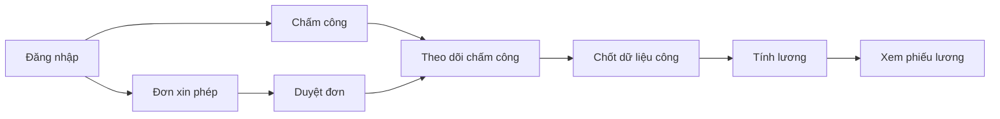
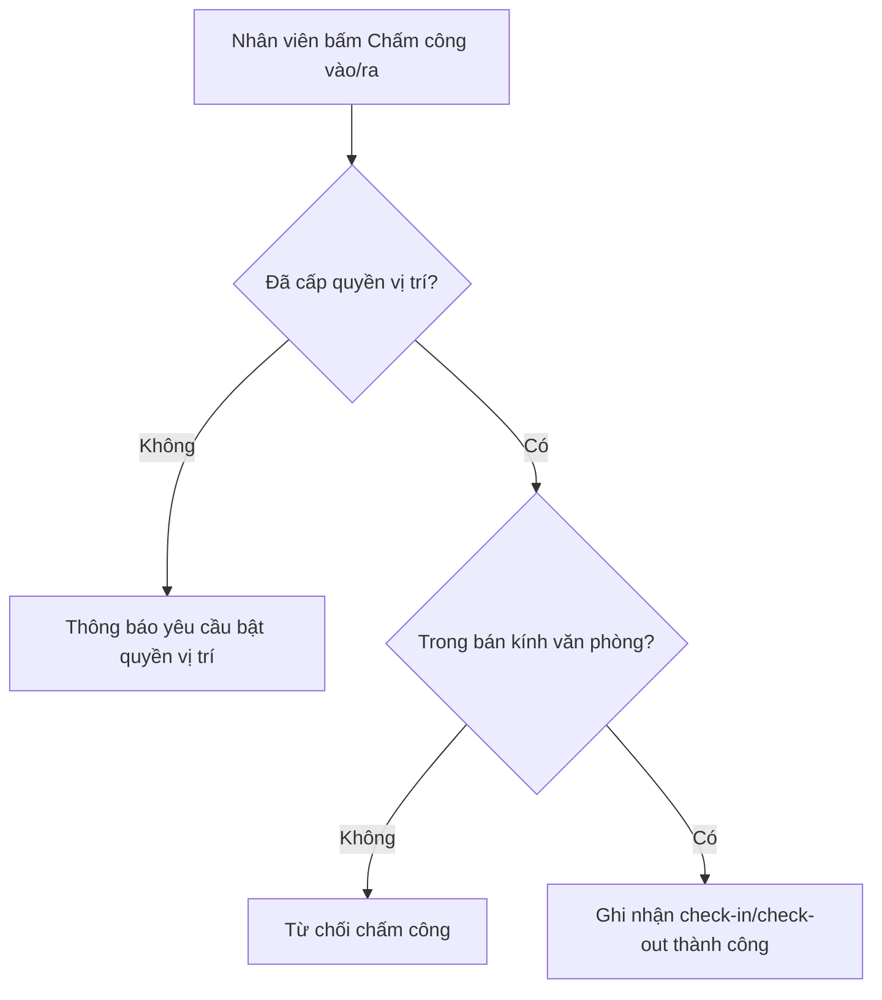
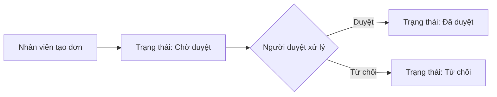
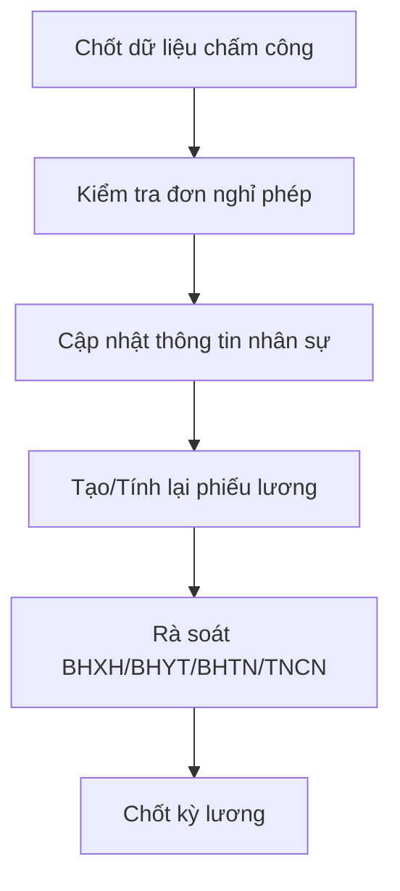

  <a href="./README.md">JP</a>
  ·
  <a href="./README.en.md">EN</a>
  ·
  <a href="./README.vi.md"><strong>VI</strong></a>

# Tài liệu Hướng dẫn Sử dụng Hệ thống Web HRM

> Phiên bản: 1.0  
> Đối tượng: Khách hàng sử dụng hệ thống HRM  
> Phạm vi: FE `tmv-hrm`, BE `tmv-hrm-be`
> Website: [https://hrm.tamada.vn/](https://hrm.tamada.vn/)

---

## 1. Mục tiêu tài liệu

Tài liệu này hướng dẫn người dùng cuối và quản trị viên vận hành hệ thống Web HRM theo quy trình chuẩn, bao gồm:

- Quản lý nhân sự (Nhân viên, Phòng ban, Chức vụ)
- Chấm công, nghỉ phép, duyệt đơn
- Quản lý lương và cấu hình thuế
- Cấu hình hệ thống (Vai trò, phân quyền, ngày nghỉ, vị trí chấm công)

## 2. Đối tượng sử dụng

| Vai trò | Mục đích sử dụng chính |
|---|---|
| Admin/HR | Cấu hình hệ thống, quản trị dữ liệu nhân sự, duyệt đơn, quản lý lương |
| Quản lý | Duyệt đơn nghỉ phép, theo dõi chấm công theo phạm vi được cấp quyền |
| Nhân viên | Chấm công, tạo đơn nghỉ phép, xem chấm công và bảng lương cá nhân |

## 3. Sơ đồ tổng quan nghiệp vụ (minh họa)

## 4. Đăng nhập và bảo mật tài khoản

### 4.1 Đăng nhập
1. Truy cập URL hệ thống HRM.
2. Nhập `Tên đăng nhập` và `Mật khẩu`.
3. Nhấn `Đăng nhập`.

### 4.2 Đổi mật khẩu
1. Chọn chức năng `Đổi mật khẩu`.
2. Nhập mật khẩu hiện tại, mật khẩu mới và xác nhận.
3. Nhấn `Cập nhật mật khẩu`.

### 4.3 Đăng xuất
- Nhấn `Đăng xuất` ở thanh điều hướng.

## 5. Cấu trúc menu hệ thống

Menu hiển thị theo quyền của tài khoản:

- **Tổng quan**
- **Tổ chức**
  - Nhân viên
  - Phòng ban
  - Chức vụ
- **Chấm công & Thời gian**
  - Chấm công
  - Theo dõi chấm công
  - Đơn xin phép
  - Duyệt đơn xin phép
- **Lương**
- **Cấu hình hệ thống**
  - Cấu hình ngày nghỉ
  - Vị trí chi nhánh
  - Nhóm quyền
  - Phân quyền

## 6. Hướng dẫn sử dụng theo phân hệ

### 6.1 Tổng quan
- Theo dõi chỉ số nhanh về nhân sự, chấm công, nghỉ phép.

### 6.2 Nhân viên
- Xem danh sách, thêm/sửa/xóa, reset mật khẩu (theo quyền).
- Cập nhật hồ sơ cá nhân tại `Hồ sơ của tôi`.

### 6.3 Phòng ban
- Quản lý phòng ban theo cây cha/con.
- Thêm/sửa/xóa phòng ban và cập nhật trạng thái hoạt động.

### 6.4 Chức vụ
- Quản lý danh sách chức vụ theo phòng ban.
- `Level` càng nhỏ thì cấp bậc càng cao.

### 6.5 Chấm công
- Chấm công vào/ra theo vị trí văn phòng (geofence).
- Xem dữ liệu công theo tháng.
- Cập nhật thủ công nếu có quyền.

### 6.6 Theo dõi chấm công
- Tìm kiếm nhân viên, xem chi tiết theo tháng, xuất Excel.

| Ký hiệu | Ý nghĩa |
|---|---|
| `1 / 8h` | Có đi làm |
| `W` | Nghỉ cuối tuần |
| `H` | Nghỉ lễ |
| `A` | Vắng |
| `PL, SL, UL...` | Nghỉ theo loại đơn |
| `F` | Quên chấm công |
| `-` | Ngày tương lai/chưa tính |

### 6.7 Đơn xin phép
- Tạo đơn, chỉnh sửa/xóa khi chưa duyệt.
- Theo dõi trạng thái: `Chờ duyệt`, `Đã duyệt`, `Từ chối`.

### 6.8 Duyệt đơn xin phép
- Người duyệt xử lý đơn theo quyền.

### 6.9 Lương
- Admin/HR: quản lý danh mục lương, cấu hình Thuế TNCN, tạo/sửa/tính lại phiếu lương.
- Nhân viên: xem phiếu lương cá nhân.

### 6.10 Vị trí chi nhánh
- Thêm/sửa/xóa vị trí chấm công.
- Cấu hình tọa độ và bán kính.

### 6.11 Cấu hình ngày nghỉ
- Cấu hình ngày nghỉ cố định theo tuần.
- Cấu hình kỳ nghỉ lễ theo khoảng ngày.

### 6.12 Nhóm quyền và Phân quyền
- Tạo nhóm quyền (ví dụ: `ADMIN`, `HR_MANAGER`, `EMPLOYEE`).
- Gán permission cho từng nhóm để kiểm soát menu và thao tác.

## 7. Quy trình vận hành đề xuất

### 7.1 Khởi tạo
1. Cấu hình phòng ban, chức vụ, vị trí, ngày nghỉ.
2. Tạo nhóm quyền, gán phân quyền.
3. Tạo tài khoản nhân viên và gán tổ chức.

### 7.2 Hằng ngày
1. Chấm công.
2. Tạo/duyệt đơn nghỉ phép.
3. Theo dõi xử lý bất thường.

### 7.3 Hằng tháng
1. Khóa dữ liệu công.
2. Cập nhật thông số lương/thuế (nếu có).
3. Chạy bảng lương và đối soát.

## 8. Xử lý sự cố thường gặp

| Vấn đề | Hướng xử lý |
|---|---|
| Không đăng nhập được | Kiểm tra tài khoản/mật khẩu, reset nếu cần |
| Không chấm công được | Kiểm tra quyền vị trí và phạm vi văn phòng |
| Không thấy menu/chức năng | Kiểm tra phân quyền |
| Không tạo/duyệt được đơn | Kiểm tra quyền `LEAVE_VIEW`/`LEAVE_APPROVE` |
| Dữ liệu lương chưa đúng | Kiểm tra dữ liệu công, đơn nghỉ, thông số thuế |

## 9. Checklist bàn giao

- [ ] Danh sách tài khoản khởi tạo
- [ ] Quy trình phân quyền nội bộ
- [ ] Quy trình sao lưu dữ liệu
- [ ] Đầu mối hỗ trợ kỹ thuật và SLA
- [ ] Đổi toàn bộ mật khẩu mặc định

> Khuyến nghị: Đổi toàn bộ mật khẩu mặc định ngay sau nghiệm thu bàn giao.
