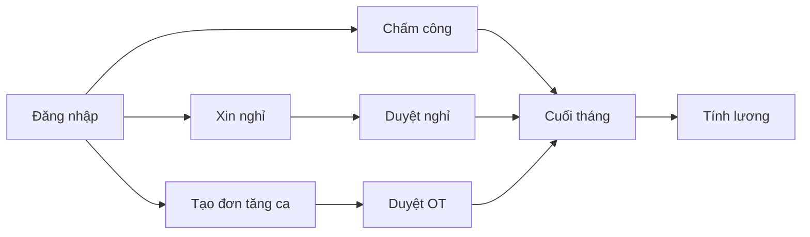

  <a href="./README.md">JP</a>
  ·
  <a href="./README.en.md">EN</a>
  ·
  <a href="./README.vi.md"><strong>VI</strong></a>

# Hướng dẫn sử dụng hệ thống HRM

> Phiên bản: 2.4  
> Đối tượng: Nhân viên, quản lý, HR / Admin  
> Website: [https://hrm.tamada.vn/](https://hrm.tamada.vn/)  
> Báo lỗi: [GitHub Issues](https://github.com/tamada-chinhhv/tmv-hrm-docs/issues/new)

Tài liệu này hướng dẫn **cách thao tác trên màn hình** (menu → nút → kết quả). Phần kỹ thuật chi tiết nằm ở [mục 6](#6-phụ-lục-kỹ-thuật).

---

## Bắt đầu nhanh

1. Mở trình duyệt → [https://hrm.tamada.vn/login](https://hrm.tamada.vn/login).
2. Đăng nhập bằng tài khoản HR cấp (mật khẩu mặc định thường trùng tên đăng nhập).
3. Đổi mật khẩu (khuyến nghị): menu tên bạn góc trên → **Đổi mật khẩu**.
4. Chấm công: **Chấm công & Thời gian** → **Chấm công** → **Chấm công vào** / **Chấm công ra**. Trên web hãy cho phép **vị trí**; trên mobile hãy nối **WiFi công ty** nếu chi nhánh dùng WiFi.
5. Xem nhanh ngày của bạn: menu **Tổng quan**.

**Kết quả mong đợi:** Đăng nhập được, thấy menu phù hợp quyền, chấm công được.

---

## Mục lục

1. [Giới thiệu](#1-giới-thiệu)
2. [Dành cho nhân viên](#2-dành-cho-nhân-viên)
3. [Dành cho quản lý](#3-dành-cho-quản-lý)
4. [Dành cho HR / Admin](#4-dành-cho-hr--admin)
5. [Câu hỏi thường gặp](#5-câu-hỏi-thường-gặp)
6. [Phụ lục kỹ thuật](#6-phụ-lục-kỹ-thuật)

---

## 1. Giới thiệu

### 1.1 HRM làm được gì?

**HRM** giúp công ty quản lý nhân sự trên một hệ thống:

- Chấm công vào / ra
- Xin nghỉ và duyệt nghỉ
- Tạo và duyệt đơn tăng ca
- Xem lịch họp, phiếu lương
- Quản lý nhân viên, giấy tờ, cấu hình ngày nghỉ / chi nhánh / ca làm việc (HR)

### 1.2 Ai dùng hệ thống?

| Bạn là… | Việc thường làm |
|---------|-----------------|
| **Nhân viên** | Chấm công, xin nghỉ, xem lương, lịch họp, tổng quan cá nhân |
| **Quản lý** | Theo dõi chấm công nhóm, duyệt nghỉ, tạo / duyệt đơn tăng ca |
| **HR / Admin** | Tạo nhân viên, phân quyền, cấu hình hệ thống, lương, giấy tờ |

Menu hiện theo quyền. Không thấy một mục nào → hỏi HR xem tài khoản đã được cấp quyền chưa.

### 1.3 Luồng công việc chính

```mermaid
flowchart LR
  A[Đăng nhập] --> B[Chấm công]
  A --> C[Xin nghỉ]
  C --> D[Duyệt nghỉ]
  A --> E[Tạo đơn tăng ca]
  E --> F[Duyệt OT]
  B --> G[Cuối tháng]
  D --> G
  F --> G
  G --> H[Tính lương]
```

---

## 2. Dành cho nhân viên

### 2.1 Đăng nhập & tài khoản

**Khi nào dùng:** Lần đầu hoặc khi cần đổi mật khẩu / sửa hồ sơ cá nhân.

**Các bước — Đăng nhập**

1. Vào [trang đăng nhập](https://hrm.tamada.vn/login).
2. Nhập tên đăng nhập và mật khẩu.
3. Bấm đăng nhập.

**Các bước — Tài khoản**

1. Menu **Tài khoản** (hoặc tên bạn góc trên).
2. Tab **Thông tin**: sửa họ tên, email, điện thoại (không đổi được tên đăng nhập, phòng ban, vai trò).
3. Tab **Cài đặt**: giao diện sáng/tối, màu, font.
4. Tab **Giấy tờ** (nếu có): xem / thêm giấy tờ của chính bạn.

**Kết quả mong đợi:** Đăng nhập vào hệ thống; hồ sơ cá nhân cập nhật được.

**Gặp vấn đề?**

- Sai mật khẩu → thử lại hoặc nhờ HR đặt lại.
- Quên mật khẩu → liên hệ HR / IT (không tự đăng ký tài khoản mới).

---

### 2.2 Tổng quan (Dashboard)

**Khi nào dùng:** Muốn xem nhanh thông tin cá nhân và chấm công tháng.

**Các bước**

1. Menu **Tổng quan**.
2. Xem **Tổng quan của tôi**: thông tin NV, bảng chấm công tháng, số đơn nghỉ đang chờ.
3. Có thể chấm công nhanh từ đây (nếu được phép).

**Kết quả mong đợi:** Thấy lịch chấm công tháng và trạng thái đơn nghỉ của mình.

**Gặp vấn đề?**

- Không thấy tab doanh nghiệp → bình thường với nhân viên thường; tab đó dành quản lý / HR trên màn hình lớn.

---

### 2.3 Chấm công vào / ra

**Khi nào dùng:** Mỗi ngày khi đến / về (hoặc theo quy định công ty).

**Các bước**

1. **Chấm công & Thời gian** → **Chấm công**.
2. Bấm **Chấm công vào** lúc đến; **Chấm công ra** lúc về.
3. Trên **web**: cho phép trình duyệt dùng vị trí.
4. Trên **mobile**: nếu chi nhánh dùng WiFi, hãy nối WiFi công ty trước khi chấm.

**Kết quả mong đợi:** Hệ thống ghi nhận giờ vào / ra trong ngày.

**Gặp vấn đề?**

- Báo ngoài khu vực văn phòng → di chuyển vào phạm vi chi nhánh hoặc nối đúng WiFi công ty.
- Đã có đơn **làm remote** được duyệt trong ngày → có thể chấm không cần GPS/WiFi.
- Quên chấm một đầu → nhờ quản lý / HR chỉnh, hoặc tạo đơn sửa (muộn / sớm / chỉnh công) theo quy định.

---

### 2.4 Đơn xin phép

**Khi nào dùng:** Nghỉ phép, nghỉ không lương, muộn, sớm, remote, hiếu hỷ, tăng ca đơn lẻ (nếu quy trình công ty dùng), v.v.

**Các bước — Tạo đơn**

1. **Chấm công & Thời gian** → **Đơn xin phép**.
2. Bấm tạo đơn → chọn loại, thời gian, lý do.
3. Với **hiếu hỷ**: chọn **Loại hiếu hỷ** (không vượt số ngày tối đa).
4. Gửi đơn → chờ duyệt.

**Các bước — Theo dõi**

- Trong danh sách đơn: xem trạng thái (chờ duyệt / đã duyệt / từ chối).
- Đơn đang chờ: thường có thể sửa hoặc xóa / hủy theo loại đơn.

**Kết quả mong đợi:** Đơn xuất hiện trong danh sách; người duyệt nhận để xử lý.

**Gặp vấn đề?**

- Không gửi được → kiểm tra đã chọn đủ ngày / loại / người nhận (nếu form yêu cầu).
- Hiếu hỷ báo quá số ngày → chọn lại loại hoặc rút ngắn thời gian nghỉ.

---

### 2.5 Lịch họp

**Khi nào dùng:** Đặt lịch họp hoặc xem lịch đồng nghiệp (theo quyền).

**Các bước**

1. Menu **Lịch**.
2. Chọn cột của bạn (hoặc đồng nghiệp được phép xem).
3. Bấm khung giờ trống → tạo cuộc họp, mời người tham gia, lưu.

**Kết quả mong đợi:** Cuộc họp hiện trên lịch các thành viên.

---

### 2.6 Xem phiếu lương

**Khi nào dùng:** Sau khi HR phát hành / tính lương kỳ.

**Các bước**

1. Menu **Lương**.
2. Chọn kỳ lương → mở phiếu của bạn.

**Kết quả mong đợi:** Xem được phiếu lương cá nhân (nếu đã được cấp quyền xem).

**Gặp vấn đề?** Không thấy phiếu → hỏi HR xem kỳ đã tính và tài khoản đã có quyền xem chưa.

---

## 3. Dành cho quản lý

### 3.1 Theo dõi chấm công nhóm

**Khi nào dùng:** Xem chấm công team theo ngày / tháng.

**Các bước**

1. **Chấm công & Thời gian** → **Theo dõi chấm công**.
2. Chọn tháng, phòng ban / nhân viên (theo phạm vi được xem).
3. Xem lưới trạng thái (đi làm, muộn, nghỉ, quên chấm…).
4. Mở chi tiết từng người khi cần chỉnh hoặc xuất báo cáo (nếu có nút xuất).

**Kết quả mong đợi:** Thấy tình hình chấm công nhóm trong phạm vi quản lý.

---

### 3.2 Duyệt đơn xin phép

**Khi nào dùng:** Có đơn nghỉ của cấp dưới / đơn được gán cho bạn.

**Các bước**

1. **Chấm công & Thời gian** → **Duyệt đơn xin phép**.
2. Mở đơn → kiểm tra loại, thời gian, lý do.
3. **Duyệt** hoặc **Từ chối** (nên ghi lý do khi từ chối).

**Kết quả mong đợi:** Đơn đổi trạng thái; nhân viên thấy kết quả trên **Đơn xin phép**.

---

### 3.3 Tạo đơn tăng ca (batch)

**Khi nào dùng:** Cần đăng ký tăng ca cho một hoặc nhiều nhân viên trong cùng ngày.

**Các bước**

1. **Chấm công & Thời gian** → **Tạo đơn tăng ca**.
2. Bấm **Tạo đơn tăng ca**.
3. Chọn **Ngày**, loại ca (ngày thường / ngày nghỉ / ngày lễ).
4. Thêm nhân viên: giờ **Từ – Đến**, ghi chú nếu cần.
5. Chọn **Trưởng phòng duyệt** (hoặc trình thẳng Giám đốc nếu được phép).
6. **Lưu nháp** hoặc **Trình lên trưởng phòng** / **Trình lên giám đốc**.

**Kết quả mong đợi:** Có mã đơn trong danh sách; trạng thái **Nháp** hoặc đang chờ duyệt.

**Các trạng thái thường gặp**

| Trạng thái | Ý nghĩa |
|------------|---------|
| Nháp | Chưa trình |
| Chờ TP duyệt | Đang chờ Trưởng phòng |
| Chờ GD duyệt | Đang chờ Giám đốc |
| Trả về TP | Giám đốc trả về để sửa |
| Đã duyệt | Hoàn tất |
| Từ chối | Bị từ chối — có thể sửa và gửi lại |
| Đã hủy | Đã hủy khi đang chờ |

**Gặp vấn đề?**

- Thiếu nhân viên / giờ / người duyệt.
- Trùng lịch OT, vượt số giờ OT trong ngày, hoặc giờ OT nằm trong ca làm việc.
- Chưa gán phòng ban nên không chọn được người duyệt.

---

### 3.4 Duyệt đơn tăng ca (TP / GĐ)

**Khi nào dùng:** Bạn là Trưởng phòng hoặc Giám đốc được gán duyệt OT.

**Các bước — Trưởng phòng**

1. **Chấm công & Thời gian** → **Duyệt đơn tăng ca** → tab **Trưởng phòng**.
2. Mở đơn **Chờ TP duyệt**.
3. Chọn **Nội dung công việc** cho từng người (danh mục do HR cấu hình).
4. Chọn **Giám đốc duyệt** → **Duyệt** hoặc **Từ chối** (có lý do).
5. Nếu đơn **Trả về TP**: chỉnh nội dung → **Gửi lại** lên Giám đốc.

**Các bước — Giám đốc**

1. Cùng menu **Duyệt đơn tăng ca** → tab **Giám đốc**.
2. Mở đơn **Chờ GD duyệt**.
3. **Duyệt** (xong) hoặc **Trả về** (bắt buộc lý do) để Trưởng phòng sửa.

**Kết quả mong đợi:** Đơn chuyển sang bước tiếp theo hoặc **Đã duyệt**.

---

## 4. Dành cho HR / Admin

### 4.1 Nhân viên, phòng ban, chức vụ

**Khi nào dùng:** Onboarding, đổi phòng ban / chức vụ, cập nhật hồ sơ.

**Các bước**

1. **Tổ chức** → **Nhân viên**: thêm / sửa / ngưng hoạt động; gán quản lý, vai trò, phòng ban.
2. **Tổ chức** → **Phòng ban**: cây phòng ban cha–con.
3. **Tổ chức** → **Chức vụ**: danh mục chức vụ (thường gắn với nhóm quyền mặc định).

**Kết quả mong đợi:** Nhân viên đăng nhập được và thấy đúng menu theo quyền.

---

### 4.2 Giấy tờ & tài liệu công ty

**Khi nào dùng:** Lưu CCCD/hợp đồng của NV, hoặc tài liệu dùng chung (nội quy…).

| Việc cần làm | Menu |
|--------------|------|
| Giấy tờ theo nhân viên / công ty (có hạn, nhắc) | **Tổ chức** → **Giấy tờ** |
| Thư viện tài liệu công ty | **Tổ chức** → **Tài liệu công ty** |
| Ai nhận nhắc hết hạn | **Cấu hình hệ thống** → **Thông báo giấy tờ** |

**Các bước — Giấy tờ**

1. **Thêm giấy tờ** → chọn chủ sở hữu (nhân viên hoặc công ty).
2. Tải file **PDF** (thường tối đa 5 MB).
3. Kiểm tra ngày hết hạn hoặc chọn vô thời hạn → lưu.

Nhân viên có thể tự xem giấy của mình tại **Tài khoản** → tab **Giấy tờ**.

**Kết quả mong đợi:** File lưu trên hệ thống; sắp hết hạn sẽ được nhắc theo cấu hình.

---

### 4.3 Lương

**Khi nào dùng:** Tính / khóa kỳ lương, xem phiếu.

**Các bước**

1. Menu **Lương**.
2. Tạo / tính lại phiếu theo kỳ (nếu có quyền quản lý).
3. **Khóa kỳ** khi đã chốt — sau khi khóa không sửa phiếu (chỉ xem / xuất).
4. Nhân viên xem phiếu của mình trên cùng menu (theo quyền).

**Kết quả mong đợi:** Phiếu lương đúng kỳ; kỳ khóa thì không bị sửa nhầm.

---

### 4.4 Cấu hình hệ thống

**Khi nào dùng:** Thiết lập ngày nghỉ, nơi chấm công, ca làm việc, giao diện chung.

| Việc | Menu |
|------|------|
| Ngày nghỉ / lễ | **Cấu hình hệ thống** → **Cấu hình ngày nghỉ** |
| Chi nhánh (GPS / WiFi chấm công) | **Cấu hình hệ thống** → **Vị trí chi nhánh** |
| Giờ ca, nghỉ trưa, ân hạn muộn/sớm | **Cấu hình hệ thống** → **Ca làm việc** |
| Giao diện mặc định hệ thống | **Cấu hình hệ thống** → **Giao diện hệ thống** |
| Phân quyền / nhóm quyền | **Cấu hình hệ thống** → **Phân quyền** |

**Chi nhánh (đời thường):** mỗi chi nhánh đang dùng cần có **vị trí GPS** và/hoặc **WiFi văn phòng** để nhân viên chấm được. WiFi dùng địa chỉ thiết bị phát (không chỉ tên mạng).

**Ca làm việc:** đặt giờ bắt đầu / kết thúc, nghỉ trưa, số phút được phép muộn / sớm. Sau khi đổi cấu hình lớn, có thể dùng chức năng áp dụng lại bảng chấm công (theo hướng dẫn trên màn hình).

---

### 4.5 Cấu hình tăng ca

**Khi nào dùng:** Chuẩn bị danh mục nội dung công việc OT trước khi Trưởng phòng duyệt đơn.

**Các bước**

1. **Cấu hình hệ thống** → **Nội dung công việc OT**.
2. Thêm / sửa các nội dung (ví dụ: hỗ trợ sản xuất, sự kiện…).
3. Khi TP duyệt đơn tăng ca, họ chọn nội dung từ danh sách này.

**Kết quả mong đợi:** Form duyệt OT có đủ lựa chọn nội dung công việc.

---

### 4.6 Hiếu hỷ

**Khi nào dùng:** Định nghĩa loại nghỉ hiếu hỷ (cưới hỏi, tang chế…) và số ngày tối đa.

**Các bước**

1. **Cấu hình hệ thống** → **Cấu hình hiếu hỷ**.
2. Xem danh sách loại (Hệ thống / Tùy chỉnh).
3. **Thêm loại** hoặc sửa: tên, số ngày, có hưởng lương hay không.
4. Loại **Hệ thống** chỉ sửa, không xóa.

**Kết quả mong đợi:** Khi tạo **Đơn xin phép** loại hiếu hỷ, nhân viên chọn đúng loại và không vượt số ngày tối đa.

---

### 4.7 Ai thấy menu nào

Quyền quyết định menu. Gợi ý:

| Nhóm việc | Ai thường thấy |
|-----------|----------------|
| Chấm công, đơn nghỉ của mình, lịch, tài khoản | Hầu hết nhân viên |
| Theo dõi chấm công, duyệt nghỉ | Quản lý / HR |
| Tạo / duyệt đơn tăng ca | Người được cấp quyền OT |
| Nhân viên, phòng ban, giấy tờ, lương quản lý | HR |
| Cấu hình hệ thống | Admin / HR được phân quyền |

Cần thêm quyền: **Cấu hình hệ thống** → **Phân quyền** (gán nhóm quyền cho vai trò / người dùng).

---

### 4.8 Quy trình cuối tháng

Gợi ý thứ tự:

1. Nhắc nhân viên chấm đủ công; xử lý đơn nghỉ / OT còn treo.
2. **Theo dõi chấm công** — rà soát muộn, quên chấm, remote.
3. Chốt dữ liệu chấm công theo quy định nội bộ.
4. **Lương** — tính phiếu → kiểm tra → **khóa kỳ**.
5. Thông báo nhân viên xem phiếu lương.

---

## 5. Câu hỏi thường gặp

**Không thấy một menu?**  
Tài khoản chưa được cấp quyền. Liên hệ HR.

**Chấm công báo ngoài khu vực?**  
Vào đúng chi nhánh hoặc nối WiFi công ty. Nếu làm remote, cần đơn remote đã được duyệt trong ngày.

**Quên chấm vào hoặc ra?**  
Bổ sung trong ngày nếu còn cho phép; hoặc nhờ quản lý / HR; hoặc tạo đơn chỉnh sửa theo quy định.

**Đơn nghỉ gửi rồi muốn hủy?**  
Chỉ khi còn **chờ duyệt** (và loại đơn cho phép). Đã duyệt thì nhờ người có quyền xử lý trên **Duyệt đơn xin phép**.

**Đơn tăng ca bị từ chối / trả về?**  
Vào **Tạo đơn tăng ca**, sửa theo lý do → gửi lại đúng bước (TP hoặc GĐ).

**File giấy tờ không tải lên?**  
Chỉ nhận PDF, dung lượng trong giới hạn (thường 5 MB). Đúng menu **Giấy tờ** hoặc **Tài liệu công ty**.

**Trình duyệt nào dùng được?**  
Chrome, Edge, Firefox, Safari bản gần đây.

---

## 6. Phụ lục kỹ thuật

Phần này dành cho IT / Admin cần tra cứu nhanh. Người dùng thường có thể bỏ qua.

### 6.1 Địa chỉ hệ thống

| Môi trường | URL |
|------------|-----|
| Production | https://hrm.tamada.vn/ |
| Đăng nhập | https://hrm.tamada.vn/login |

### 6.2 Một số mã lỗi thường gặp (thông báo hệ thống)

| Hiện tượng / mã | Cách xử lý gợi ý |
|-----------------|------------------|
| Ngoài khu vực văn phòng / `OUTSIDE_OFFICE_AREA` | Vào phạm vi GPS hoặc đúng WiFi chi nhánh |
| Thiếu vị trí / WiFi khi chấm | Bật GPS hoặc gửi thông tin WiFi (mobile) |
| Không đủ quyền xóa đơn đã duyệt | Chỉ admin / người duyệt được phép |
| Kỳ lương đã khóa | Mở khóa kỳ (nếu có quyền) trước khi sửa phiếu |
| Trùng / vượt giờ OT | Điều chỉnh giờ hoặc nhân viên trên đơn tăng ca |

### 6.3 Ghi chú kiến trúc (cho dev)

- FE: `tmv-hrm` · BE: `tmv-hrm-be`
- Tăng ca theo batch: `/time/overtime-batches` và luồng duyệt TP/GĐ (không dùng menu OT đơn lẻ cũ trên sidebar chính)
- Báo lỗi sản phẩm: [GitHub Issues](https://github.com/tamada-chinhhv/tmv-hrm-docs/issues/new)
