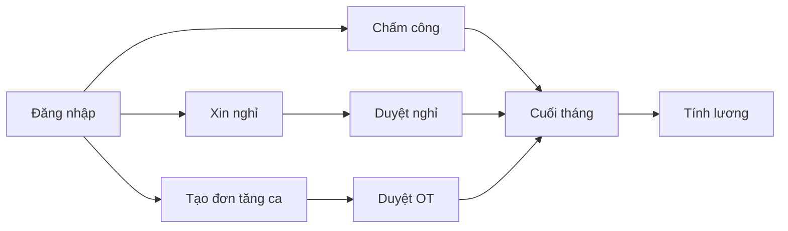

# Giới thiệu

#### 1.1 HRM làm được gì?

**HRM** giúp công ty quản lý nhân sự trên một hệ thống:

- Chấm công vào / ra
- Xin nghỉ và duyệt nghỉ
- Tạo và duyệt đơn tăng ca
- Xem lịch họp, phiếu lương
- Quản lý nhân viên, giấy tờ, cấu hình ngày nghỉ / chi nhánh / ca làm việc (HR)

#### 1.2 Ai dùng hệ thống?

| Bạn là… | Việc thường làm |
|---------|-----------------|
| **Nhân viên** | Chấm công, xin nghỉ, xem lương, lịch họp, tổng quan cá nhân |
| **Quản lý** | Theo dõi chấm công nhóm, duyệt nghỉ, tạo / duyệt đơn tăng ca |
| **HR / Admin** | Tạo nhân viên, phân quyền, cấu hình hệ thống, lương, giấy tờ |

Menu hiện theo quyền. Không thấy một mục nào → hỏi HR xem tài khoản đã được cấp quyền chưa.

#### 1.3 Luồng công việc chính

---
