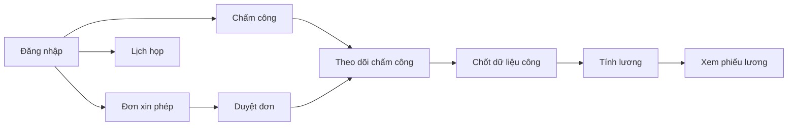

# Giới thiệu hệ thống HRM

#### 1.1 HRM là gì?

**HRM** (Human Resource Management — Quản lý nhân sự) là hệ thống web giúp công ty quản lý nhân sự và các công việc liên quan trên một nền tảng thống nhất: hồ sơ nhân viên, chấm công, nghỉ phép, lương, lịch họp và cấu hình hệ thống.

Bạn dùng HRM để:

- Ghi nhận giờ làm việc (chấm công vào/ra).
- Tạo và duyệt đơn xin nghỉ phép.
- Xem và quản lý thông tin nhân viên, phòng ban, chức vụ.
- Lên lịch cuộc họp, mời đồng nghiệp tham gia.
- Tính và xem phiếu lương (theo quyền).
- Cấu hình ngày nghỉ, vị trí chấm công, nhóm quyền (dành cho quản trị).

#### 1.2 Ai sẽ dùng hệ thống?

| Đối tượng | Vai trò trong hệ thống | Việc thường làm |
|-----------|------------------------|-----------------|
| **Quản trị / HR** | Vai trò `ADMIN` hoặc được gán đủ quyền quản trị | Tạo nhân viên, phân quyền, cấu hình ngày nghỉ, vị trí chấm công, quản lý lương |
| **Quản lý (Manager)** | Nhân viên có quyền `EMPLOYEE_VIEW` và có cấp dưới (`manager`) | Xem chấm công team, duyệt đơn nghỉ (nếu có `LEAVE_APPROVE`), theo dõi nhân viên trong team |
| **Nhân viên** | Vai trò `EMPLOYEE` (mặc định khi gán) | Chấm công, tạo đơn nghỉ, xem lương cá nhân, tham gia lịch họp |

:::note
Trong hệ thống, mỗi nhân viên có **một vai trò (role)** gắn với tài khoản. Quyền chi tiết (xem menu, tạo/sửa dữ liệu) phụ thuộc vào **phân quyền (permission)** của vai trò đó.
:::

#### 1.3 Các module chính

| Nhóm menu | Chức năng | Đường dẫn (URL) |
|-----------|-----------|-----------------|
| **Tổng quan** | Bảng điều khiển, chỉ số nhanh | `/dashboard` |
| **Tài khoản** | Hồ sơ cá nhân, giao diện (màu, font, sáng/tối) | `/account` (tab **Thông tin** / **Cài đặt**) |
| **Lịch** | Lịch họp nhiều nhân viên | `/calendar` |
| **Tổ chức** | Nhân viên, Phòng ban, Chức vụ, Giấy tờ | `/org/employees`, `/org/departments`, `/org/positions`, `/org/documents` |
| **Chấm công & Thời gian** | Chấm công, Theo dõi chấm công, Đơn xin phép, Duyệt đơn xin phép | `/time/attendance`, `/time/attendance-tracking`, `/time/leave`, `/time/leave-approvals` |
| **Lương** | Phiếu lương, cấu hình thuế | `/payroll` |
| **Cấu hình hệ thống** | Ngày nghỉ, Vị trí, Giao diện & Ca làm việc, Phân quyền (tab Gán quyền + Nhóm quyền), Thông báo giấy tờ | `/sysConfig/holidays`, `/sysConfig/locations`, `/sysConfig/settings`, `/sysConfig/assign` (tab `roles` cho nhóm quyền; `/sysConfig/roles` redirect), `/settings/document-notifications` |

Menu hiển thị **theo quyền** — nếu bạn không thấy mục nào, có thể tài khoản chưa được gán quyền tương ứng (xem [mục 6](/docs/roles-permissions)).

#### 1.4 Sơ đồ luồng nghiệp vụ chính

---
