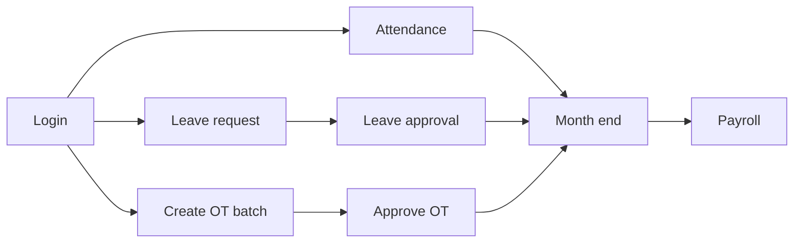

# Introduction

#### 1.1 What can HRM do?

**HRM** helps your company manage people in one place:

- Check in / check out
- Request and approve leave
- Create and approve overtime batches
- Meetings calendar and payslips
- Employees, documents, holidays / branches / work shifts (HR)

#### 1.2 Who uses the system?

| You are… | Typical tasks |
|----------|---------------|
| **Employee** | Attendance, leave requests, payslip, calendar, personal overview |
| **Manager** | Team attendance, leave approvals, create / approve overtime batches |
| **HR / Admin** | Employees, permissions, system setup, payroll, documents |

Menus depend on permissions. Missing a menu item → ask HR to grant access.

#### 1.3 Main workflow

---
