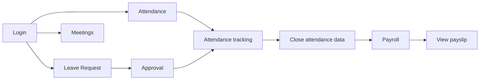

# Introduction to the HRM System

#### 1.1 What is HRM?

**HRM** (Human Resource Management) is a web system that helps your company manage HR-related work in one place: employee records, attendance, leave, payroll, meeting schedules, and system configuration.

You use HRM to:

- Record work hours (check-in / check-out).
- Create and approve leave requests.
- View and manage employees, departments, and positions.
- Schedule meetings and invite colleagues.
- Calculate and view payslips (based on permissions).
- Configure holidays, office locations, and roles (for administrators).

#### 1.2 Who uses the system?

| User type | Role in the system | Typical tasks |
|-----------|-------------------|-----------------|
| **Admin / HR** | `ADMIN` or full admin permissions | Create employees, assign permissions, configure holidays and locations, manage payroll |
| **Manager** | Has `EMPLOYEE_VIEW` and direct reports (`manager`) | Monitor team attendance, approve leave (with `LEAVE_APPROVE`), view team employees |
| **Employee** | `EMPLOYEE` role when assigned | Check in/out, request leave, view own payslip, join meetings |

:::note
Each employee has **one role** on their account. Menus and actions depend on **permissions** assigned to that role.
:::

#### 1.3 Main modules

| Menu group | Function | URL path |
|------------|----------|----------|
| **Overview** | Dashboard, quick metrics | `/dashboard` |
| **Account** | Personal profile, appearance (color, font, light/dark) | `/account` (tabs **Information** / **Settings**) |
| **Calendar** | Multi-employee meeting schedule | `/calendar` |
| **Organization** | Employees, Departments, Positions, Documents | `/org/employees`, `/org/departments`, `/org/positions`, `/org/documents` |
| **Time & Attendance** | Attendance, Attendance tracking, Leave requests, Leave request approvals | `/time/attendance`, `/time/attendance-tracking`, `/time/leave`, `/time/leave-approvals` |
| **Payroll** | Payslips, tax settings | `/payroll` |
| **System configuration** | Holidays, Locations, Work shift, Assign permissions (tabs: Assign + Role groups), Document expiry notifications | `/sysConfig/holidays`, `/sysConfig/locations`, `/sysConfig/settings`, `/sysConfig/assign` (tab `roles` for role groups; `/sysConfig/roles` redirects), `/settings/document-notifications` |

Menus appear **based on permissions**. If a menu item is missing, your account may lack the required permission (see [Section 6](/docs/roles-permissions)).

#### 1.4 Main business flow

---
