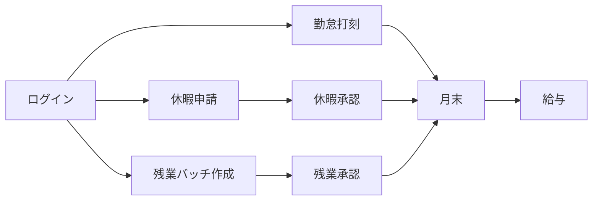

# はじめに

#### 1.1 HRM でできること

**HRM** は人事まわりを一つのシステムで扱います。

- 出退勤の打刻
- 休暇申請と承認
- 残業（バッチ）の作成と承認
- 会議カレンダー・給与明細
- 従業員・書類・休日 / 拠点 / 勤務シフト設定（HR）

#### 1.2 だれが使うか

| あなたは… | 主な作業 |
|-----------|----------|
| **従業員** | 打刻、休暇申請、給与確認、カレンダー、個人の概要 |
| **マネージャー** | チーム勤怠、休暇承認、残業バッチの作成 / 承認 |
| **HR / 管理者** | 従業員管理、権限、システム設定、給与、書類 |

メニューは権限で変わります。項目が見えない場合は HR に権限を確認してください。

#### 1.3 主な業務フロー

---
