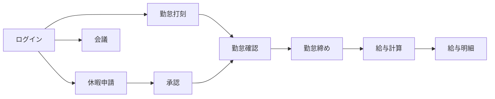

# HRM システムの概要

#### 1.1 HRM とは

**HRM**（人事管理）は、従業員情報・勤怠・休暇・給与・会議スケジュール・システム設定を一つの Web システムで扱うためのツールです。

主な用途:

- 出退勤の記録（出勤 / 退勤）
- 休暇申請の作成と承認
- 従業員・部署・役職の管理
- 会議の予定作成と参加者招待
- 給与明細の参照・計算（権限による）
- 休日・打刻拠点・ロールの設定（管理者向け）

#### 1.2 利用者

| 利用者 | システム上の位置づけ | 主な作業 |
|--------|---------------------|----------|
| **管理者 / HR** | `ADMIN` または十分な管理権限 | 従業員作成、権限付与、休日・拠点設定、給与運用 |
| **マネージャー** | `EMPLOYEE_VIEW` があり部下（`manager`）がいる | チーム勤怠の確認、休暇承認（`LEAVE_APPROVE` がある場合） |
| **一般従業員** | `EMPLOYEE` ロール（割り当て時） | 打刻、休暇申請、自分の給与確認、会議参加 |

> **補足:** 各従業員には **1 つのロール** が紐づきます。メニューや操作可否は、そのロールに付与された **権限コード** で決まります。

#### 1.3 主なモジュール

| メニュー | 機能 | URL |
|----------|------|-----|
| **概要** | ダッシュボード | `/dashboard` |
| **アカウント** | 個人プロフィール・外観（色・フォント・ライト/ダーク） | `/account`（タブ **情報** / **設定**） |
| **カレンダー** | 複数従業員の会議カレンダー | `/calendar` |
| **組織** | 従業員, 部署, 役職, 書類 | `/org/employees`, `/org/departments`, `/org/positions`, `/org/documents` |
| **勤怠・休暇** | 勤怠, 勤怠一覧, 休暇申請, 休暇申請の承認 | `/time/attendance`, `/time/attendance-tracking`, `/time/leave`, `/time/leave-approvals` |
| **給与** | 給与明細・税設定 | `/payroll` |
| **システム設定** | 休日・拠点・勤務シフト・権限割り当て（タブ: 割当 + 権限グループ）・書類期限通知 | `/sysConfig/holidays`, `/sysConfig/locations`, `/sysConfig/settings`, `/sysConfig/assign`（権限グループは `?tab=roles`；`/sysConfig/roles` はリダイレクト）、`/settings/document-notifications` |

メニューは **権限に応じて表示** されます。項目が見えない場合は [セクション 6](/docs/roles-permissions) を参照してください。

#### 1.4 業務フロー概要

---
